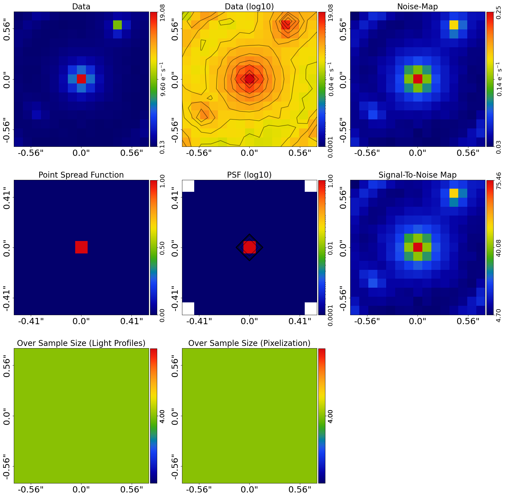
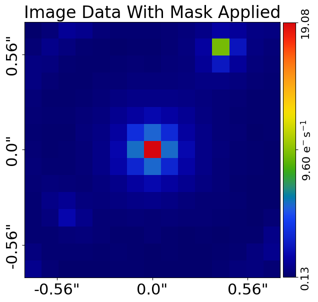
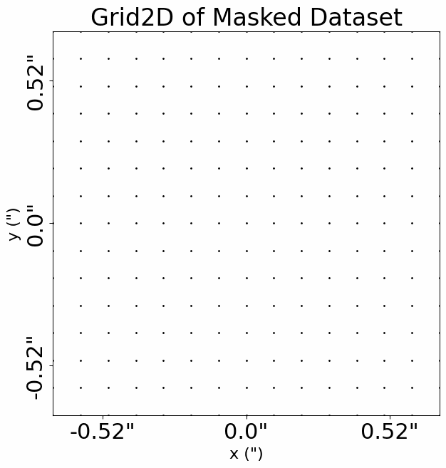
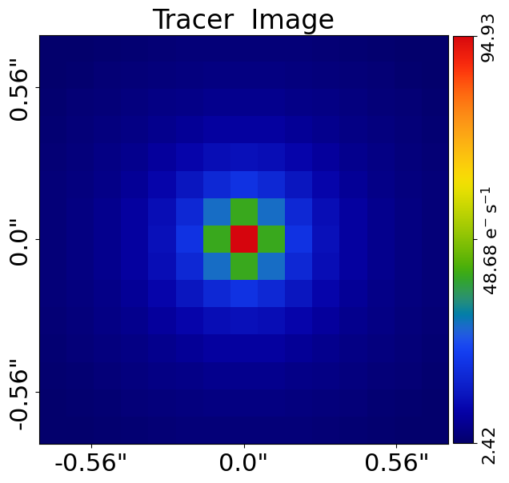
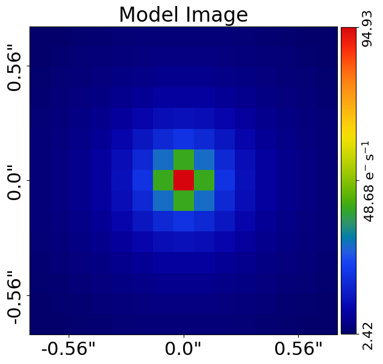
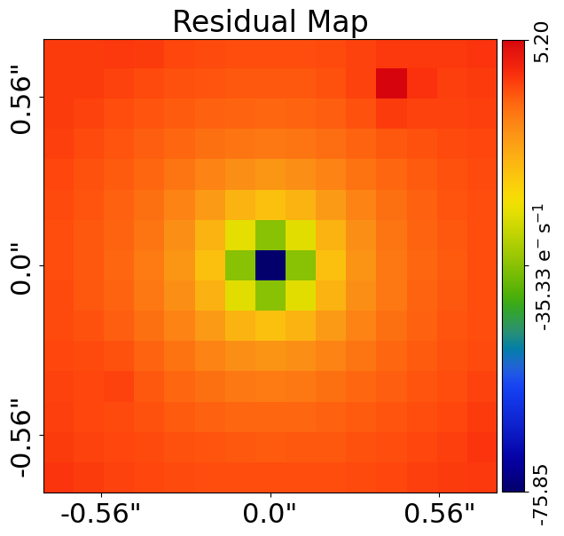
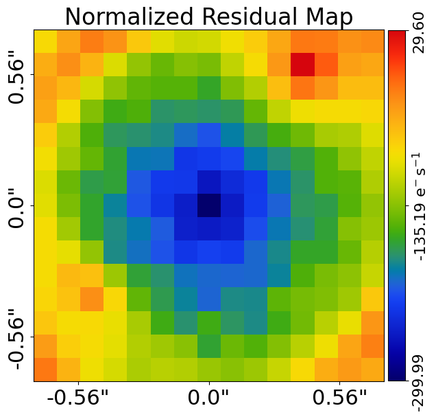
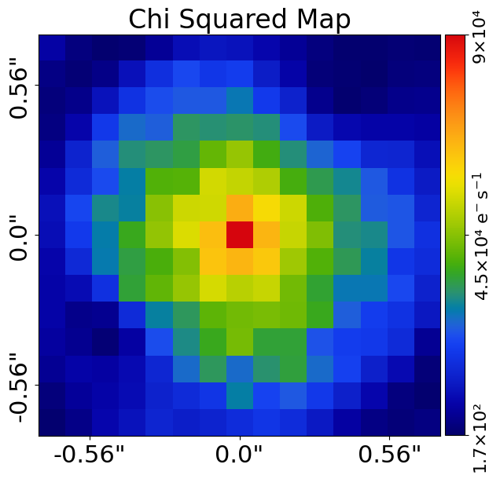
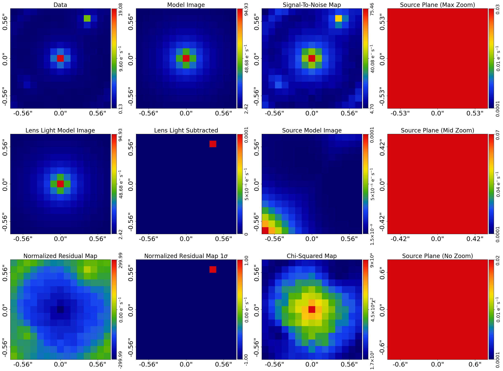

> ✏️ **This page is auto-generated from [`scripts/group/fit.py`](../../scripts/group/fit.py) — do not edit it directly.**
> It shows the example fully executed, with its real output images.
> Run it yourself via the [Python script](../../scripts/group/fit.py) or the [Jupyter notebook](../../notebooks/group/fit.ipynb).

Fits: Group
===========

This guide shows how to fit data using the `FitImaging` object for group-scale strong lenses, including visualizing
and interpreting its results.

A group-scale lens differs from a galaxy-scale lens in that there are multiple lens galaxies contributing to the
lensing. In this example, there is a single main lens galaxy and two extra galaxies nearby whose mass contributes
significantly to the ray-tracing and must therefore be included in the model.

References
----------

This example uses functionality described fully in other examples in the `guides` package:

- `guides/plot`: Using the plotting API (`aplt.plot_array`, `aplt.subplot_fit_imaging`, etc.) to visualize figures.
- `guides/units`: The source code unit conventions (e.g. arc seconds for distances and how to convert to physical units).
- `guides/data_structures`: The bespoke data structures used to store 1D and 2d arrays.

__Contents__

- **Loading Data:** We begin by loading the group-scale strong lens dataset `simple` from .fits files, which is the.
- **Mask:** Define the 2D mask applied to the dataset for the model-fit.
- **Galaxy Centres:** For group-scale lenses we load the centres of the main lens galaxies and extra galaxies from JSON.
- **Fitting:** Fit the lens model to the dataset and inspect the results.
- **Bad Fit:** A bad lens model will show features in the residual-map and chi-squared map.
- **Fit Quantities:** The maximum log likelihood fit contains many 1D and 2D arrays showing the fit.
- **Figures of Merit:** There are single valued floats which quantify the goodness of fit.
- **Plane Quantities:** The `FitImaging` object has specific quantities which break down each image of each plane.
- **Unmasked Quantities:** All of the quantities above are computed using the mask which was used to fit the data.
- **Pixel Counting:** An alternative way to quantify residuals like the lens light residuals is pixel counting.
- **Outputting Results:** You may wish to output certain results to .fits files for later inspection.
- **Over Sampling:** Set up the adaptive over-sampling grid for accurate light profile evaluation.

__JAX__

Same JAX story as `scripts/imaging/fit.py`: `FitImaging` runs on either
backend. For the standard analysis-driven path see `start_here.py` /
`modeling.py`. For JIT-ing library methods directly see
`scripts/guides/lens_calc.py`.


```python

from autolens import jax_wrapper  # Sets JAX environment before other imports

from autolens import setup_notebook; setup_notebook()

import numpy as np
from pathlib import Path
import autolens as al
import autolens.plot as aplt
```

    Working Directory has been set to `autolens_workspace`


__Loading Data__

We begin by loading the group-scale strong lens dataset `simple` from .fits files, which is the dataset
we will use to demonstrate fitting.

This dataset was simulated using the `group/simulator` example, read through that to have a better
understanding of how the data this example fits was generated.

The group-scale dataset has a larger field of view than a typical galaxy-scale lens, because it includes
emission from multiple lens galaxies and a more extended lensing configuration.


```python
dataset_name = "simple"
dataset_path = Path("dataset") / "group" / dataset_name
```

__Dataset Auto-Simulation__

If the dataset does not already exist on your system, it will be created by running the corresponding
simulator script. This ensures that all example scripts can be run without manually simulating data first.


```python
if not dataset_path.exists():
    import subprocess
    import sys

    subprocess.run(
        [sys.executable, "scripts/group/simulator.py"],
        check=True,
    )

dataset = al.Imaging.from_fits(
    data_path=dataset_path / "data.fits",
    psf_path=dataset_path / "psf.fits",
    noise_map_path=dataset_path / "noise_map.fits",
    pixel_scales=0.1,
)
```

The `aplt.subplot_imaging_dataset` contains a subplot which plots all the key properties of the dataset simultaneously.

This includes the observed image data, RMS noise map, Point Spread Function and other information.


```python
aplt.subplot_imaging_dataset(dataset=dataset)
```


    

    


__Mask__

We now mask the data, so that regions where there is no signal (e.g. the edges) are omitted from the fit.

We use a ``Mask2D`` object, which for this example is a 7.5" circular mask. This is larger than a typical
galaxy-scale lens mask because the group-scale lens has emission spread over a wider area due to the
multiple lens galaxies.


```python
mask_radius = 7.5

mask = al.Mask2D.circular(
    shape_native=dataset.shape_native,
    pixel_scales=dataset.pixel_scales,
    radius=mask_radius,
)
```

We now combine the imaging dataset with the mask.


```python
dataset = dataset.apply_mask(mask=mask)
```

    2026-07-11 15:34:35,885 - autoarray.dataset.imaging.dataset - INFO - IMAGING - Data masked, contains a total of 225 image-pixels


We now plot the image with the mask applied, where the image automatically zooms around the mask to make the lensed
source appear bigger.


```python
aplt.plot_array(array=dataset.data, title="Image Data With Mask Applied")
```


    

    


The mask is also used to compute a `Grid2D`, where the (y,x) arc-second coordinates are only computed in unmasked
pixels within the masks' circle.

As shown in the previous overview example, this grid will be used to perform lensing calculations when fitting the
data below.


```python
aplt.plot_grid(grid=dataset.grid, title="Grid2D of Masked Dataset")
```


    

    


__Galaxy Centres__

For group-scale lenses we load the centres of the main lens galaxies and extra galaxies from JSON files. These
centres are used during modeling to fix or constrain the positions of the galaxies.

The main lens galaxy is at (0.0, 0.0) and the two extra galaxies are at (3.5, 2.5) and (-4.4, -5.0).


```python
main_lens_centres = al.from_json(file_path=dataset_path / "main_lens_centres.json")
extra_galaxies_centres = al.from_json(
    file_path=dataset_path / "extra_galaxies_centres.json"
)

print(f"Main lens centres: {main_lens_centres}")
print(f"Extra galaxies centres: {extra_galaxies_centres}")
```

    Main lens centres: Grid2DIrregular([[0., 0.]])
    Extra galaxies centres: Grid2DIrregular([[ 3.5,  2.5],
           [-4.4, -5. ]])


__Fitting__

Following the previous overview example, we can make a tracer from a collection of light profiles, mass profiles
and galaxies.

The combination of light and mass profiles below is the same as those used to generate the simulated
dataset we loaded above.

For a group-scale lens, we have multiple lens galaxies: a main lens galaxy and extra galaxies. The fit
handles all of these galaxies simultaneously, computing the combined deflection field from all mass
profiles to ray-trace the source galaxy light.


```python
lens_galaxy = al.Galaxy(
    redshift=0.5,
    bulge=al.lp.SersicSph(
        centre=(0.0, 0.0), intensity=0.7, effective_radius=2.0, sersic_index=4.0
    ),
    mass=al.mp.IsothermalSph(centre=(0.0, 0.0), einstein_radius=4.0),
)

extra_galaxy_0 = al.Galaxy(
    redshift=0.5,
    bulge=al.lp.SersicSph(
        centre=(3.5, 2.5), intensity=0.9, effective_radius=0.8, sersic_index=3.0
    ),
    mass=al.mp.IsothermalSph(centre=(3.5, 2.5), einstein_radius=0.8),
)

extra_galaxy_1 = al.Galaxy(
    redshift=0.5,
    bulge=al.lp.SersicSph(
        centre=(-4.4, -5.0), intensity=0.9, effective_radius=0.8, sersic_index=3.0
    ),
    mass=al.mp.IsothermalSph(centre=(-4.4, -5.0), einstein_radius=1.0),
)

source_galaxy = al.Galaxy(
    redshift=1.0,
    bulge=al.lp.SersicCore(
        centre=(0.0, 0.1),
        ell_comps=al.convert.ell_comps_from(axis_ratio=0.8, angle=60.0),
        intensity=3.0,
        effective_radius=0.4,
        sersic_index=1.0,
    ),
)

tracer = al.Tracer(
    galaxies=[lens_galaxy, extra_galaxy_0, extra_galaxy_1, source_galaxy]
)
```

Because the tracer's light and mass profiles are the same used to make the dataset, its image is nearly the same as the
observed image.

However, the tracer's image does appear different to the data, in that its ring appears a bit thinner. This is
because its image has not been blurred with the telescope optics PSF, which the data has.

[For those not familiar with Astronomy data, the PSF describes how the observed emission of the galaxy is blurred by
the telescope optics when it is observed. It mimicks this blurring effect via a 2D convolution operation].


```python
aplt.plot_array(array=tracer.image_2d_from(grid=dataset.grid), title="Tracer  Image")
```


    

    


We now use a `FitImaging` object to fit this tracer to the dataset.

The fit creates a `model_image` which we fit the data with, which includes performing the step of blurring the tracer`s
image with the imaging dataset's PSF. We can see this by comparing the tracer`s image (which isn't PSF convolved) and
the fit`s model image (which is).

For a group-scale lens, the model image includes contributions from all lens galaxies (main and extra) as well as
the lensed source galaxy.


```python
fit = al.FitImaging(dataset=dataset, tracer=tracer)

aplt.plot_array(array=fit.model_data, title="Model Image")
```


    

    


The fit does a lot more than just blur the tracer's image with the PSF, it also creates the following:

 - The `residual_map`: The `model_image` subtracted from the observed dataset`s `data`.
 - The `normalized_residual_map`: The `residual_map `divided by the observed dataset's `noise_map`.
 - The `chi_squared_map`: The `normalized_residual_map` squared.

For a good lens model where the model image and tracer are representative of the strong lens system the
residuals, normalized residuals and chi-squareds are minimized:


```python
aplt.plot_array(array=fit.residual_map, title="Residual Map")
aplt.plot_array(array=fit.normalized_residual_map, title="Normalized Residual Map")
aplt.plot_array(array=fit.chi_squared_map, title="Chi Squared Map")
```


    

    


    

    


    

    


A subplot can be plotted which contains all of the above quantities, as well as other information contained in the
tracer such as the source-plane image, a zoom in of the source-plane and a normalized residual map where the colorbar
goes from 1.0 sigma to -1.0 sigma, to highlight regions where the fit is poor.


```python
aplt.subplot_fit_imaging(fit=fit)
```


    

    


The fit also provides us with a ``log_likelihood``, a single value quantifying how good the tracer fitted the dataset.

Lens modeling, described in the next overview example, effectively tries to maximize this log likelihood value.


```python
print(fit.log_likelihood)
```

    -2484713.436884074


__Bad Fit__

A bad lens model will show features in the residual-map and chi-squared map.

We can produce such an image by creating a tracer with different lens and source galaxies. In the example below, we
change the centre of the main lens galaxy's mass from (0.0, 0.0) to (0.2, 0.2), which leads to residuals appearing
in the fit. For a group-scale lens, even a small offset in the main lens mass centre can produce significant
residuals because the main lens dominates the total deflection field.


```python
lens_galaxy = al.Galaxy(
    redshift=0.5,
    bulge=al.lp.SersicSph(
        centre=(0.0, 0.0), intensity=0.7, effective_radius=2.0, sersic_index=4.0
    ),
    mass=al.mp.IsothermalSph(centre=(0.2, 0.2), einstein_radius=4.0),
)

extra_galaxy_0 = al.Galaxy(
    redshift=0.5,
    bulge=al.lp.SersicSph(
        centre=(3.5, 2.5), intensity=0.9, effective_radius=0.8, sersic_index=3.0
    ),
    mass=al.mp.IsothermalSph(centre=(3.5, 2.5), einstein_radius=0.8),
)

extra_galaxy_1 = al.Galaxy(
    redshift=0.5,
    bulge=al.lp.SersicSph(
        centre=(-4.4, -5.0), intensity=0.9, effective_radius=0.8, sersic_index=3.0
    ),
    mass=al.mp.IsothermalSph(centre=(-4.4, -5.0), einstein_radius=1.0),
)

source_galaxy = al.Galaxy(
    redshift=1.0,
    bulge=al.lp.SersicCore(
        centre=(0.0, 0.1),
        ell_comps=al.convert.ell_comps_from(axis_ratio=0.8, angle=60.0),
        intensity=3.0,
        effective_radius=0.4,
        sersic_index=1.0,
    ),
)

tracer = al.Tracer(
    galaxies=[lens_galaxy, extra_galaxy_0, extra_galaxy_1, source_galaxy]
)
```

A new fit using this tracer shows residuals, normalized residuals and chi-squared which are non-zero.


```python
fit = al.FitImaging(dataset=dataset, tracer=tracer)

aplt.subplot_fit_imaging(fit=fit)
```


    

    


We also note that its likelihood decreases.


```python
print(fit.log_likelihood)
```

    -2484714.1374693285


__Fit Quantities__

The maximum log likelihood fit contains many 1D and 2D arrays showing the fit.

There is a `model_image`, which is the image-plane image of the tracer we inspected in the previous tutorial
blurred with the imaging data's PSF.

This is the image that is fitted to the data in order to compute the log likelihood and therefore quantify the
goodness-of-fit.

If you are unclear on what `slim` means, refer to the section `Data Structure` at the top of this example.


```python
print(fit.model_data.slim)

# The native property provides quantities in 2D NumPy Arrays.
# print(fit.model_data.native)
```

    Array2D([ 2.42832773,  2.71903872,  3.02990039,  3.34743283,  3.64916831,
            3.90392592,  4.07669997,  4.13873329,  4.07875642,  3.90803887,
            3.65533691,  3.35565366,  3.04016719,  2.73134317,  2.44265902,
            2.71780561,  3.09327904,  3.51100602,  3.9569535 ,  4.40083747,
            4.79253303,  5.06765833,  5.16798585,  5.06950275,  4.79622133,
            4.40636739,  3.96431919,  3.520199  ,  3.10428918,  2.73061989,
            3.02741899,  3.50976647,  4.07195618,  4.7060482 ,  5.37740341,
            6.00837695,  6.47607329,  6.65168272,  6.47772397,  6.01167741,
            5.38235024,  4.71263363,  4.08017083,  3.51959921,  3.03885513,
            3.34368648,  3.95446667,  4.70480972,  5.60953265,  6.64890276,
    ... [16 lines of output truncated] ...
           11.96918204,  8.58329664,  6.47415994,  5.06526159,  4.07375992,
            3.89628881,  4.78603245,  6.00297608,  7.71529211, 10.17920865,
           13.68080674, 17.92586652, 20.26430566, 17.92654623, 13.68216471,
           10.1812407 ,  7.71799086,  6.00633107,  4.79003022,  3.90091284,
            3.64218016,  4.39485521,  5.37239601,  6.6448396 ,  8.26742463,
           10.17903745, 11.96646607, 12.75091052, 11.96704747, 10.18019845,
            8.26916094,  6.64714399,  5.37525824,  4.39826203,  3.64611521,
            3.34107326,  3.95147623,  4.70142752,  5.60574261,  6.64468751,
            7.71497009,  8.57965995,  8.92177135,  8.5801503 ,  7.71594856,
            6.64614943,  5.60768064,  4.70383147,  3.95433294,  3.34436642,
            3.02414972,  3.5060202 ,  4.06771451,  4.70129077,  5.37210824,
            6.0025208 ,  6.46963205,  6.64463168,  6.4700377 ,  6.00332948,
            5.37331476,  4.70288739,  4.06969075,  3.50836272,  3.02684202,
            2.71387812,  3.08877113,  3.5058955 ,  3.95121572,  4.39444573,
            4.78545896,  5.05987225,  5.15945687,  5.06019874,  4.78610899,
            4.39541353,  3.9524929 ,  3.50747097,  3.09063091,  2.71600507,
            2.4237395 ,  2.71376243,  3.02391018,  3.34069972,  3.64166066,
            3.89560981,  4.06753944,  4.12869046,  4.06779161,  3.89611088,
            3.64240428,  3.34167664,  3.02510832,  2.71516672,  2.42533156])


There are numerous ndarrays showing the goodness of fit:

 - `residual_map`: Residuals = (Data - Model_Data).
 - `normalized_residual_map`: Normalized_Residual = (Data - Model_Data) / Noise
 - `chi_squared_map`: Chi_Squared = ((Residuals) / (Noise)) ** 2.0 = ((Data - Model)**2.0)/(Variances)


```python
print(fit.residual_map.slim)
print(fit.normalized_residual_map.slim)
print(fit.chi_squared_map.slim)
```

    Array2D([ -2.29832773,  -2.21903872,  -1.81990039,  -2.35743283,
            -3.16916831,  -3.59725925,  -3.79669997,  -3.82539995,
            -3.67208976,  -3.37470554,  -2.83533691,  -1.82232033,
            -1.79016719,  -1.99134317,  -1.75599235,  -2.29447228,
            -2.16327904,  -2.88100602,  -3.6569535 ,  -4.19083747,
            -4.5991997 ,  -4.794325  ,  -4.90465252,  -4.64950275,
            -4.182888  ,  -2.97970072,   5.20234748,  -1.16353234,
            -2.42428918,  -2.24061989,  -2.36408565,  -2.92976647,
            -3.76528952,  -4.46271487,  -5.12740341,  -5.69837695,
            -6.10607329,  -6.31834939,  -6.01439063,  -5.46167741,
    ... [142 lines of output truncated] ...
            4389.7375342 , 15939.60112821, 29043.18794459, 33208.39641046,
           40858.80764689, 42967.94894093, 43424.4911828 , 42555.55039231,
           37154.21633229, 24548.18362209, 19892.19336353, 17625.4040632 ,
           11722.49705165,  6453.60539663,  4593.95466581,  1345.46193331,
            6738.85707757, 22522.20596774, 30928.19968536, 37066.77372494,
           43249.93885284, 35323.30764196, 35578.92477239, 23051.3359704 ,
           20156.27681518, 19074.92968205, 15690.68561568,  5065.00371429,
            5012.64888258,  7398.32617803,  6812.39456369,  8700.76058326,
           14833.1161866 , 26112.26990647, 33157.56240696, 25974.19972879,
           32137.14016015, 34960.13752264, 26113.94266864, 20534.1827683 ,
           13245.87443829,  8793.21695388,  1664.05720833,  1992.82877839,
            5770.90690954,  7249.95011462,  9148.74646608, 13792.7453033 ,
           15702.77492124, 18222.25667846, 28839.88725698, 21209.83621583,
           24006.65328078, 18785.24428963, 13386.36471227,  8223.60698457,
            2488.23471397,   814.27991836,   620.54517799,  3471.72359783,
            8194.25993958, 10410.61863482, 14409.98000282, 13145.53517628,
           13878.33727609, 16262.32142189, 18145.63847062, 16105.98983309,
           11850.14725897,  6795.21065745,  3061.10897051,  1857.9127171 ,
            2696.41775373])


__Figures of Merit__

There are single valued floats which quantify the goodness of fit:

 - `chi_squared`: The sum of the `chi_squared_map`.

 - `noise_normalization`: The normalizing noise term in the likelihood function
    where [Noise_Term] = sum(log(2*pi*[Noise]**2.0)).

 - `log_likelihood`: The log likelihood value of the fit where [LogLikelihood] = -0.5*[Chi_Squared_Term + Noise_Term].


```python
print(fit.chi_squared)
print(fit.noise_normalization)
print(fit.log_likelihood)
```

    4970403.790293537
    -975.5153548799391
    -2484714.1374693285


__Plane Quantities__

The `FitImaging` object has specific quantities which break down each image of each plane:

 - `model_images_of_planes_list`: Model-images of each individual plane, which for a group-scale lens includes the
 model images of the main lens galaxy, each extra galaxy and the lensed source galaxy. All images are convolved
 with the imaging's PSF.

 - `subtracted_images_of_planes_list`: Subtracted images of each individual plane, which are the data's image with
   all other plane's model-images subtracted. For example, the first subtracted image has the source galaxy's and
   extra galaxies' model images subtracted, leaving only the main lens galaxy's emission. This is especially useful
   for group-scale lenses where isolating the light contribution of each galaxy is important.

For group-scale lenses, there are more galaxies contributing to each plane compared to galaxy-scale lenses.
All lens galaxies (main and extra) are at the same redshift and therefore in the same plane, while the
source galaxy is in a separate background plane.


```python
print(fit.model_images_of_planes_list[0].slim)
print(fit.model_images_of_planes_list[1].slim)

print(fit.subtracted_images_of_planes_list[0].slim)
print(fit.subtracted_images_of_planes_list[1].slim)
```

    Array2D([ 2.42832563,  2.71903715,  3.02989918,  3.34743184,  3.64916743,
            3.90392504,  4.07669893,  4.13873179,  4.07875387,  3.90803426,
            3.65532944,  3.35564393,  3.04015688,  2.73133349,  2.44265028,
            2.71780366,  3.09327765,  3.511005  ,  3.95695272,  4.40083684,
            4.79253246,  5.0676577 ,  5.16798497,  5.06950112,  4.796218  ,
            4.40636173,  3.96431244,  3.52019281,  3.104284  ,  2.73061549,
            3.02741702,  3.50976511,  4.07195523,  4.70604752,  5.3774029 ,
            6.00837655,  6.47607291,  6.65168224,  6.47772301,  6.01167499,
            5.38234602,  4.7126295 ,  4.08016776,  3.51959689,  3.03885319,
            3.34368429,  3.95446519,  4.70480871,  5.60953196,  6.64890229,
    ... [175 lines of output truncated] ...
            -4.24237813,  -6.05482504,  -7.74741296,  -9.46902855,
           -11.1531266 , -11.8675736 , -11.20037909,  -9.62686441,
            -7.86916064,  -6.26714384,  -5.08525815,  -4.19826195,
            -3.4427818 ,  -3.01770035,  -3.32811125,  -2.91140222,
            -4.71572264,  -6.22800557,  -7.29829243,  -8.14298611,
            -8.5184339 ,  -8.12014822,  -7.35928092,  -6.2394823 ,
            -5.29101373,  -4.48716465,  -3.78099948,  -2.93436631,
            -2.69076094,  -3.19264314,  -3.59768035,  -4.19459801,
            -4.97208906,  -5.72584088,  -6.21962362,  -6.28796013,
            -6.21003509,  -5.81332814,  -5.16664739,  -4.50622032,
            -3.83635716,  -3.24836252,  -2.23017518,  -2.13046945,
            -2.78537942,  -3.18585097,  -3.62118265,  -4.12442214,
            -4.49877638,  -4.78319552,  -4.99945092,  -4.8301954 ,
            -4.61944048,  -4.21207916,  -3.73915893,  -3.22747054,
            -2.46063059,  -1.72267147,  -1.47363976,  -2.34035318,
            -2.83052016,  -3.15399189,  -3.48829856,  -3.68559061,
            -3.84752725,  -3.94201641,  -3.91445394,  -3.73610835,
            -3.44240276,  -3.03500901,  -2.50844099,  -2.10183288,
            -2.05533113])


__Unmasked Quantities__

All of the quantities above are computed using the mask which was used to fit the data.

The `FitImaging` can also compute the unmasked blurred image of each plane.


```python
print(fit.unmasked_blurred_image.native)
print(fit.unmasked_blurred_image_of_planes_list[0].native)
print(fit.unmasked_blurred_image_of_planes_list[1].native)
```

    Array2D([[ 2.42832773,  2.71903872,  3.02990039,  3.34743283,  3.64916831,
             3.90392592,  4.07669997,  4.13873329,  4.07875642,  3.90803887,
             3.65533691,  3.35565366,  3.04016719,  2.73134317,  2.44265902],
           [ 2.71780561,  3.09327904,  3.51100602,  3.9569535 ,  4.40083747,
             4.79253303,  5.06765833,  5.16798585,  5.06950275,  4.79622133,
             4.40636739,  3.96431919,  3.520199  ,  3.10428918,  2.73061989],
           [ 3.02741899,  3.50976647,  4.07195618,  4.7060482 ,  5.37740341,
             6.00837695,  6.47607329,  6.65168272,  6.47772397,  6.01167741,
             5.38235024,  4.71263363,  4.08017083,  3.51959921,  3.03885513],
           [ 3.34368648,  3.95446667,  4.70480972,  5.60953265,  6.64890276,
    ... [121 lines of output truncated] ...
            1.16721702e-05, 8.90739912e-06, 6.13668110e-06, 3.58385588e-06,
            1.71464132e-06, 7.08735255e-07, 2.94745149e-07, 1.45717219e-07,
            9.30688562e-08, 7.59960503e-08, 7.50880955e-08],
           [3.95756747e-05, 3.16444000e-05, 2.52924669e-05, 1.99718970e-05,
            1.52757398e-05, 1.09895195e-05, 7.17197215e-06, 4.11898213e-06,
            2.08012884e-06, 9.71778584e-07, 4.62435121e-07, 2.47872806e-07,
            1.59078236e-07, 1.23454663e-07, 1.13086129e-07],
           [5.54482425e-05, 4.37197414e-05, 3.41516584e-05, 2.61017458e-05,
            1.91768081e-05, 1.32510442e-05, 8.43035372e-06, 4.88402131e-06,
            2.60695033e-06, 1.33652809e-06, 7.01648131e-07, 4.02511123e-07,
            2.63739207e-07, 2.00396660e-07, 1.75090225e-07],
           [7.53430261e-05, 5.83751002e-05, 4.45305702e-05, 3.30701510e-05,
            2.35804434e-05, 1.59130208e-05, 1.00551862e-05, 5.94483291e-06,
            3.33887800e-06, 1.84076551e-06, 1.04142239e-06, 6.31976956e-07,
            4.24927627e-07, 3.21379193e-07, 2.73176343e-07],
           [9.97464122e-05, 7.59116424e-05, 5.66876097e-05, 4.11594150e-05,
            2.87735857e-05, 1.92039194e-05, 1.21882084e-05, 7.38716876e-06,
            4.34053333e-06, 2.53660602e-06, 1.52223636e-06, 9.67978793e-07,
            6.68222301e-07, 5.07522369e-07, 4.25193949e-07]])


__Mask__

We can use the `Mask2D` object to mask regions of one of the fit's maps and estimate quantities of it.

Below, we estimate the average absolute normalized residuals within a 1.0" circular mask, which would inform us of
how accurate the lens light subtraction of a model fit is and if it leaves any significant residuals.

For group-scale lenses, this is particularly useful for evaluating how well each individual galaxy's light
has been subtracted.


```python
mask = al.Mask2D.circular(
    shape_native=fit.dataset.shape_native,
    pixel_scales=fit.dataset.pixel_scales,
    radius=1.0,
)

normalized_residuals = fit.normalized_residual_map.apply_mask(mask=mask)

print(np.mean(np.abs(normalized_residuals.slim)))
```

    135.7922180735911


__Pixel Counting__

An alternative way to quantify residuals like the lens light residuals is pixel counting. For example, we could sum
up the number of pixels whose chi-squared values are above 10 which indicates a poor fit to the data.

Whereas computing the mean above the average level of residuals, pixel counting informs us how spatially large the
residuals extend.


```python
mask = al.Mask2D.circular(
    shape_native=fit.dataset.shape_native,
    pixel_scales=fit.dataset.pixel_scales,
    radius=1.0,
)

chi_squared_map = fit.chi_squared_map.apply_mask(mask=mask)

print(np.sum(chi_squared_map > 10.0))
```

    225


__Outputting Results__

You may wish to output certain results to .fits files for later inspection.

For example, one could output the lens light subtracted image of the lensed source galaxy to a .fits file such that
we could fit this source-only image again with an independent pipeline. For group-scale lenses, this subtracted
image has the light of all lens galaxies (main and extra) removed.


```python
lens_subtracted_image = fit.subtracted_images_of_planes_list[1]
aplt.fits_array(
    array=lens_subtracted_image,
    file_path=dataset_path / "lens_subtracted_data.fits",
    overwrite=True,
)
```

Fin.


```python

```
