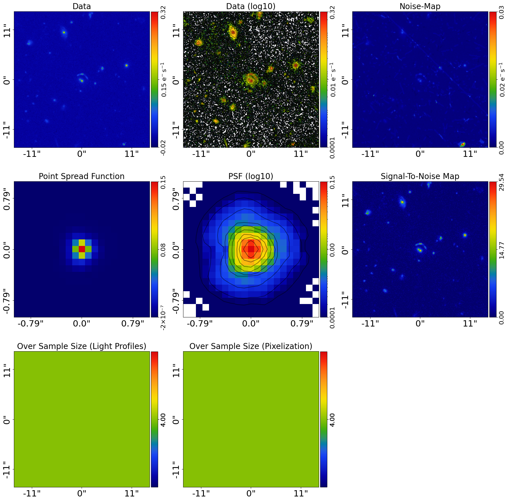
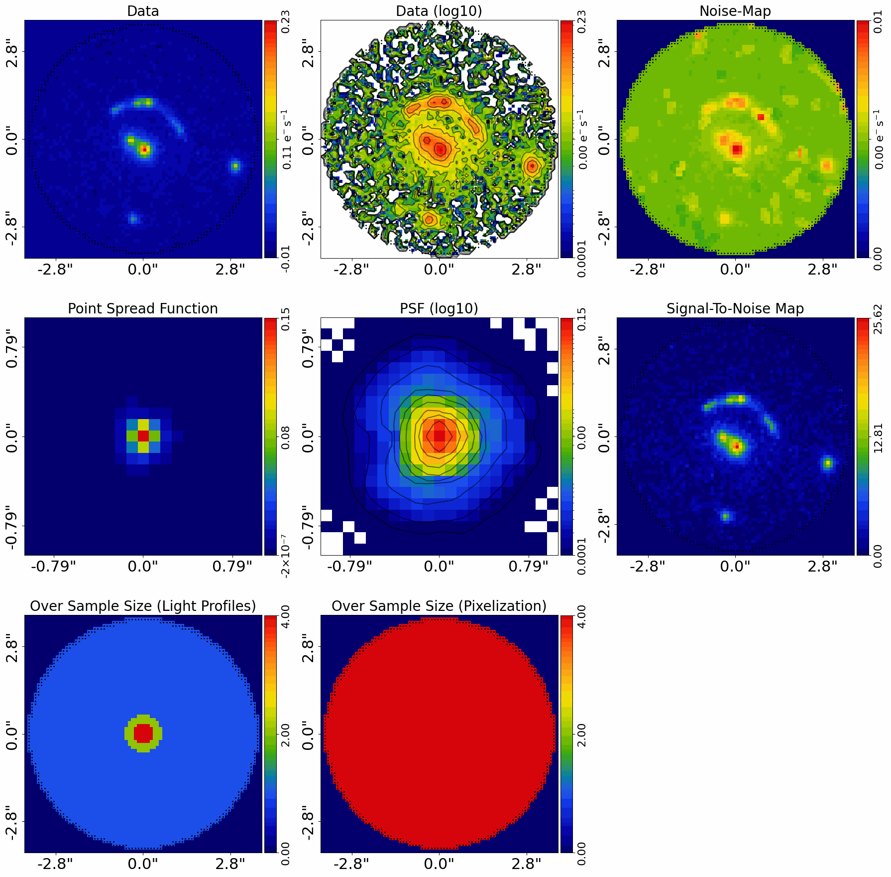
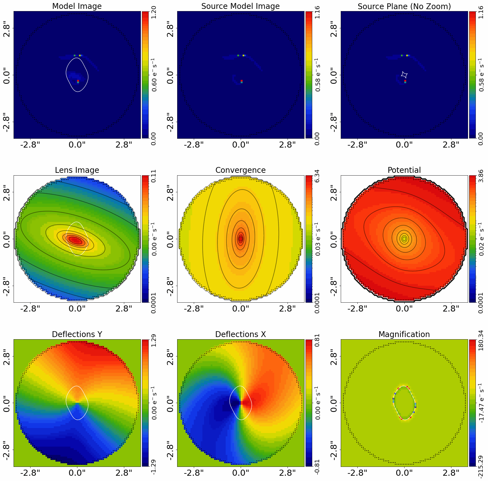
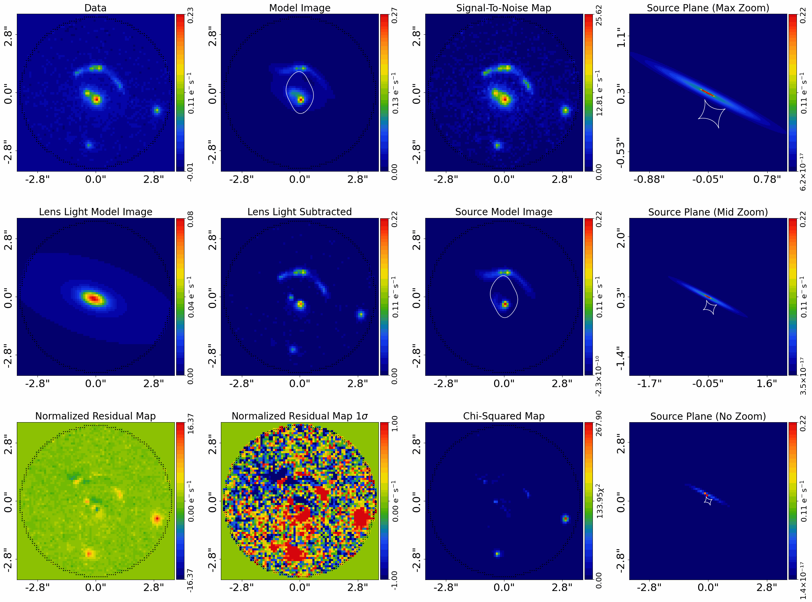

> ✏️ **This page is auto-generated from [`scripts/group/start_here.py`](../../scripts/group/start_here.py) — do not edit it directly.**
> It shows the example fully executed, with its real output images.
> Run it yourself via the [Python script](../../scripts/group/start_here.py) or the [Jupyter notebook](../../notebooks/group/start_here.ipynb).

Start Here: Group
=================

Group scale lenses typically have multiple lens galaxies whose light and mass all contribute significantly to the
lensing of the source galaxy. Groups typically also have just one lensed source.

This script shows you how to model a group lens system using **PyAutoLens** with as little setup
as possible. In about 15 minutes you'll be able to point the code at your own FITS files and
fit your first group-scale lens.

We focus on a *group-scale* lens (multiple lens galaxies nearby). If you have a single
lens galaxy, see the `start_here_imaging.ipynb` example, if your system has many lens and sources galaxies
see `start_here_cluster.ipynb` example.

This example uses Euclid CCD imaging data, but the workflow for interferometer data on group scale lenses is similar.
The lens has 2 main lens galaxies, so the model is not too complex, meaning this example runs in about 10 minutes on a
good GPU. More complex groups with more galaxies will take longer to fit, but the workflow is identical and
PyAutoLens can efficiently scale to these more complex systems.

__Contents__

- **JAX:** JAX acceleration for fast GPU/CPU model-fitting.
- **Google Colab Setup:** The introduction `start_here` examples are available on Google Colab, which allows you to run them.
- **Imports:** Import the required Python libraries.
- **Dataset:** Load and plot the strong lens dataset.
- **Main Lens Galaxies:** For a group-scale lens, we have multiple lens galaxies whose light and mass all contribute.
- **Masking:** Lens modeling does not need to fit the entire image, only the region containing lens and source.
- **Model:** Compose the lens model fitted to the data.
- **Model Fit:** Perform the model-fit using the search and analysis.
- **Live Visual Update:** Push the quick-update image to a live display surface.
- **Result:** Overview of the results of the model-fit.
- **Centre Input GUI:** The centres of the main lens galaxies above were loaded from a .json file, which was created using.
- **Model Your Own Lens:** If you have your own strong lens imaging data, you are now ready to model it yourself by adapting.
- **Wrap Up:** Summary of the script and next steps.

__JAX__

PyAutoLens runs group-scale model-fits on JAX by default — `al.AnalysisImaging`
auto-enables `use_jax=True` (JAX installs with `autolens` itself). Group fits
benefit substantially from GPU acceleration (the multi-galaxy deflection
sum is the dominant cost). Expect 5-30 minutes on GPU vs hours on pure
NumPy.

For the broader JAX principles, see the top-level
`autolens_workspace/start_here.py` `__JAX__` section. For per-dataset
simulator / fit / likelihood patterns shared with imaging, see
`scripts/imaging/start_here.py` and its companions.

__Google Colab Setup__

The introduction `start_here` examples are available on Google Colab, which allows you to run them in a web browser
without manual local PyAutoLens installation.

The code below sets up your environment if you are using Google Colab, including installing autolens and downloading
files required to run the notebook. If you are running this script not in Colab (e.g. locally on your own computer),
running the code will still check correctly that your environment is set up and ready to go.


```python

import subprocess
import sys

try:
    import google.colab

    subprocess.check_call(
        [sys.executable, "-m", "pip", "install", "autonerves", "--no-deps"]
    )
except ImportError:
    pass

from autonerves import setup_colab

setup_colab.for_autolens(
    raise_error_if_not_gpu=False  # Switch to False for CPU Google Colab
)
```

    
                You are not running in a Google Colab environment so cannot use the setup_colab() function.
    
                You should therefore have PyAutoLens installed locally in your environment already (e.g. via pip or
                conda) and can run the rest of your script normally.
    
                You may now continue running your script or Notebook.
                


__Imports__

Lets first import autolens, its plotting module and the other libraries we'll need.

You'll see these imports in the majority of workspace examples.


```python
from autolens import jax_wrapper  # Sets JAX environment before other imports

from autolens import setup_notebook; setup_notebook()

import numpy as np
from pathlib import Path

import autofit as af
import autolens as al
import autolens.plot as aplt
```

    Working Directory has been set to `autolens_workspace`


__Dataset__

We begin by loading the dataset. Three ingredients are needed for lens modeling:

1. The image itself (CCD counts).
2. A noise-map (per-pixel RMS noise).
3. The PSF (Point Spread Function).

Here we use HST imaging of a Euclid group-scale strong lens. Replace these FITS paths with your own to
immediately try modeling your data.

The `pixel_scales` value converts pixel units into arcseconds. It is critical you set this
correctly for your data.


```python
dataset_name = "102021990_NEG650312660474055399"
dataset_path = Path("dataset") / "group" / dataset_name

dataset = al.Imaging.from_fits(
    data_path=dataset_path / "data.fits",
    psf_path=dataset_path / "psf.fits",
    noise_map_path=dataset_path / "noise_map.fits",
    pixel_scales=0.1,
)

aplt.subplot_imaging_dataset(dataset=dataset)
```


    

    


__Main Lens Galaxies__

For a group-scale lens, we have multiple lens galaxies whose light and mass all contribute significantly to the
lensing of the source galaxy. We call these the "main lens galaxies" and model each one individually.

We load the centres of the main lens galaxies from a `.json` file contained in the dataset folder. These centres
are used to initialize the model for each lens galaxy.

After modeling the data, this example will provide a GUI for you to determine the centres of the lens galaxies in
your own data, if they are not already known.


```python
main_lens_centres = al.from_json(file_path=dataset_path / "main_lens_centres.json")
```

__Masking__

Lens modeling does not need to fit the entire image, only the region containing lens and
source light and all lens galaxies in the group. We therefore define a circular mask around all galaxies.

- Make sure the mask fully encloses the lensed arcs and all lens galaxies.
- Avoid masking too much empty sky, as this slows fitting without adding information.

We'll also oversample the central pixels of each galaxy, which improves modeling accuracy without adding
unnecessary cost far from the lens.


```python
mask_radius = 3.7

mask = al.Mask2D.circular(
    shape_native=dataset.shape_native,
    pixel_scales=dataset.pixel_scales,
    radius=mask_radius,
)

dataset = dataset.apply_mask(mask=mask)

# Over sampling is important for accurate lens modeling, but details are omitted
# for simplicity here, so don't worry about what this code is doing yet!

over_sample_size = al.util.over_sample.over_sample_size_via_radial_bins_from(
    grid=dataset.grid,
    sub_size_list=[4, 2, 1],
    radial_list=[0.3, 0.6],
    centre_list=list(main_lens_centres),
)

dataset = dataset.apply_over_sampling(over_sample_size_lp=over_sample_size)

aplt.subplot_imaging_dataset(dataset=dataset)
```

    2026-07-11 14:24:07,829 - autoarray.dataset.imaging.dataset - INFO - IMAGING - Data masked, contains a total of 4304 image-pixels


    

    


__Model__

To perform lens modeling we must define a lens model, describing the light profiles of the lens and source galaxies,
and the mass profile of each lens galaxy.

A brilliant lens model to start with is one which uses a Multi Gaussian Expansion (MGE) to model the lens and source
light, and a Singular Isothermal Ellipsoid (SIE) plus shear to model the lens mass.

Full details of why this model is so good are provided in the main workspace docs, but in a nutshell it
provides an excellent balance of being fast to fit, flexible enough to capture complex galaxy morphologies and
providing accurate fits to the vast majority of strong lenses. For group scale lenses, the MGE allows us to fit
the light of all lens galaxies without increasing the number of free parameters in the model.

__List-Based Model Composition__

For group-scale lenses, we compose the model using a list-based API. Each main lens galaxy is created in a loop
over the main lens galaxy centres, and stored in a dictionary as `lens_0`, `lens_1`, etc. This API scales naturally
to groups with any number of main lens galaxies.

Only the first lens galaxy (`lens_0`) carries an `ExternalShear`, as the group system has one overall external shear.

The MGE model composition API is quite long and technical, so we simply load the MGE models for the lens and source
below via a utility function `mge_model_from` which hides the API to make the code in this introduction example ready
to read. We then use the PyAutoLens Model API to compose the overall lens model.


```python
# Main Lens Galaxies:

lens_dict = {}

for i, centre in enumerate(main_lens_centres):

    bulge = al.model_util.mge_model_from(
        mask_radius=mask_radius,
        total_gaussians=20,
        centre_prior_is_uniform=True,
        centre=(centre[0], centre[1]),
    )

    mass = af.Model(al.mp.Isothermal)
    mass.centre = (centre[0], centre[1])

    lens_dict[f"lens_{i}"] = af.Model(
        al.Galaxy,
        redshift=0.5,
        bulge=bulge,
        mass=mass,
        shear=af.Model(al.mp.ExternalShear) if i == 0 else None,
    )

# Source:

bulge = al.model_util.mge_model_from(
    mask_radius=mask_radius,
    total_gaussians=20,
    gaussian_per_basis=1,
    centre_prior_is_uniform=False,
)

source = af.Model(al.Galaxy, redshift=1.0, bulge=bulge)

# Overall Lens Model:

model = af.Collection(galaxies=af.Collection(**lens_dict, source=source))
```

We can print the model to show the parameters that the model is composed of, which shows many of the MGE's fixed
parameter values the API above hided the composition of.

Note how each lens galaxy is listed as `lens_0`, `lens_1`, etc., reflecting the list-based API.


```python
print(model.info)
```

    Total Free Parameters = 13
    
    model                                                                           Collection (N=13)
        galaxies                                                                    Collection (N=13)
            lens_0                                                                  Galaxy (N=9)
                mass                                                                Isothermal (N=3)
                shear                                                               ExternalShear (N=2)
            source                                                                  Galaxy (N=4)
            lens_0 - source
                bulge                                                               Basis (N=4)
    ... [96 lines of output truncated] ...
                        sigma                                                       0.025369779750318466
                    11
                        sigma                                                       0.04413146722763604
                    12
                        sigma                                                       0.07676796640851673
                    13
                        sigma                                                       0.13354010271402503
                    14
                        sigma                                                       0.23229687937772373
                    15
                        sigma                                                       0.40408715488400954
                    16
                        sigma                                                       0.7029213185285339
                    17
                        sigma                                                       1.222752008001147
                    18
                        sigma                                                       2.127012559813468
                    19
                        sigma                                                       3.6999999999999997


__Model Fit__

We now fit the data with the lens model using the non-linear fitting method and nested sampling algorithm Nautilus.

This requires an `AnalysisImaging` object, which defines the `log_likelihood_function` used by Nautilus to fit
the model to the imaging data.

__JAX__

`AnalysisImaging` defaults to `use_jax=True`. Search driver wraps the
likelihood in `jax.vmap(jax.jit(...))`. Force NumPy with `use_jax=False`
(or `PYAUTO_DISABLE_JAX=1`) when debugging.

**Run Time Error:** On certain operating systems (e.g. Windows, Linux) and Python versions, the code below may produce
an error. If this occurs, see the `autolens_workspace/guides/modeling/bug_fix` example for a fix.

__Live Visual Update__

By default the quick-update image is only written to disk. Set `live_visual_update=True` to also push it to a
live display surface:

- **Python script** — a matplotlib window opens automatically and refreshes with each quick update, so you can
  watch the fit converge without leaving your terminal.
- **Jupyter / Colab notebook** — the cell that ran `search.fit(...)` shows a single self-updating image that
  refreshes in place every `iterations_per_quick_update`.

The disk write (`fit.png`) always happens regardless of this flag. Set it to `False` (the default) if you just
want the on-disk output, or if you are running in a headless environment (e.g. an HPC cluster).


```python
search = af.Nautilus(
    path_prefix=Path("group"),  # The path where results and output are stored.
    name="start_here",  # The name of the fit and folder results are output to.
    unique_tag=dataset_name,  # A unique tag which also defines the folder.
    n_live=150,  # The number of Nautilus "live" points, increase for more complex models.
    n_batch=50,  # GPU lens model fits are batched and run simultaneously, see modeling examples for details.
    iterations_per_full_update=100000,  # Every N iterations the results are written to hard-disk for inspection.
    live_visual_update=False,  # Set True to open a live matplotlib window (script) or refresh a Jupyter cell (notebook).
)

analysis = al.AnalysisImaging(
    dataset=dataset,
    use_jax=True,  # JAX will use GPUs for acceleration if available, else JAX will use multithreaded CPUs.
)
```

The code below begins the model-fit. This will take around 10 minutes with a GPU, or 20-30 minutes with a CPU.

**Run Time Error:** On certain operating systems (e.g. Windows, Linux) and Python versions, the code below may produce
an error. If this occurs, see the `autolens_workspace/guides/modeling/bug_fix` example for a fix.


```python
print(
    """
    The non-linear search has begun running.

    This Jupyter notebook cell with progress once the search has completed - this could take a few minutes!

    On-the-fly updates every iterations_per_quick_update are printed to the notebook.
    """
)

result = search.fit(model=model, analysis=analysis)

print("The search has finished run - you may now continue the notebook.")
```

    
        The non-linear search has begun running.
    
        This Jupyter notebook cell with progress once the search has completed - this could take a few minutes!
    
        On-the-fly updates every iterations_per_quick_update are printed to the notebook.
        
    2026-07-11 14:24:11,840 - autofit.non_linear.search.abstract_search - INFO - Starting non-linear search with JAX (CPU: cpu).


    2026-07-11 14:24:12,853 - start_here - INFO - The output path of this fit is autolens_workspace/output/group/102021990_NEG650312660474055399/start_here/21cbd57b7eacb5c6b4f21506e5248435


    2026-07-11 14:24:12,854 - start_here - INFO - Outputting pre-fit files (e.g. model.info, visualization).


    2026-07-11 14:24:14,101 - start_here - INFO - Starting new Nautilus non-linear search (no previous samples found).


    2026-07-11 14:24:14,104 - autofit.non_linear.fitness - INFO - JAX: Applying vmap and jit to likelihood function -- may take a few seconds.


    2026-07-11 14:24:14,104 - autofit.non_linear.fitness - INFO - JAX: vmap and jit applied in 0.0008857250213623047 seconds.


    2026-07-11 14:24:14,105 - autofit.non_linear.fitness - INFO - Warming up visualization (one-time JAX compilation)...


    2026-07-11 14:24:22,983 - autofit.non_linear.fitness - INFO - Visualization warm-up complete.


    2026-07-11 14:24:22,985 - start_here - INFO - Running search with JAX vectorization (parallelization handled by JAX).


    Starting the nautilus sampler...
    Please report issues at github.com/johannesulf/nautilus.
    Status    | Bounds | Ellipses | Networks | Calls    | f_live | N_eff | log Z    


    

    

    

    

    

    

    

    

    

    

    

    

    

    

    

    

    

    

    

    

    

    

    

    

    

    

    

    

    

    

    

    

    

    

    

    

    

    

    

    

    

    

    

    

    

    

    

    

    

    

    

    

    

    

    

    

    

    

    

    

    

    

    

    

    

    

    

    

    

    

    

    

    

    

    

    

    

    

    

    

    

    

    

    

    

    

    

    

    

    

    

    

    

    

    

    

    

    

    

    

    

    

    

    

    

    

    

    

    

    

    

    

    

    

    

    

    

    

    

    

    

    

    

    

    

    

    

    

    

    

    

    

    

    

    

    

    

    

    

    

    

    

    

    

    

    

    

    

    

    

    

    

    

    

    

    

    

    

    

    

    

    

    

    

    

    

    

    

    

    

    

    

    

    

    

    

    

    

    

    

    

    

    

    

    

    

    

    

    

    

    

    

    

    

    

    

    

    

    

    

    

    

    

    

    

    

    

    

    

    

    

    

    

    

    

    

    

    

    

    

    

    

    

    

    

    

    

    

    

    

    

    

    

    

    

    

    

    

    

    

    

    

    

    

    

    

    

    

    

    

    

    

    

    

    

    

    

    

    

    

    

    

    

    

    

    

    

    

    

    

    

    

    

    

    

    

    

    

    

    

    

    

    

    

    

    

    

    

    

    

    

    

    

    

    

    

    

    

    

    

    

    

    

    

    

    

    

    

    

    

    

    

    

    

    

    

    

    

    

    

    

    

    

    

    

    

    

    

    

    

    

    

    

    

    

    

    

    

    

    

    

    

    

    

    

    

    

    

    

    

    

    

    

    

    

    

    

    

    

    

    

    

    

    

    

    

    

    

    

    

    

    

    

    

    

    

    

    

    

    

    

    

    

    

    

    

    

    

    

    

    

    

    

    

    

    

    

    

    

    

    

    

    

    

    

    

    

    

    

    

    

    

    

    

    

    

    

    

    

    

    

    

    

    

    

    

    

    

    

    

    

    

    

    

    

    

    

    

    

    

    

    

    

    

    

    

    

    

    

    

    

    

    

    

    

    

    

    

    

    

    

    

    

    

    

    

    

    

    

    

    

    

    

    

    

    

    

    

    

    

    

    

    

    

    

    

    

    

    

    

    

    

    

    

    

    

    

    

    

    

    

    

    

    

    

    

    

    

    

    

    

    

    

    

    

    

    

    

    

    

    

    

    

    

    

    

    

    

    

    

    

    

    

    

    

    

    

    

    

    

    

    

    

    

    

    

    

    

    

    

    

    

    

    

    

    

    

    

    

    

    

    

    

    

    

    

    

    

    

    

    

    

    

    

    

    

    

    

    

    

    

    

    

    

    

    

    

    

    

    

    

    

    

    

    

    

    

    

    

    

    

    

    

    

    

    

    

    

    

    

    

    

    

    

    

    

    

    

    

    

    

    

    

    

    

    

    

    

    

    

    

    

    

    

    

    

    

    

    

    

    

    

    

    

    

    

    

    

    

    

    

    

    

    

    

    

    

    

    

    

    

    

    

    

    

    

    

    

    

    

    

    

    

    

    

    

    

    

    

    

    

    

    

    

    

    

    

    

    

    

    

    

    

    

    

    

    

    

    

    

    

    

    

    

    

    

    

    

    

    

    

    

    

    

    

    

    

    

    

    

    

    

    

    

    

    

    

    

    

    

    

    

    

    

    

    

    

    

    

    

    

    

    

    

    

    

    

    

    

    

    

    

    

    

    

    

    

    

    

    

    

    

    

    

    

    

    

    

    

    

    

    

    

    

    

    

    

    

    

    

    

    

    

    

    

    

    

    

    

    

    

    

    

    

    

    

    

    

    

    

    

    

    

    

    

    

    

    

    

    

    

    

    

    

    

    

    

    

    

    

    

    

    

    

    

    

    

    

    

    

    

    

    

    

    

    

    

    

    

    

    

    

    

    

    

    

    

    

    

    

    

    

    

    

    

    

    

    

    

    

    

    

    

    

    

    

    

    

    

    

    

    

    

    

    

    

    

    

    

    

    

    

    

    

    

    

    

    

    

    

    

    

    

    

    

    

    

    

    

    

    

    

    

    

    

    

    

    

    

    

    

    

    

    

    

    

    

    

    

    

    

    

    

    

    

    

    

    

    

    

    

    

    

    

    

    

    

    

    

    

    

    

    

    

    

    

    

    

    

    

    

    

    

    

    

    

    

    

    Finished  | 86     | 1        | 4        | 43650    | N/A    | 2232  | +16553.51
    2026-07-11 15:29:02,285 - start_here - INFO - Fit Running: Updating results (see output folder).


    2026-07-11 15:30:22,612 - autofit.non_linear.plot.plot_util - INFO - Unable to produce corner_anesthetic visual: posterior estimate not yet sufficient. Should succeed in a later update.


    Starting the nautilus sampler...
    Please report issues at github.com/johannesulf/nautilus.
    Status    | Bounds | Ellipses | Networks | Calls    | f_live | N_eff | log Z    
    Finished  | 86     | 1        | 4        | 43650    | N/A    | 2232  | +16553.51
    2026-07-11 15:30:32,856 - start_here - INFO - Fit Running: Updating results (see output folder).


    2026-07-11 15:30:43,564 - autofit.non_linear.samples.samples - INFO - Samples with weight less than 1e-10 removed from samples.csv.


    2026-07-11 15:30:44,086 - autofit.non_linear.search.updater - INFO - Creating latent samples by drawing 100 from the PDF.


    2026-07-11 15:30:44,095 - autofit.non_linear.analysis.latent - INFO - JAX: Applying per-sample jit to latent variables (LATENT_BATCH_MODE='jit') -- may take a few seconds on first sample.


    2026-07-11 15:30:44,096 - autofit.non_linear.analysis.latent - INFO - JAX: jit dispatch applied in 0.0013232231140136719 seconds.


    2026-07-11 15:30:50,531 - autolens.analysis.latent - WARNING - magzero not set on Analysis; 'total_lens_flux_mujy' latent will be NaN. Pass magzero=<value> to AnalysisImaging to enable it, or disable in config/latent.yaml to silence this warning.


    2026-07-11 15:30:50,532 - autolens.analysis.latent - WARNING - magzero not set on Analysis; 'total_lensed_source_flux_mujy' latent will be NaN. Pass magzero=<value> to AnalysisImaging to enable it, or disable in config/latent.yaml to silence this warning.


    2026-07-11 15:30:50,533 - autolens.analysis.latent - WARNING - magzero not set on Analysis; 'total_source_flux_mujy' latent will be NaN. Pass magzero=<value> to AnalysisImaging to enable it, or disable in config/latent.yaml to silence this warning.


    Time to compute latent variables: 36.70280647277832 seconds for 100 samples.


    2026-07-11 15:32:27,958 - autofit.non_linear.plot.plot_util - INFO - Unable to produce corner_anesthetic visual: posterior estimate not yet sufficient. Should succeed in a later update.


    2026-07-11 15:32:45,920 - start_here - INFO - Removing search internal folder.


    2026-07-11 15:32:45,926 - start_here - INFO - Removing all files except for .zip file


    2026-07-11 15:32:46,957 - start_here - INFO - Search complete, returning result


    The search has finished run - you may now continue the notebook.


    <Figure size 5200x5200 with 0 Axes>


    <Figure size 5200x5200 with 0 Axes>


__Result__

Now this is running you should checkout the `autolens_workspace/output` folder, where many results of the fit
are written in a human readable format (e.g. .json files) and .fits and .png images of the fit are stored.

When the fit is complex, we can print the results by printing `result.info`.


```python
print(result.info)
```

    Bayesian Evidence                                                               16553.50827453
    Maximum Log Likelihood                                                          16624.06790671
    
    model                                                                           Collection (N=13)
        galaxies                                                                    Collection (N=13)
            lens_0                                                                  Galaxy (N=9)
                mass                                                                Isothermal (N=3)
                shear                                                               ExternalShear (N=2)
            source                                                                  Galaxy (N=4)
            lens_0 - source
    ... [174 lines of output truncated] ...
                        sigma                                                       0.025369779750318466
                    11
                        sigma                                                       0.04413146722763604
                    12
                        sigma                                                       0.07676796640851673
                    13
                        sigma                                                       0.13354010271402503
                    14
                        sigma                                                       0.23229687937772373
                    15
                        sigma                                                       0.40408715488400954
                    16
                        sigma                                                       0.7029213185285339
                    17
                        sigma                                                       1.222752008001147
                    18
                        sigma                                                       2.127012559813468
                    19
                        sigma                                                       3.6999999999999997


The result also contains the maximum likelihood lens model which can be used to plot the best-fit lensing information
and fit to the data.


```python
aplt.subplot_tracer(tracer=result.max_log_likelihood_tracer, grid=result.grids.lp)

aplt.subplot_fit_imaging(fit=result.max_log_likelihood_fit)
```


    

    


    

    


The result object contains pretty much everything you need to do science with your own strong lens, but details
of all the information it contains are beyond the scope of this introductory script. The `guides` and `result`
packages of the workspace contains all the information you need to analyze your results yourself.

__Centre Input GUI__

The centres of the main lens galaxies above were loaded from a .json file, which was created using a GUI where one
simply clicks the centres of the galaxies on the image.

For your own group lens, if you do not know the centres of the galaxies already, you can use the GUI below
to do this yourself. It will output a .json file in the dataset folder you can then load and use in the model above.


```python
search_box_size = (
    3  # Size of the search box to find the brightest pixel around your click
)

try:
    clicker = al.Clicker(
        image=dataset.data,
        pixel_scales=dataset.pixel_scales,
        search_box_size=search_box_size,
    )

    main_lens_centres = clicker.start(
        data=dataset.data,
        pixel_scales=dataset.pixel_scales,
    )

    al.output_to_json(
        file_path=dataset_path / "main_lens_centres.json",
        obj=main_lens_centres,
    )
except Exception as e:
    print(
        """
        Problem loading GUI, probably an issue with TKinter or your matplotlib TKAgg backend.

        You will likely need to try and fix or reinstall various GUI / visualization libraries, or try
        running this example not via a Jupyter notebook.

        There are also manual tools for performing this task in the workspace.
        """
    )
    print()
    print(e)
```

    
            Problem loading GUI, probably an issue with TKinter or your matplotlib TKAgg backend.
    
            You will likely need to try and fix or reinstall various GUI / visualization libraries, or try
            running this example not via a Jupyter notebook.
    
            There are also manual tools for performing this task in the workspace.
            
    
    bad operand type for unary -: 'tuple'


__Model Your Own Lens__

If you have your own strong lens imaging data, you are now ready to model it yourself by adapting the code above
and simply inputting the path to your own .fits files into the `Imaging.from_fits()` function.

A few things to note, with full details on data preparation provided in the main workspace documentation:

- Supply your own CCD image, PSF, and RMS noise-map.
- Ensure the primary lens galaxy is roughly centered in the image.
- Double-check `pixel_scales` for your telescope/detector.
- Adjust the mask radius to include all relevant light.
- Provide the centres of all main lens galaxies in the group in a `main_lens_centres.json` file.
- Start with the default model -- it works very well for pretty much all groups!

__Wrap Up__

This script has shown how to model CCD imaging data of group-scale strong lenses, using the list-based model
composition API where each main lens galaxy is created in a loop and stored as `lens_0`, `lens_1`, etc.

Details of the **PyAutoLens** API and how lens modeling works were omitted for simplicity, but everything you need to
know is described throughout the main workspace documentation. You should check it out, but maybe you want to try and
model your own lens first!

The following locations of the workspace are good places to checkout next:

- `autolens_workspace/*/group/modeling`: A full description of the lens modeling API and how to customize your model-fits.
- `autolens_workspace/*/group/simulators`: A full description of the lens simulation API and how to customize your simulations.
- `autolens_workspace/*/group/data_preparation`: How to load and prepare your own imaging data for lens modeling.
- `autolens_workspace/guides/results`: How to load and analyze the results of your lens model fits, including tools for large samples.
- `autolens_workspace/guides`: A complete description of the API and information on lensing calculations and units.
- `autolens_workspace/group/features`: A description of advanced features for lens modeling, for example pixelized source reconstructions, read this once you're confident with the basics!


```python

```
