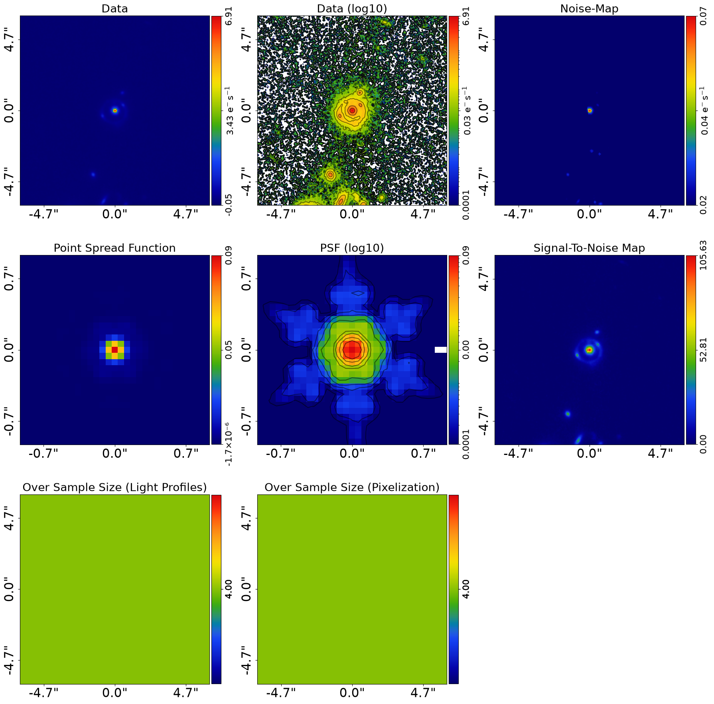
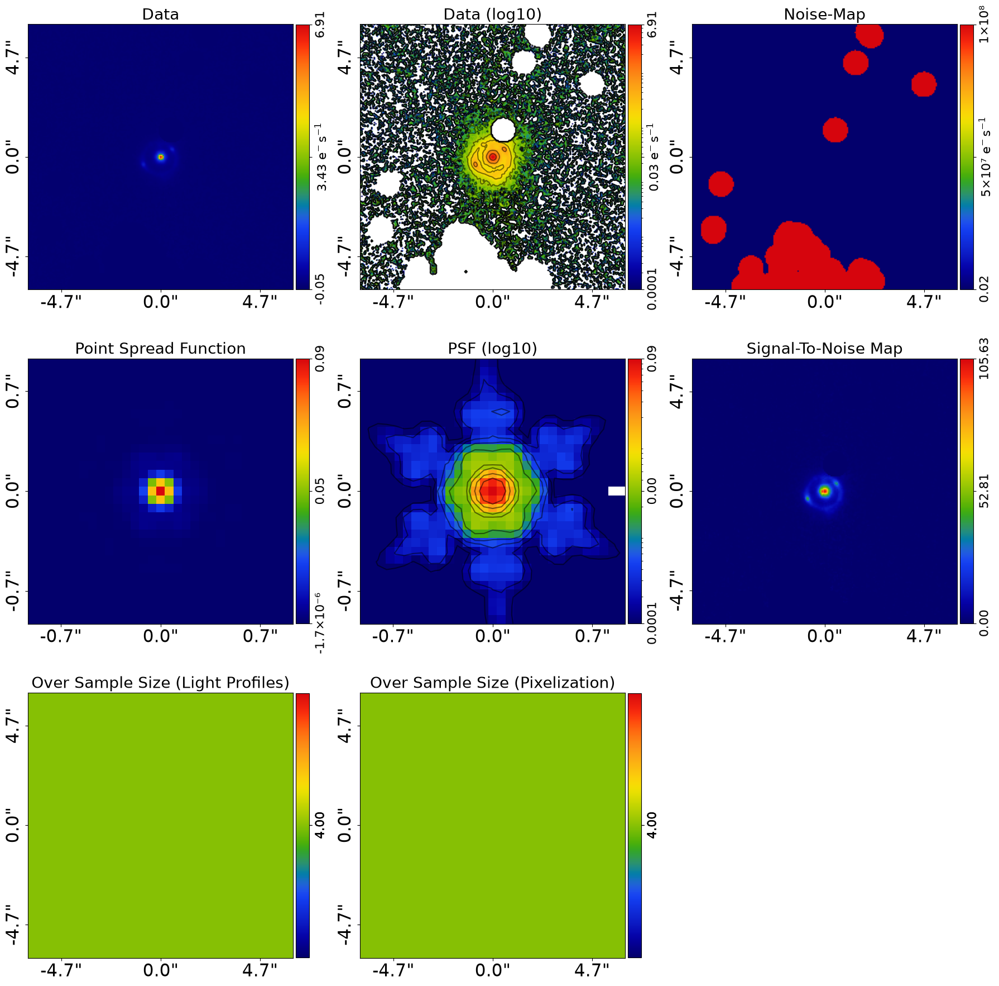
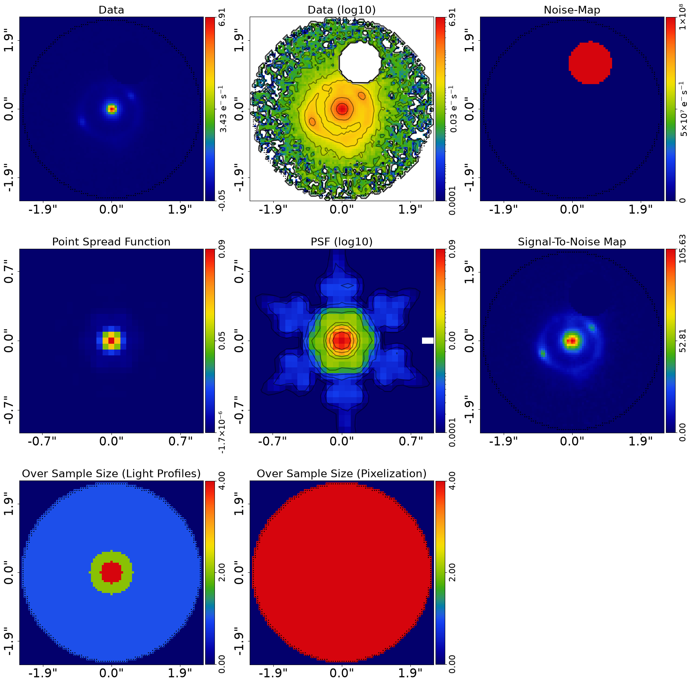
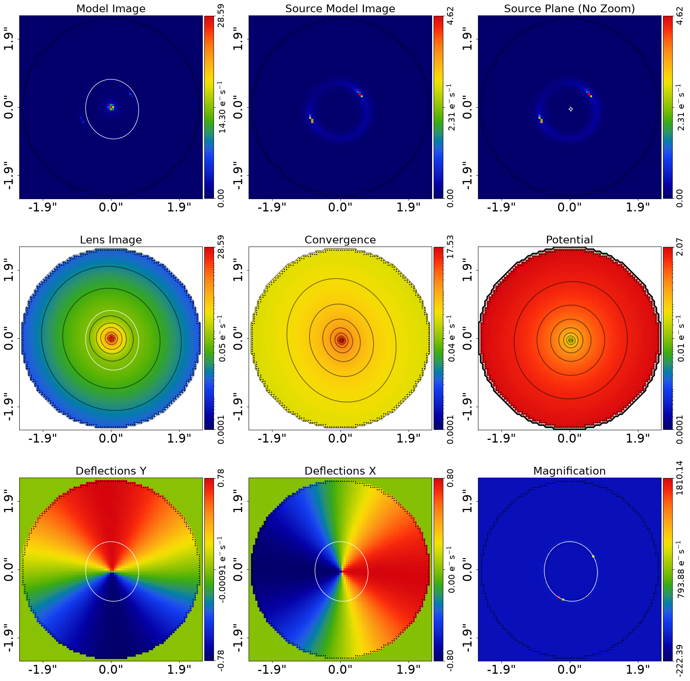
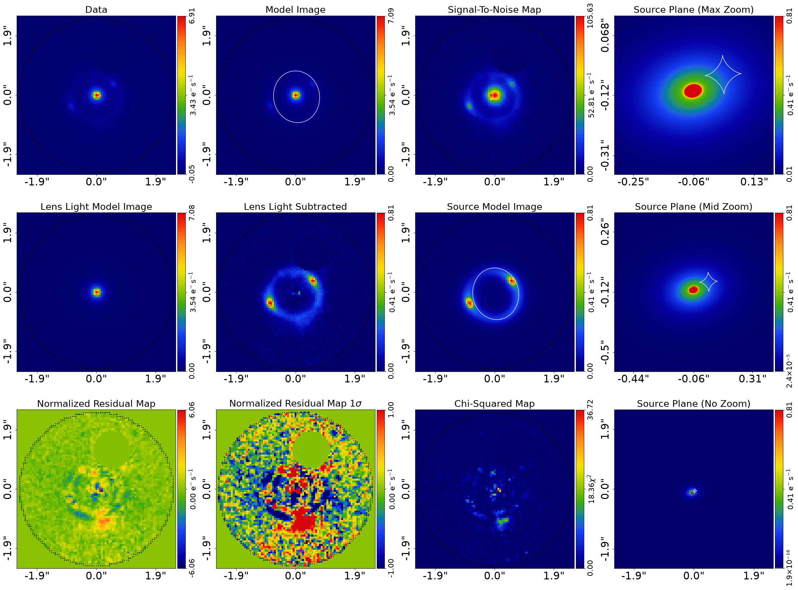
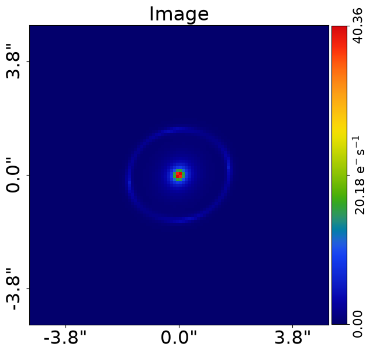
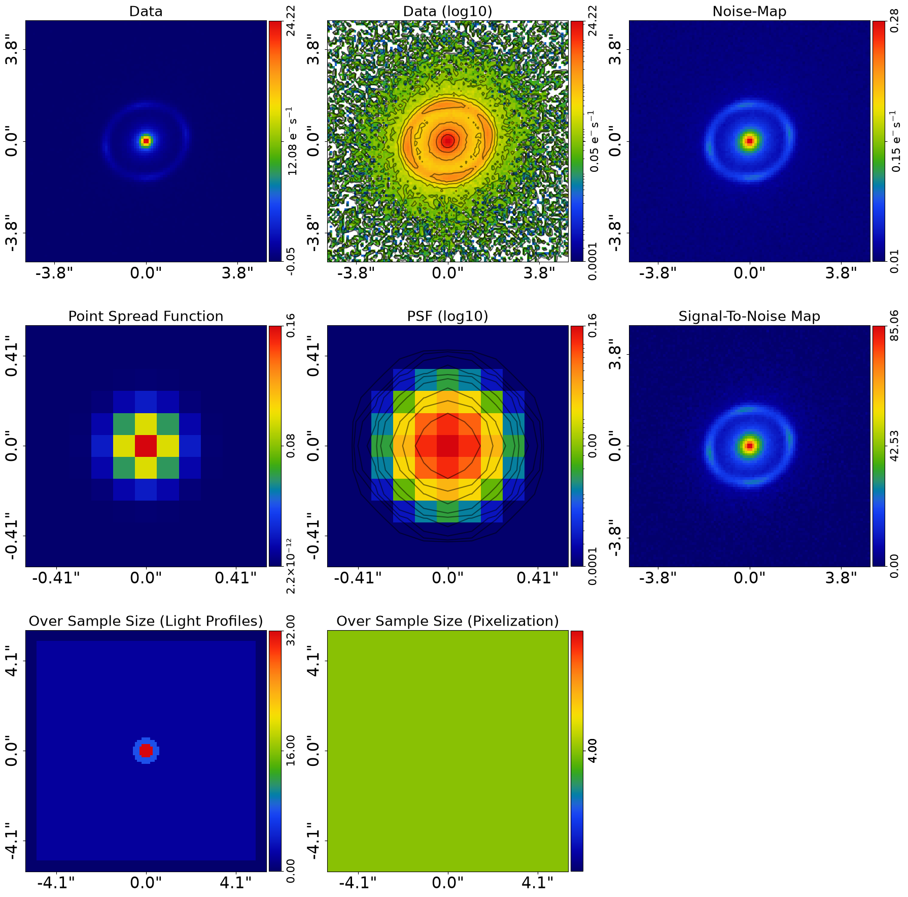
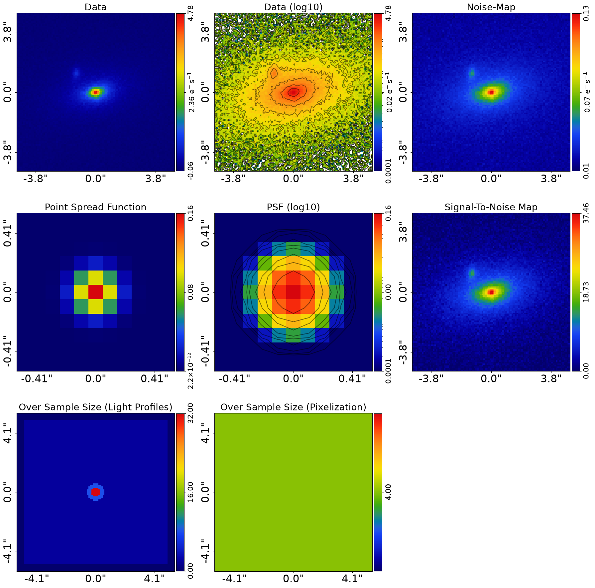
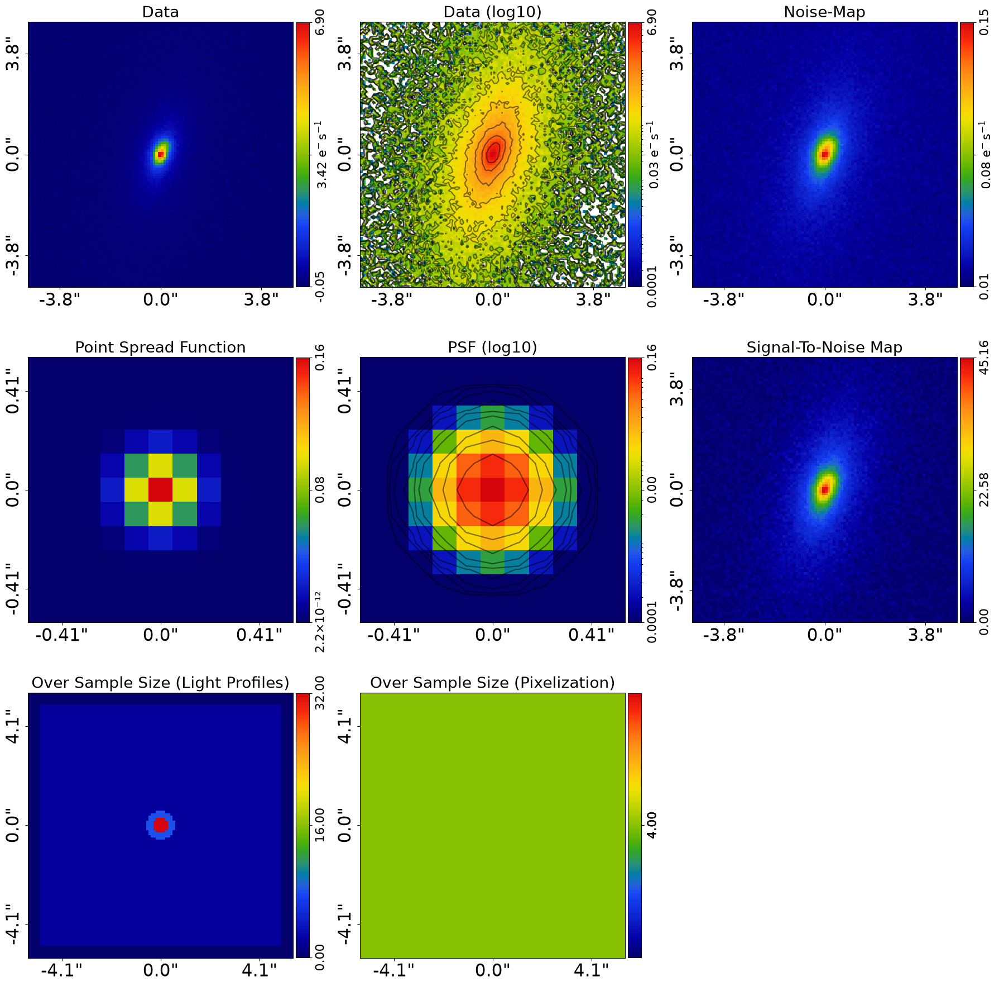
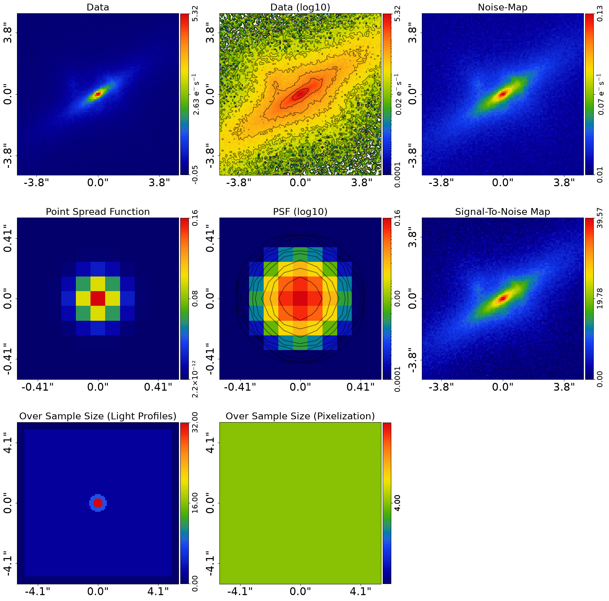

> ✏️ **This page is auto-generated from [`scripts/imaging/start_here.py`](../../scripts/imaging/start_here.py) — do not edit it directly.**
> It shows the example fully executed, with its real output images.
> Run it yourself via the [Python script](../../scripts/imaging/start_here.py) or the [Jupyter notebook](../../notebooks/imaging/start_here.ipynb).

Start Here: Imaging
===================

Strong gravitational lenses are often observed with CCD imaging, for example using HST, JWST,
or ground-based telescopes.

This script shows you how to model such a lens system using **PyAutoLens** with as little setup
as possible. In about 15 minutes you’ll be able to point the code at your own FITS files and
fit your first lens.

We focus on a *galaxy-scale* lens (a single lens galaxy). If you have multiple lens galaxies,
see the `start_here_group.ipynb` and `start_here_cluster.ipynb` examples.

__Contents__

- **JAX:** JAX acceleration for fast GPU/CPU model-fitting.
- **Google Colab Setup:** The introduction `start_here` examples are available on Google Colab, which allows you to run them.
- **Imports:** Import the required Python libraries.
- **Dataset:** Load and plot the strong lens dataset.
- **Extra Galaxy Removal:** There may be regions of an image that have signal near the lens and source that is from other.
- **Masking:** Lens modeling does not need to fit the entire image, only the region containing lens and source.
- **Model:** Compose the lens model fitted to the data.
- **Model Fit:** Perform the model-fit using the search and analysis.
- **Iterations Per Update:** Every `iterations_per_quick_update`, the non-linear search outputs the maximum likelihood model and.
- **Live Visual Update:** Opt-in live matplotlib window (scripts) or Jupyter cell refresh (notebooks) during the fit.
- **Result:** Overview of the results of the model-fit.
- **Extra Galaxy Removal GUI:** The model-fit above removed a region of the image to the south-east of the lens, which contains.
- **Model Your Own Lens:** If you have your own strong lens imaging data, you are now ready to model it yourself by adapting.
- **Simulator:** Let’s now switch gears and simulate our own strong lens imaging.
- **Sample:** Often we want to simulate *many* strong lenses — for example, to train a neural network or to.
- **Wrap Up:** Summary of the script and next steps.

__JAX__

PyAutoLens runs imaging model-fits on JAX by default. If you installed
`autolens[jax]`, the `al.AnalysisImaging(dataset=dataset)` line below
auto-enables `use_jax=True`; expect 10-30 minutes on CPU, 1-10 minutes on
GPU, vs 1-2 hours on pure NumPy for a typical lens. If you do not have a
GPU locally, Google Colab provides free GPUs.

For the broader JAX principles (when you write `@jax.jit` yourself, the
return-type contract, how to opt out for debugging), see the `__JAX__`
section of the top-level `autolens_workspace/start_here.py`. For a
runnable example of the user-written `@jax.jit + SimulatorImaging(use_jax=True)`
pattern, see the `__JAX Variant__` section at the end of
`scripts/imaging/simulator.py`.

__Google Colab Setup__

The introduction `start_here` examples are available on Google Colab, which allows you to run them in a web browser
without manual local PyAutoLens installation.

The code below sets up your environment if you are using Google Colab, including installing autolens and downloading
files required to run the notebook. If you are running this script not in Colab (e.g. locally on your own computer),
running the code will still check correctly that your environment is set up and ready to go.


```python

import subprocess
import sys

try:
    import google.colab

    subprocess.check_call(
        [sys.executable, "-m", "pip", "install", "autoconf", "--no-deps"]
    )
except ImportError:
    pass

from autoconf import setup_colab

setup_colab.for_autolens(
    raise_error_if_not_gpu=False  # Switch to False for CPU Google Colab
)
```

    
                You are not running in a Google Colab environment so cannot use the setup_colab() function.
    
                You should therefore have PyAutoLens installed locally in your environment already (e.g. via pip or
                conda) and can run the rest of your script normally.
    
                You may now continue running your script or Notebook.
                


__Imports__

Lets first import autolens, its plotting module and the other libraries we'll need.

You'll see these imports in the majority of workspace examples.


```python
from autoconf import jax_wrapper  # Sets JAX environment before other imports

from autoconf import setup_notebook; setup_notebook()

import numpy as np
from pathlib import Path

import autofit as af
import autolens as al
import autolens.plot as aplt
```

    Working Directory has been set to `autolens_workspace`


__Dataset__

We begin by loading the dataset. Three ingredients are needed for lens modeling:

1. The image itself (CCD counts).
2. A noise-map (per-pixel RMS noise).
3. The PSF (Point Spread Function).

Here we use James Webb Space Telescope imaging of a strong lens called the COSMOS-Web ring. Replace these FITS paths 
with your own to immediately try modeling your data.

The `pixel_scales` value converts pixel units into arcseconds. It is critical you set this
correctly for your data.


```python
dataset_name = "cosmos_web_ring"
dataset_path = Path("dataset") / "imaging" / dataset_name

# PSF convolution runs at the image resolution (sub size 1), which is the fastest
# option and accurate for well-sampled PSFs. Supplying a PSF at a multiple of the
# image resolution and raising this value improves blurring fidelity for
# undersampled PSFs (e.g. HST / Euclid VIS) at extra compute cost — see
# `guides/advanced/over_sampling.py` and the simulator's `__Oversampled PSF__` section.
psf_convolve_over_sample_size = 1

dataset = al.Imaging.from_fits(
    convolve_over_sample_size_lp=psf_convolve_over_sample_size,
    convolve_over_sample_size_pixelization=psf_convolve_over_sample_size,
    data_path=dataset_path / "data.fits",
    psf_path=dataset_path / "psf.fits",
    noise_map_path=dataset_path / "noise_map.fits",
    pixel_scales=0.06,
)

aplt.subplot_imaging_dataset(dataset=dataset)
```


    

    


__Extra Galaxy Removal__

There may be regions of an image that have signal near the lens and source that is from other galaxies not associated
with the strong lens we are studying. The emission from these images will impact our model fitting and needs to be
removed from the analysis.

This `mask_extra_galaxies` is used to prevent them from impacting a fit by scaling the RMS noise map values to
large values. This mask may also include emission from objects which are not technically galaxies,
but blend with the galaxy we are studying in a similar way. Common examples of such objects are foreground stars
or emission due to the data reduction process.

In this example, the noise is scaled over all regions of the image, even those quite far away from the strong lens
in the centre. We are next going to apply a 2.5" circular mask which means we only analyse the central region of
the image. It only in these central regions where for the actual lens analysis it matters that we scaled the noise.

After performing lens modeling to this strong lens, the script further down provides a GUI to create such a mask
for your own data, if necessary.


```python
mask_extra_galaxies = al.Mask2D.from_fits(
    file_path=dataset_path / "mask_extra_galaxies.fits",
    pixel_scales=dataset.pixel_scales,
    invert=True,
)

dataset = dataset.apply_noise_scaling(mask=mask_extra_galaxies)

aplt.subplot_imaging_dataset(dataset=dataset)
```

    2026-07-10 16:10:11,809 - autoarray.dataset.imaging.dataset - INFO - IMAGING - Data noise scaling applied, a total of 5725 pixels were scaled to large noise values.


    

    


__Masking__

Lens modeling does not need to fit the entire image, only the region containing lens and
source light. We therefore define a circular mask around the lens.

- Make sure the mask fully encloses the lensed arcs and the lens galaxy.
- Avoid masking too much empty sky, as this slows fitting without adding information.

We’ll also oversample the central pixels, which improves modeling accuracy without adding
unnecessary cost far from the lens.


```python
mask_radius = 2.5

mask = al.Mask2D.circular(
    shape_native=dataset.shape_native,
    pixel_scales=dataset.pixel_scales,
    radius=mask_radius,
)

dataset = dataset.apply_mask(mask=mask)

# Over sampling is important for accurate lens modeling, but details are omitted
# for simplicity here, so don't worry about what this code is doing yet!

over_sample_size = al.util.over_sample.over_sample_size_via_radial_bins_from(
    grid=dataset.grid,
    sub_size_list=[4, 2, 1],
    radial_list=[0.3, 0.6],
    centre_list=[(0.0, 0.0)],
)

dataset = dataset.apply_over_sampling(over_sample_size_lp=over_sample_size)

aplt.subplot_imaging_dataset(dataset=dataset)
```

    2026-07-10 16:10:14,983 - autoarray.dataset.imaging.dataset - INFO - IMAGING - Data masked, contains a total of 5449 image-pixels


    

    


__Model__

To perform lens modeling we must define a lens model, describing the light profiles of 
the lens and source galaxies, and the mass profile of the lens galaxy.

A brilliant lens model to start with is one which uses a Multi Gaussian Expansion (MGE) 
to model the lens and source light, and a Singular Isothermal Ellipsoid (SIE) plus 
shear to model the lens mass. 

Full details of why this models is so good are provided in the main workspace docs, 
but in a nutshell it  provides an excellent balance of being fast to fit, flexible 
enough to capture complex galaxy morphologies and providing accurate fits to the vast 
majority of strong lenses.

The MGE model composition API is quite long and technical, so we simply load the MGE 
models for the lens and source below via a utility function `mge_model_from` which 
hides the API to make the code in this introduction example ready to read. We then 
use the PyAutoLens Model API to compose the over lens model.


```python
# Lens:

bulge = al.model_util.mge_model_from(
    mask_radius=mask_radius, total_gaussians=20, centre_prior_is_uniform=True
)

mass = af.Model(al.mp.Isothermal)

shear = af.Model(al.mp.ExternalShear)

lens = af.Model(al.Galaxy, redshift=0.5, bulge=bulge, mass=mass, shear=shear)

# Source:

bulge = al.model_util.mge_model_from(
    mask_radius=mask_radius, total_gaussians=20, centre_prior_is_uniform=False
)

source = af.Model(al.Galaxy, redshift=1.0, bulge=bulge)

# Overall Lens Model:

model = af.Collection(galaxies=af.Collection(lens=lens, source=source))
```

We can print the model to show the parameters that the model is composed of, which shows many of the MGE's fixed
parameter values the API above hided the composition of.


```python
print(model.info)
```

    Total Free Parameters = 15
    
    model                                                                           Collection (N=15)
        galaxies                                                                    Collection (N=15)
            lens                                                                    Galaxy (N=11)
                mass                                                                Isothermal (N=5)
                shear                                                               ExternalShear (N=2)
            source                                                                  Galaxy (N=4)
            lens - source
                bulge                                                               Basis (N=4)
    ... [98 lines of output truncated] ...
                        sigma                                                       0.020639789690294032
                    11
                        sigma                                                       0.03517027745951032
                    12
                        sigma                                                       0.05993028200091701
                    13
                        sigma                                                       0.10212142070372625
                    14
                        sigma                                                       0.17401527605673328
                    15
                        sigma                                                       0.2965226697046549
                    16
                        sigma                                                       0.5052757185530644
                    17
                        sigma                                                       0.8609916807156944
                    18
                        sigma                                                       1.4671329870837333
                    19
                        sigma                                                       2.5


__Model Fit__

We now fit the data with the lens model using the non-linear fitting method and nested sampling algorithm Nautilus.

This requires an `AnalysisImaging` object, which defines the `log_likelihood_function` used by Nautilus to fit
the model to the imaging data.

__JAX__

`AnalysisImaging` defaults to `use_jax=True` when JAX is installed (set
explicitly below for clarity). The search driver wraps the likelihood in
`jax.vmap(jax.jit(...))` internally — batches of parameter vectors
evaluate in parallel on a single GPU call. Watch for `JAX: Applying vmap
and jit to likelihood function -- may take a few seconds.` in the log;
that's the JIT compile starting, after which evaluations re-use the
compiled trace.

Force NumPy with `use_jax=False` (or `PYAUTO_DISABLE_JAX=1`) when
debugging — NumPy stack traces are easier to read than JAX traces.

__Iterations Per Update__

Every `iterations_per_quick_update`, the non-linear search outputs the maximum likelihood model and its best fit
image to hard-disk (as `fit.png` in the output folder).

This process takes around ~10 seconds, so we don't want it to happen too often so as to slow down the overall
fit, but we also want it to happen frequently enough that we can track the progress.

The value of 1000 below means this output happens every few minutes on GPU and every ~10 minutes on CPU, a good balance.

__Live Visual Update__

By default the quick-update image is only written to disk. Set `live_visual_update=True` to also push it to a
live display surface:

- **Python script** — a matplotlib window opens automatically and refreshes with each quick update, so you can
  watch the fit converge without leaving your terminal.
- **Jupyter / Colab notebook** — the cell that ran `search.fit(...)` shows a single self-updating image that
  refreshes in place every `iterations_per_quick_update`.

The disk write (`fit.png`) always happens regardless of this flag. Set it to `False` (the default) if you just
want the on-disk output, or if you are running in a headless environment (e.g. an HPC cluster).


```python
search = af.Nautilus(
    path_prefix=Path("imaging"),  # The path where results and output are stored.
    name="start_here",  # The name of the fit and folder results are output to.
    unique_tag=dataset_name,  # A unique tag which also defines the folder.
    n_live=100,  # The number of Nautilus "live" points, increase for more complex models.
    n_batch=50,  # GPU lens model fits are batched and run simultaneously, see modeling examples for details.
    iterations_per_quick_update=1000,  # Every N iterations the max likelihood model is visualized and output to hard-disk.
    live_visual_update=True,  # Set True to open a live matplotlib window (script) or refresh a Jupyter cell (notebook).
)

analysis = al.AnalysisImaging(
    dataset=dataset,
    use_jax=True,  # JAX will use GPUs for acceleration if available, else JAX will use multithreaded CPUs.
)
```

The code below begins the model-fit. This will take around 10 minutes with a GPU, or 20-30 minutes with a CPU.

**Run Time Error:** On certain operating systems (e.g. Windows, Linux) and Python versions, the code below may produce 
an error. If this occurs, see the `autolens_workspace/guides/modeling/bug_fix` example for a fix.


```python
print(
    """
    The non-linear search has begun running.

    This Jupyter notebook cell with progress once the search has completed - this could take a few minutes!

    On-the-fly updates every iterations_per_quick_update are printed to the notebook.
    """
)

result = search.fit(model=model, analysis=analysis)

print("The search has finished run - you may now continue the notebook.")
```

    
        The non-linear search has begun running.
    
        This Jupyter notebook cell with progress once the search has completed - this could take a few minutes!
    
        On-the-fly updates every iterations_per_quick_update are printed to the notebook.
        
    2026-07-10 16:10:23,953 - autofit.non_linear.search.abstract_search - INFO - Starting non-linear search with JAX (CPU: cpu).


    2026-07-10 16:10:26,422 - start_here - INFO - The output path of this fit is autolens_workspace/output/imaging/cosmos_web_ring/start_here/d6f2ac254997c057526619cd8c341292


    2026-07-10 16:10:27,004 - start_here - INFO - Fit Already Completed: skipping non-linear search.


    2026-07-10 16:10:27,551 - start_here - INFO - Removing search internal folder.


    2026-07-10 16:10:27,554 - start_here - INFO - Removing all files except for .zip file


    2026-07-10 16:10:28,483 - start_here - INFO - Search complete, returning result


    The search has finished run - you may now continue the notebook.


__Result__

Now this is running you should checkout the `autolens_workspace/output` folder, where many results of the fit
are written in a human readable format (e.g. .json files) and .fits and .png images of the fit are stored.

When the fit is complex, we can print the results by printing `result.info`.


```python
print(result.info)
```

    Bayesian Evidence                                                               8004.98165215
    Maximum Log Likelihood                                                          8083.48795743
    
    model                                                                           Collection (N=15)
        galaxies                                                                    Collection (N=15)
            lens                                                                    Galaxy (N=11)
                mass                                                                Isothermal (N=5)
                shear                                                               ExternalShear (N=2)
            source                                                                  Galaxy (N=4)
            lens - source
    ... [183 lines of output truncated] ...
                        sigma                                                       0.020639789690294032
                    11
                        sigma                                                       0.03517027745951032
                    12
                        sigma                                                       0.05993028200091701
                    13
                        sigma                                                       0.10212142070372625
                    14
                        sigma                                                       0.17401527605673328
                    15
                        sigma                                                       0.2965226697046549
                    16
                        sigma                                                       0.5052757185530644
                    17
                        sigma                                                       0.8609916807156944
                    18
                        sigma                                                       1.4671329870837333
                    19
                        sigma                                                       2.5


The result also contains the maximum likelihood lens model which can be used to plot the best-fit lensing information
and fit to the data.


```python
aplt.subplot_tracer(tracer=result.max_log_likelihood_tracer, grid=result.grids.lp)

aplt.subplot_fit_imaging(fit=result.max_log_likelihood_fit)
```


    

    


    

    


The result object contains pretty much everything you need to do science with your own strong lens, but details
of all the information it contains are beyond the scope of this introductory script. The `guides` and `result` 
packages of the workspace contains all the information you need to analyze your results yourself.

__Extra Galaxy Removal GUI__

The model-fit above removed a region of the image to the south-east of the lens, which contains light from
another galaxy not associated with the strong lens system.

This GUI below provides the tool you need to produce such a mask for your own data, if necessary, with which you can
then use the `apply_noise_scaling` function.


```python
cmap = "jet"

try:
    scribbler = al.Scribbler(
        image=dataset.data.native,
        cmap=cmap,
        brush_width=0.04,
        mask_overlay=mask,
    )
    mask = scribbler.show_mask()
    mask = al.Mask2D(mask=mask, pixel_scales=dataset.pixel_scales)

    data = dataset.data.apply_mask(mask=mask)

    aplt.fits_array(
        array=mask,
        file_path=dataset_path / "mask_extra_galaxies.fits",
        overwrite=True,
    )
except Exception as e:
    print(
        """
        Problem loading GUI, probably an issue with TKinter or your matplotlib TKAgg backend.

        You will likely need to try and fix or reinstall various GUI / visualization libraries, or try
        running this example not via a Jupyter notebook.

        There are also manual tools for performing this task in the workspace.
        """
    )
    print()
    print(e)
```

    
            Problem loading GUI, probably an issue with TKinter or your matplotlib TKAgg backend.
    
            You will likely need to try and fix or reinstall various GUI / visualization libraries, or try
            running this example not via a Jupyter notebook.
    
            There are also manual tools for performing this task in the workspace.
            
    
    No module named 'tkinter'


__Model Your Own Lens__

If you have your own strong lens imaging data, you are now ready to model it yourself by adapting the code above
and simply inputting the path to your own .fits files into the `Imaging.from_fits()` function.

A few things to note, with full details on data preparation provided in the main workspace documentation:

- Supply your own CCD image, PSF, and RMS noise-map.
- Ensure the lens galaxy is roughly centered in the image.
- Double-check `pixel_scales` for your telescope/detector.
- Adjust the mask radius to include all relevant light.
- Remove extra light from galaxies and other objects using the extra galaxies mask GUI above.
- Start with the default model — it works very well for pretty much all galaxy scale lenses!

__Simulator__

Let’s now switch gears and simulate our own strong lens imaging. This is a great way to:

- Practice lens modeling before using real data.
- Build large training sets (e.g. for machine learning).
- Test lensing theory in a controlled environment.

To do this we need to define a 2D grid of (y,x) coordinates in the image-plane. This grid is
where we’ll evaluate the light from the lens and source galaxies.


```python
grid = al.Grid2D.uniform(
    shape_native=(100, 100),
    pixel_scales=0.1,
)

over_sample_size = al.util.over_sample.over_sample_size_via_radial_bins_from(
    grid=grid,
    sub_size_list=[32, 8, 2],
    radial_list=[0.3, 0.6],
    centre_list=[(0.0, 0.0)],
)

grid = grid.apply_over_sampling(over_sample_size=over_sample_size)
```

We now define a `Tracer` — this is the key object that combines all galaxies in the system
and computes how light rays are deflected.

- The lens galaxy has both light (a Sersic bulge) and mass (an isothermal profile + shear).
- The source galaxy has its own light (a SersicCore profile).

Together they define a strong lens system. The tracer will “ray-trace” our grid through
this mass distribution and generate a lensed image.


```python
lens_galaxy = al.Galaxy(
    redshift=0.5,
    bulge=al.lp.Sersic(
        centre=(0.0, 0.0),
        ell_comps=al.convert.ell_comps_from(axis_ratio=0.9, angle=45.0),
        intensity=2.0,
        effective_radius=0.6,
        sersic_index=3.0,
    ),
    mass=al.mp.Isothermal(
        centre=(0.0, 0.0),
        einstein_radius=1.6,
        ell_comps=al.convert.ell_comps_from(axis_ratio=0.9, angle=45.0),
    ),
    shear=al.mp.ExternalShear(gamma_1=0.05, gamma_2=0.05),
)

source_galaxy = al.Galaxy(
    redshift=1.0,
    bulge=al.lp.SersicCore(
        centre=(0.0, 0.0),
        ell_comps=al.convert.ell_comps_from(axis_ratio=0.8, angle=60.0),
        intensity=4.0,
        effective_radius=0.1,
        sersic_index=1.0,
    ),
)

tracer = al.Tracer(galaxies=[lens_galaxy, source_galaxy])
```

Plotting the tracer’s image gives us a “perfect” view of the strong lens system, before
adding telescope effects.


```python
aplt.plot_array(array=tracer.image_2d_from(grid=grid), title="Image")
```


    

    


The image can be saved to .fits for later use.


```python
image = tracer.image_2d_from(grid=grid)

al.output_to_fits(
    values=image.native,
    file_path=Path("image.fits"),
    overwrite=True,
)
```

__Simulator__

The images above do not represent real CCD imaging data, as they do not include the blurring due to the telescope 
optics or sources of noise.

The `SimulatorImaging` class simulates these two key properties of real imaging data, which we use below to create
realistic imaging of the strong lens system.

The units of the image are arbitrary, with the workspace providing guides on how to convert to physical units for lens
simulations.

The code below performs the simulation, plots the simulated imaging data and outputs it to .fits files with .png
files included for easy visualization.


```python
psf = al.Convolver.from_gaussian(
    shape_native=(11, 11),  # The 2D shape of the PSF array.
    sigma=0.1,  # The size of the Gaussian PSF, where FWHM = 2.35 * sigma.
    pixel_scales=grid.pixel_scales,  # The pixel scale of the PSF, matches the image's pixel scale.
)

simulator = al.SimulatorImaging(
    exposure_time=300.0,  # The exposure time of the observation, increases the S/N of the image.
    psf=psf,  # The PSF which blurs the image.
    background_sky_level=0.1,  # The background sky level of the image, increases the noise.
    add_poisson_noise_to_data=True,  # Whether Poisson noise is added to the image or not.
)

dataset = simulator.via_tracer_from(tracer=tracer, grid=grid)

aplt.subplot_imaging_dataset(dataset=dataset)

dataset_path = Path("dataset") / "imaging" / "simulated_lens"

aplt.fits_imaging(
    dataset=dataset,
    data_path=dataset_path / "data.fits",
    psf_path=dataset_path / "psf.fits",
    noise_map_path=dataset_path / "noise_map.fits",
    overwrite=True,
)

```


    

    


We can now inspect the simulated dataset: image, noise-map, and PSF. These can also be
written to FITS files and visualized as PNGs. This is exactly the same format as real data,
so you can immediately try fitting the simulated dataset with the modeling workflow above.


```python
aplt.subplot_imaging_dataset(dataset=dataset)
aplt.plot_array(array=dataset.data, title="Data")
```


    

    


    

    


__Sample__

Often we want to simulate *many* strong lenses — for example, to train a neural network
or to explore population-level statistics.

This uses the model composition API to define the distribution of the light and mass profiles
of the lens and source galaxies we draw from. The model composition is a little too complex for
the first example, thus we use a helper function to create a simple lens and source model.

We then generate 3 lenses for speed, and plot their images so you can see the variety of lenses
we create.

Each lens is simulated as if it were observed with CD imaging, therefore with a PSF and noise-map.


```python
print(al.model_util.SIMULATOR_RANDOM_LENS_SUMMARY)
```

    Each simulated strong lens draws fresh truths from: lens bulge SNR in [20, 60] (when included), lens mass einstein_radius in [0.2, 1.8] with normal-clipped ellipticity, external shear ~ Normal(0, 0.05), source bulge SNR in [10, 30] / point-source flux in [0.0, 2.0] (mode dependent).


We now simulate a sample of strong lens, we just do 3 for efficiency here but you can increase this to any number.


```python
total_datasets = 3

for sample_index in range(total_datasets):

    lens_galaxy, source_galaxy = al.model_util.random_galaxies_for_simulation_from()

    tracer = al.Tracer(galaxies=[lens_galaxy, source_galaxy])

    dataset = simulator.via_tracer_from(tracer=tracer, grid=grid)

    aplt.subplot_imaging_dataset(dataset=dataset)
```


    

    


    

    


    

    


__Wrap Up__

This script has shown how to model CCD imaging data of strong lenses, and simulate your own strong lens images.

Details of the **PyAutoLens** API and how lens modeling and simulations actually work were omitted for simplicity,
but everything you need to know is described throughout the main workspace documentation. You should check it out,
but maybe you want to try and model your own lens first!

The following locations of the workspace are good places to checkout next:

- `autolens_workspace/*/imaging/modeling`: A full description of the lens modeling API and how to customize your model-fits.
- `autolens_workspace/*/imaging/simulator`: A full description of the lens simulation API and how to customize your simulations.
- `autolens_workspace/*/imaging/data_preparation`: How to load and prepare your own imaging data for lens modeling.
- `autolens_workspace/*/imaging/source_science`: Performing source science calculations like computing the unlensed source's total flux and magnification.
- `autolens_workspace/guides/results`: How to load and analyze the results of your lens model fits, including tools for large samples.
- `autolens_workspace/guides`: A complete description of the API and information on lensing calculations and units.
- `autolens_workspace/imaging/features`: A description of advanced features for lens modeling, for example pixelized source reconstructions, read this once you're confident with the basics!


```python

```
