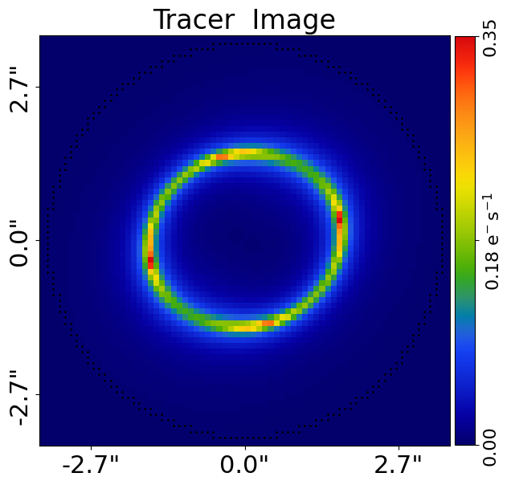
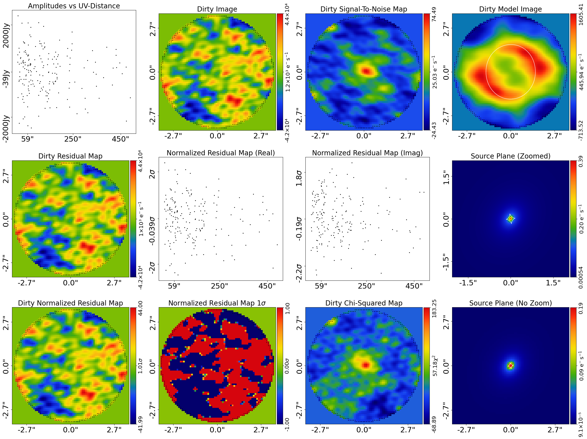
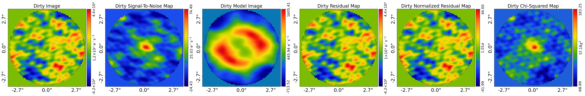
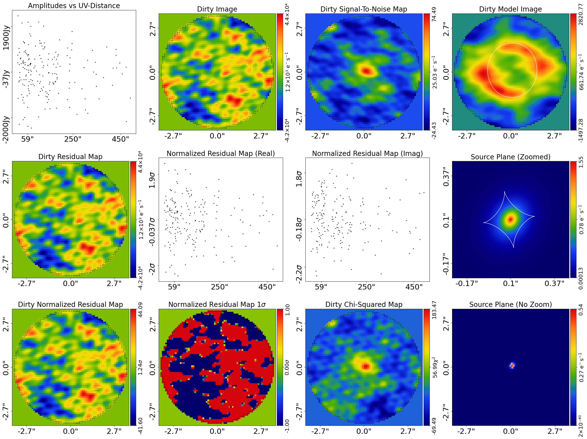
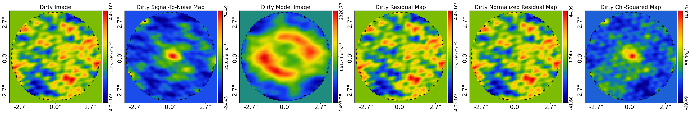

> ✏️ **This page is auto-generated from [`scripts/interferometer/fit.py`](../../scripts/interferometer/fit.py) — do not edit it directly.**
> It shows the example fully executed, with its real output images.
> Run it yourself via the [Python script](../../scripts/interferometer/fit.py) or the [Jupyter notebook](../../notebooks/interferometer/fit.ipynb).

Fits
====

This guide shows how to fit data using the `FitInterferometer` object, including visualizing and interpreting its results.

References
----------

This example uses functionality described fully in other examples in the `guides` package:

- `guides/plot`: Using the plotting API (`aplt.plot_array`, `aplt.subplot_fit_interferometer`, etc.) to visualize figures.
- `guides/units`: The source code unit conventions (e.g. arc seconds for distances and how to convert to physical units).
- `guides/data_structures`: The bespoke data structures used to store 1D and 2d arrays.

__Contents__

- **Mask:** Define the 2D mask applied to the dataset for the model-fit.
- **Loading Data:** We we begin by loading the strong lens dataset `simple` from .fits files, which is the dataset we.
- **Fitting:** Fit the lens model to the dataset and inspect the results.
- **Bad Fit:** A bad lens model will show features in the residual-map and chi-squared map.
- **Fit Quantities:** The maximum log likelihood fit contains many 1D and 2D arrays showing the fit.
- **Figures of Merit:** There are single valued floats which quantify the goodness of fit.
- **Plane Quantities:** The `FitInterferometer` object has specific quantities which break down each image of each plane.
- **Outputting Results:** You may wish to output certain results to .fits files for later inspection.

__JAX__

`FitInterferometer` runs on either NumPy or JAX. For the standard
analysis-driven path — where `AnalysisInterferometer` auto-enables
`use_jax=True` and the search driver handles the JIT — see `start_here.py`
/ `modeling.py`. For the JIT-it-yourself path around individual library
methods, see `scripts/guides/lens_calc.py`.


```python

from autoconf import jax_wrapper  # Sets JAX environment before other imports

from autoconf import setup_notebook; setup_notebook()

import numpy as np
from pathlib import Path
import autolens as al
import autolens.plot as aplt
```

    2026-07-10 19:41:40,728 - matplotlib.font_manager - WARNING - Matplotlib is building the font cache; this may take a moment.


    2026-07-10 19:41:41,886 - matplotlib.font_manager - INFO - Failed to extract font properties from /usr/share/fonts/truetype/noto/NotoColorEmoji.ttf: Can not load face (unknown file format; error code 0x2)


    2026-07-10 19:41:43,971 - matplotlib.font_manager - INFO - generated new fontManager


    Working Directory has been set to `autolens_workspace`


__Mask__

We define the ‘real_space_mask’ which defines the grid the image the strong lens is evaluated using.


```python
mask_radius = 3.5

real_space_mask = al.Mask2D.circular(
    shape_native=(256, 256),
    pixel_scales=0.1,
    radius=mask_radius,
)
```

__Loading Data__

We we begin by loading the strong lens dataset `simple` from .fits files, which is the dataset 
we will use to demonstrate fitting.

This includes the method used to Fourier transform the real-space image of the strong lens to the uv-plane and
compare directly to the visibilities. We use `TransformerNUFFT`, the JAX-native Non-Uniform Fast Fourier Transform
backed by `nufftax`, which scales efficiently from a few hundred visibilities to tens of millions.

This dataset was simulated using the `interferometer/simulator` example, read through that to understand how
the data this example fits was generated.


```python
dataset_name = "simple"
dataset_path = Path("dataset") / "interferometer" / dataset_name
```

__Dataset Auto-Simulation__

If the dataset does not already exist on your system, it will be created by running the corresponding
simulator script. This ensures that all example scripts can be run without manually simulating data first.


```python
if not dataset_path.exists():
    import subprocess
    import sys

    subprocess.run(
        [sys.executable, "scripts/interferometer/simulator.py"],
        check=True,
    )

dataset = al.Interferometer.from_fits(
    data_path=dataset_path / "data.fits",
    noise_map_path=dataset_path / "noise_map.fits",
    uv_wavelengths_path=dataset_path / "uv_wavelengths.fits",
    real_space_mask=real_space_mask,
    transformer_class=al.TransformerNUFFT,
)
```

The `aplt.subplot_interferometer_dirty_images` contains a subplot which plots all the key properties of the dataset simultaneously.

This includes the observed visibility data, RMS noise map and other information.


```python
aplt.subplot_interferometer_dirty_images(dataset=dataset)
```


    

    


Visibility data is in uv space, making it hard to interpret by eye.

The dirty images of the interferometer dataset can plotted, which use the transformer of the interferometer 
to map the visibilities, noise-map or other quantity to a real-space image.


```python

# %%
'''
__Fitting__

Following the previous overview example, we can make a tracer from a collection of light profiles, mass profiles
and galaxies.

The combination of light and mass profiels below is the same as those used to generate the simulated 
dataset we loaded above.

It therefore produces a tracer whose image looks exactly like the dataset.
'''
```


    '\n__Fitting__\n\nFollowing the previous overview example, we can make a tracer from a collection of light profiles, mass profiles\nand galaxies.\n\nThe combination of light and mass profiels below is the same as those used to generate the simulated \ndataset we loaded above.\n\nIt therefore produces a tracer whose image looks exactly like the dataset.\n'


```python
lens_galaxy = al.Galaxy(
    redshift=0.5,
    mass=al.mp.Isothermal(
        centre=(0.0, 0.0),
        einstein_radius=1.6,
        ell_comps=al.convert.ell_comps_from(axis_ratio=0.9, angle=45.0),
    ),
    shear=al.mp.ExternalShear(gamma_1=0.05, gamma_2=0.05),
)

source_galaxy = al.Galaxy(
    redshift=1.0,
    bulge=al.lp.SersicCore(
        centre=(0.0, 0.0),
        ell_comps=al.convert.ell_comps_from(axis_ratio=0.8, angle=60.0),
        intensity=0.3,
        effective_radius=1.0,
        sersic_index=2.5,
    ),
)

tracer = al.Tracer(galaxies=[lens_galaxy, source_galaxy])
```

Because the tracer's light and mass profiles are the same used to make the dataset, its image is nearly the same as the
observed image.

We can plot the image of the tracer to confirm this, noting that for a tracer its images are always in real space
(not Fourier space like the interferometer dataset) and therefore they can be directly visualized.


```python
aplt.plot_array(array=tracer.image_2d_from(grid=dataset.grid), title="Tracer  Image")
```


    

    


However, the tracer's image is not what we observe in the interferometer dataset, because we observe the image as
visibilities in the uv-plane. 

To compare directly to the data, we therefore need to Fourier transform the tracer's image to the uv-plane. 

We do this by creating a `FitInterferometer` object, which performs this Fourier transform as part of the fitting 
procedure.

The code plots the result of this, by using the `model_data` of the fit, which performs this Fourier transform 
on the tracer image above and plots the result visibilities in uv-space.


```python
fit = al.FitInterferometer(dataset=dataset, tracer=tracer)

```

The visibilities are again hard to interpret by eye, so we can plot the dirty image of the fit's model data. This 
dirty image is the Fourier transform of the fit's model data (therefore the Fourier transform of the tracer's image) and
can be compared directly to the image of the tracer above (albeit it still has the interferometer's PSF/dirty beam
convolved with it).


```python
fit = al.FitInterferometer(dataset=dataset, tracer=tracer)

```

The fit does a lot more than just Fourier transform the tracer's image it also creates the following:

 - The `residual_map`: The `model_data` visibilities subtracted from the observed dataset`s `data` visibilities.
 - The `normalized_residual_map`: The `residual_map `divided by the observed dataset's `noise_map`.
 - The `chi_squared_map`: The `normalized_residual_map` squared.

For a good lens model where the model and tracer are representative of the strong lens system the
residuals, normalized residuals and chi-squareds are minimized:


```python

# %%
'''
A subplot can be plotted which contains all of the above quantities, as well as other information contained in the
tracer such as the source-plane image, a zoom in of the source-plane and a normalized residual map where the colorbar
goes from 1.0 sigma to -1.0 sigma, to highlight regions where the fit is poor.
'''
```


    '\nA subplot can be plotted which contains all of the above quantities, as well as other information contained in the\ntracer such as the source-plane image, a zoom in of the source-plane and a normalized residual map where the colorbar\ngoes from 1.0 sigma to -1.0 sigma, to highlight regions where the fit is poor.\n'


```python
aplt.subplot_fit_interferometer(fit=fit)
```


    

    


Once again, dirty images are often easier to interpret, so we can plot a subplot of the dirty images of the data, model
data, residuals and chi-squared.


```python
aplt.subplot_fit_dirty_images(fit=fit)
```


    

    


The fit also provides us with a ``log_likelihood``, a single value quantifying how good the tracer fitted the dataset.

Lens modeling, describe in the next overview example, effectively tries to maximize this log likelihood value.


```python
print(fit.log_likelihood)
```

    -3142.931119801864


__Bad Fit__

A bad lens model will show features in the residual-map and chi-squared map.

We can produce such an image by creating a tracer with different lens and source galaxies. In the example below, we 
change the centre of the source galaxy from (0.0, 0.0) to (0.05, 0.05), which leads to residuals appearing
in the fit.


```python
lens_galaxy = al.Galaxy(
    redshift=0.5,
    mass=al.mp.Isothermal(
        centre=(0.1, 0.1),
        einstein_radius=1.6,
        ell_comps=al.convert.ell_comps_from(axis_ratio=0.9, angle=45.0),
    ),
    shear=al.mp.ExternalShear(gamma_1=0.05, gamma_2=0.05),
)

source_galaxy = al.Galaxy(
    redshift=1.0,
    bulge=al.lp.Sersic(
        centre=(0.1, 0.1),
        ell_comps=al.convert.ell_comps_from(axis_ratio=0.8, angle=60.0),
        intensity=0.3,
        effective_radius=0.1,
        sersic_index=1.0,
    ),
)

tracer = al.Tracer(galaxies=[lens_galaxy, source_galaxy])
```

A new fit using this plane shows residuals, normalized residuals and chi-squared which are non-zero. 


```python
fit = al.FitInterferometer(dataset=dataset, tracer=tracer)

aplt.subplot_fit_interferometer(fit=fit)
aplt.subplot_fit_dirty_images(fit=fit)
```


    

    


    

    


We also note that its likelihood decreases.


```python
print(fit.log_likelihood)
```

    -3143.1647083926764


__Fit Quantities__

The maximum log likelihood fit contains many 1D and 2D arrays showing the fit.

There is a `model_data`, which is the image-plane visibilities of the tracer.

This is the image that is fitted to the data in order to compute the log likelihood and therefore quantify the 
goodness-of-fit.

If you are unclear on what `slim` means, refer to the section `Data Structure` at the top of this example.


```python
print(fit.model_data)
```

    Visibilities([-2.45177817e+01+16.64384782j,  8.22122456e+00 -4.66397709j,
           -6.14840866e+00-12.63166004j, -1.03221056e+01-14.8858394j ,
            1.23106867e+00 +7.69683431j, -1.72880304e+00 +4.94737412j,
           -1.20535925e+01 -8.94838325j, -1.41340858e+01+15.79453553j,
           -7.72646997e+00 +5.9698396j ,  3.81259057e+01+16.05874494j,
            6.42793654e-01 -3.14829845j, -5.12738088e+01+17.2594893j ,
           -4.83918557e+00-14.32968678j, -7.56365671e+00 -8.75540174j,
            2.01843085e+00 +6.12343549j, -2.07150618e+00-11.27612612j,
            8.25332320e+00 +3.40078304j,  1.69541369e+00 -2.6262642j ,
            9.11513752e+00 -3.70288203j, -1.89926868e+00 -1.59151025j,
    ... [66 lines of output truncated] ...
            1.00403468e-01 +3.86626774j, -3.47381013e+00 -7.00886966j,
            8.64200378e+01 +1.84560257j, -2.69577962e+01 +8.30199688j,
            7.33637261e+01 +3.91602048j,  1.99738802e+01 +1.49517706j,
            1.99664736e+00 +4.77249203j,  2.67000533e+01 +2.85056283j,
            1.01860846e+02 -3.88419512j, -3.87275934e+01 +9.15386648j,
            9.32835911e+01 -3.51183286j,  8.39301671e+00 +0.08250127j,
            1.30630335e+01 +2.3211526j , -3.34708484e+01 -3.75585407j,
           -3.62441216e+01-14.1406417j , -3.03727473e+01-11.05555399j,
            2.16689930e+01 +3.15642532j, -1.86761803e+01 -4.66502838j,
            6.35446153e+01 +4.65274673j,  1.03446368e+02 +4.75050848j,
           -5.42954713e+01-15.53949546j, -2.10791558e+01 -1.54719419j,
           -4.92993513e+01+16.21893896j,  8.56985592e+01 +1.49476244j,
            5.67454669e+01 +4.25800473j,  3.38400274e+01 -2.10032285j,
            7.60351368e+01 -4.64675633j, -3.64404512e+01-12.19900631j,
            5.69201016e+00 +3.54360906j,  1.50366856e+00 -6.10995175j,
            8.88173389e+01 +1.81534815j, -2.15674123e+01 +7.1229567j ,
            7.64566206e+01 +4.05632209j,  2.52387053e+01 +1.60211425j,
            7.34602971e+00 +3.83929552j,  3.15550927e+01 +2.33818454j,
            1.03333255e+02 -3.81036147j, -3.89680931e+01 +9.02369314j])


There are numerous ndarrays showing the goodness of fit: 

 - `residual_map`: Residuals = (Data - Model_Data).
 - `normalized_residual_map`: Normalized_Residual = (Data - Model_Data) / Noise
 - `chi_squared_map`: Chi_Squared = ((Residuals) / (Noise)) ** 2.0 = ((Data - Model)**2.0)/(Variances)


```python
print(fit.residual_map.slim)
print(fit.normalized_residual_map.slim)
print(fit.chi_squared_map.slim)
```

    Visibilities([  637.29439801 -691.91043046j, -1813.37828258-1094.82826471j,
           -1159.53482444 +964.48057801j,   705.12685993 -398.20795205j,
             171.44166697 +937.28904511j,  -877.2505378  -780.29486974j,
              13.66017956 +729.78938348j,  -647.62733077  +92.64232901j,
             904.00068676-1165.205023j  ,   -63.53752331 -757.57374438j,
            1033.68029598 +656.94217678j,    -9.82442097 +494.25680324j,
             142.31645145  +62.44759717j,   461.84971189-2492.45574293j,
           -1185.93026825 -647.301729j  ,   377.66017393  +16.53131074j,
           -1853.1014848  -438.16840354j,   673.11701093-1624.63312187j,
             141.61555701 -755.08689362j,  -815.4594783  -554.58930176j,
    ... [256 lines of output truncated] ...
           7.26158880e-02+5.70709422e-02j, 1.33545919e-01+3.68758278e-01j,
           6.34210688e-01+2.02094759e+00j, 1.11866944e+00+9.43201464e-01j,
           6.95209407e-02+9.79146150e-01j, 3.74009611e-01+3.14996089e-04j,
           1.45717619e+00+5.86928908e-01j, 1.21199033e-01+1.21872593e+00j,
           1.36087712e+00+4.85058166e-01j, 3.07663295e-01+1.43620140e+00j,
           2.18491647e-01+8.50261078e-01j, 6.30267427e-01+8.22281841e-01j,
           1.87071062e+00+2.95318377e-01j, 5.58386560e+00+2.91816071e-03j,
           7.13643082e-01+1.96406891e+00j, 4.95969646e-01+1.46280605e+00j,
           1.97890774e-01+1.89655642e+00j, 2.41227014e+00+7.36233856e-01j,
           1.44308774e-01+3.25783271e-01j, 4.66037146e-01+2.35896384e+00j,
           2.60980658e-02+2.73158090e-01j, 4.24385553e-01+3.32074211e-05j,
           2.51967536e+00+5.66520620e-03j, 9.33784120e-01+1.40871823e-01j,
           1.01833363e+00+6.69648075e-01j, 1.53170963e+00+2.69115165e-01j,
           2.74090660e-01+1.03629438e-01j, 5.27167929e-02+1.53582337e+00j,
           3.96431581e+00+7.27627091e-01j, 1.01099667e-02+3.88592349e-01j,
           5.22639317e+00+3.51113849e-01j, 3.83783036e-03+1.16123085e-02j,
           4.42435629e-03+8.04525401e-03j, 1.36903125e-01+2.48515587e+00j,
           1.47237423e+00+1.25192980e+00j, 3.16066898e-01+5.64206516e+00j,
           5.60969076e+00+3.07905586e-01j, 1.72375603e-01+7.42978773e-01j])


There are `dirty` variants of the above maps, which transform the visibilities, residual-map, chi squared and other
values to to real-space images using the interferometer's transformer.

These real space images can be mapped between their `slim` and `native` representations (see the
`guides/data_structures` example for more information on these terms).


```python
print(fit.dirty_image.slim)  # Data
print(fit.dirty_model_image.slim)
print(fit.dirty_residual_map.slim)
print(fit.dirty_normalized_residual_map.slim)
print(fit.dirty_chi_squared_map.slim)
```

    Array2D([19255.87698335, 20318.3303464 , 18619.62628761, ...,
            -570.28599511, -2022.30123173, -2268.81594271], shape=(3852,))
    Array2D([-270.07810712, -209.58913155, -168.11414926, ..., -614.52786016,
           -542.5963223 , -473.84880848], shape=(3852,))


    Array2D([19525.95509047, 20527.91947794, 18787.74043686, ...,
              44.24186505, -1479.70490943, -1794.96713423], shape=(3852,))


    Array2D([19.52595509, 20.52791948, 18.78774044, ...,  0.04424187,
           -1.47970491, -1.79496713], shape=(3852,))


    Array2D([  5.19905349,   3.87036034,   3.26317979, ..., -13.43734744,
           -13.11841146, -12.92071325], shape=(3852,))


__Figures of Merit__

There are single valued floats which quantify the goodness of fit:

 - `chi_squared`: The sum of the `chi_squared_map`.

 - `noise_normalization`: The normalizing noise term in the likelihood function 
    where [Noise_Term] = sum(log(2*pi*[Noise]**2.0)).

 - `log_likelihood`: The log likelihood value of the fit where [LogLikelihood] = -0.5*[Chi_Squared_Term + Noise_Term].
 
These sum other both the real and imaginary components of the visibilities to give a single value for each quantity.


```python
print(fit.chi_squared)
print(fit.noise_normalization)
print(fit.log_likelihood)
```

    338.0421195233772
    5948.287297261975
    -3143.1647083926764


__Plane Quantities__

The `FitInterferometer` object has specific quantities which break down each image of each plane:

 - `model_visibilities_of_planes_list`: Model-images of each individual plane, which in this example is a model image of the 
 lens galaxy and model image of the lensed source galaxy, both corresponding to dirty images.

 - `subtracted_images_of_planes_list`: Subtracted images of each individual plane, which are the data's image with
   all other plane's model-images subtracted. For example, the first subtracted image has the source galaxy's model image
   subtracted and therefore is of only the lens galaxy's emission. The second subtracted image is of the lensed source,
   with the lens galaxy's light removed.

For multi-plane lens systems these lists will be extended to provide information on every individual plane.


```python
print(fit.model_visibilities_of_planes_list[1].slim)
```

    Visibilities([-2.45177817e+01+16.64384782j,  8.22122456e+00 -4.66397709j,
           -6.14840866e+00-12.63166004j, -1.03221056e+01-14.8858394j ,
            1.23106867e+00 +7.69683431j, -1.72880304e+00 +4.94737412j,
           -1.20535925e+01 -8.94838325j, -1.41340858e+01+15.79453553j,
           -7.72646997e+00 +5.9698396j ,  3.81259057e+01+16.05874494j,
            6.42793654e-01 -3.14829845j, -5.12738088e+01+17.2594893j ,
           -4.83918557e+00-14.32968678j, -7.56365671e+00 -8.75540174j,
            2.01843085e+00 +6.12343549j, -2.07150618e+00-11.27612612j,
            8.25332320e+00 +3.40078304j,  1.69541369e+00 -2.6262642j ,
            9.11513752e+00 -3.70288203j, -1.89926868e+00 -1.59151025j,
    ... [66 lines of output truncated] ...
            1.00403468e-01 +3.86626774j, -3.47381013e+00 -7.00886966j,
            8.64200378e+01 +1.84560257j, -2.69577962e+01 +8.30199688j,
            7.33637261e+01 +3.91602048j,  1.99738802e+01 +1.49517706j,
            1.99664736e+00 +4.77249203j,  2.67000533e+01 +2.85056283j,
            1.01860846e+02 -3.88419512j, -3.87275934e+01 +9.15386648j,
            9.32835911e+01 -3.51183286j,  8.39301671e+00 +0.08250127j,
            1.30630335e+01 +2.3211526j , -3.34708484e+01 -3.75585407j,
           -3.62441216e+01-14.1406417j , -3.03727473e+01-11.05555399j,
            2.16689930e+01 +3.15642532j, -1.86761803e+01 -4.66502838j,
            6.35446153e+01 +4.65274673j,  1.03446368e+02 +4.75050848j,
           -5.42954713e+01-15.53949546j, -2.10791558e+01 -1.54719419j,
           -4.92993513e+01+16.21893896j,  8.56985592e+01 +1.49476244j,
            5.67454669e+01 +4.25800473j,  3.38400274e+01 -2.10032285j,
            7.60351368e+01 -4.64675633j, -3.64404512e+01-12.19900631j,
            5.69201016e+00 +3.54360906j,  1.50366856e+00 -6.10995175j,
            8.88173389e+01 +1.81534815j, -2.15674123e+01 +7.1229567j ,
            7.64566206e+01 +4.05632209j,  2.52387053e+01 +1.60211425j,
            7.34602971e+00 +3.83929552j,  3.15550927e+01 +2.33818454j,
            1.03333255e+02 -3.81036147j, -3.89680931e+01 +9.02369314j])


There is also a `galaxy_model_visibilities_dict` which maps each galaxy in the tracer to its model visibilities.


```python
print(fit.galaxy_model_visibilities_dict[source_galaxy].slim)
```

    Visibilities([-2.45177817e+01+16.64384782j,  8.22122456e+00 -4.66397709j,
           -6.14840866e+00-12.63166004j, -1.03221056e+01-14.8858394j ,
            1.23106867e+00 +7.69683431j, -1.72880304e+00 +4.94737412j,
           -1.20535925e+01 -8.94838325j, -1.41340858e+01+15.79453553j,
           -7.72646997e+00 +5.9698396j ,  3.81259057e+01+16.05874494j,
            6.42793654e-01 -3.14829845j, -5.12738088e+01+17.2594893j ,
           -4.83918557e+00-14.32968678j, -7.56365671e+00 -8.75540174j,
            2.01843085e+00 +6.12343549j, -2.07150618e+00-11.27612612j,
            8.25332320e+00 +3.40078304j,  1.69541369e+00 -2.6262642j ,
            9.11513752e+00 -3.70288203j, -1.89926868e+00 -1.59151025j,
    ... [66 lines of output truncated] ...
            1.00403468e-01 +3.86626774j, -3.47381013e+00 -7.00886966j,
            8.64200378e+01 +1.84560257j, -2.69577962e+01 +8.30199688j,
            7.33637261e+01 +3.91602048j,  1.99738802e+01 +1.49517706j,
            1.99664736e+00 +4.77249203j,  2.67000533e+01 +2.85056283j,
            1.01860846e+02 -3.88419512j, -3.87275934e+01 +9.15386648j,
            9.32835911e+01 -3.51183286j,  8.39301671e+00 +0.08250127j,
            1.30630335e+01 +2.3211526j , -3.34708484e+01 -3.75585407j,
           -3.62441216e+01-14.1406417j , -3.03727473e+01-11.05555399j,
            2.16689930e+01 +3.15642532j, -1.86761803e+01 -4.66502838j,
            6.35446153e+01 +4.65274673j,  1.03446368e+02 +4.75050848j,
           -5.42954713e+01-15.53949546j, -2.10791558e+01 -1.54719419j,
           -4.92993513e+01+16.21893896j,  8.56985592e+01 +1.49476244j,
            5.67454669e+01 +4.25800473j,  3.38400274e+01 -2.10032285j,
            7.60351368e+01 -4.64675633j, -3.64404512e+01-12.19900631j,
            5.69201016e+00 +3.54360906j,  1.50366856e+00 -6.10995175j,
            8.88173389e+01 +1.81534815j, -2.15674123e+01 +7.1229567j ,
            7.64566206e+01 +4.05632209j,  2.52387053e+01 +1.60211425j,
            7.34602971e+00 +3.83929552j,  3.15550927e+01 +2.33818454j,
            1.03333255e+02 -3.81036147j, -3.89680931e+01 +9.02369314j])


A dictionary which maps the model images of each galaxy is also available.

These are not the dirty images, but instead the images of each galaxy that come from the tracer object
(e.g. simply evaluating the tracer's image on the interferometer's real-space grid).


```python
print(fit.galaxy_image_dict[source_galaxy].slim)
```

    Array2D([2.35559298e-15, 4.13155988e-15, 6.94297735e-15, ...,
           6.25832186e-16, 4.08084305e-16, 2.55271132e-16], shape=(3852,))


__Outputting Results__

You may wish to output certain results to .fits files for later inspection. 

For example, one could output the lens light subtracted image of the lensed source galaxy to a .fits file such that
we could fit this source-only image again with an independent pipeline.


```python
source_model_image = fit.galaxy_image_dict[source_galaxy]
aplt.fits_array(
    array=source_model_image,
    file_path=dataset_path / "source_model_image.fits",
    overwrite=True,
)
```

Fin.


```python

```
