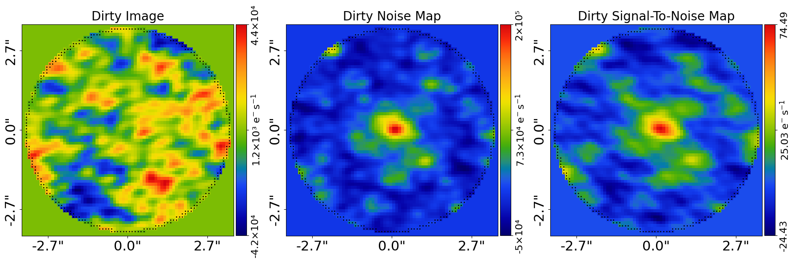
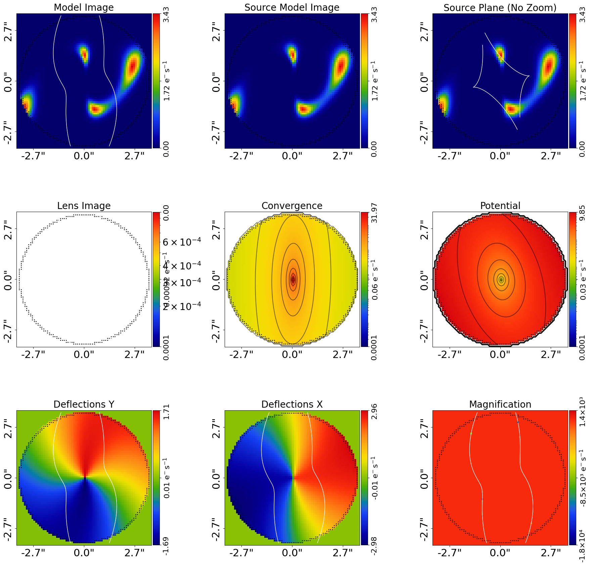
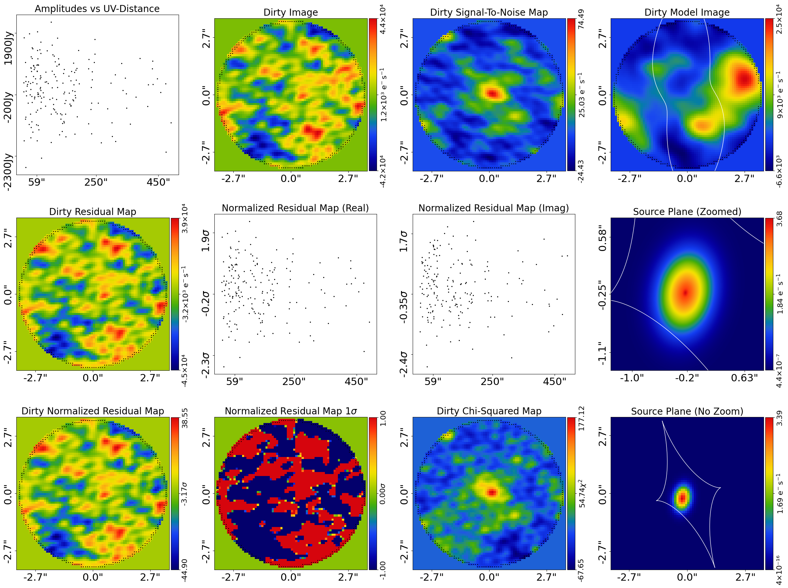
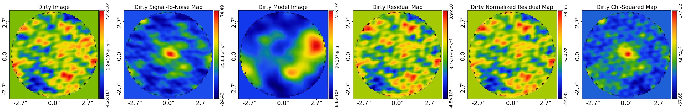
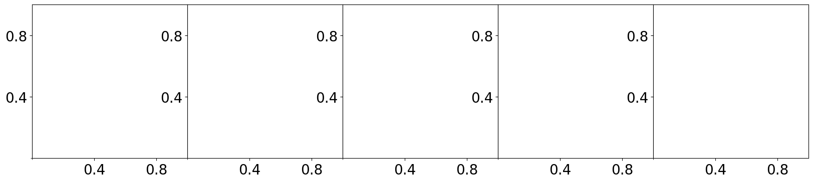

> ✏️ **This page is auto-generated from [`scripts/interferometer/modeling.py`](../../scripts/interferometer/modeling.py) — do not edit it directly.**
> It shows the example fully executed, with its real output images.
> Run it yourself via the [Python script](../../scripts/interferometer/modeling.py) or the [Jupyter notebook](../../notebooks/interferometer/modeling.ipynb).

Modeling: Start Here
====================

This script is the starting point for lens modeling of interferometer datasets (e.g. SMA, ALMA) and it
provides an overview of the lens modeling API. The same workflow scales from a few hundred visibilities
to many millions, thanks to the JAX-native `TransformerNUFFT` (backed by `nufftax`).

__Contents__

- **Number of Visibilities:** This example fits a low-resolution dataset, but the same workflow scales to many millions of visibilities.
- **Model:** Compose the lens model fitted to the data.
- **Mask:** Define the 2D mask applied to the dataset for the model-fit.
- **Dataset:** Load and plot the strong lens dataset.
- **Over Sampling:** Set up the adaptive over-sampling grid for accurate light profile evaluation.
- **Coordinates:** Coordinate system assumptions for the model-fit.
- **Improved Lens Model:** The previous model used Sérsic light profiles for the source galaxy.
- **Linear Light Profiles:** The MGE model below uses a **linear light profile** for the bulge via the ``lp_linear`` API.
- **Concise API:** The MGE model composition API is quite long and technical, so we simply load the MGE models for the.
- **Search:** Configure the non-linear search used to fit the model.
- **Unique Identifier:** In the path above, the `unique_identifier` appears as a collection of characters, where this.
- **Iterations Per Update:** Every `iterations_per_quick_update`, the non-linear search outputs the maximum likelihood model and.
- **Live Visual Update:** Push the quick-update image to a live display surface.
- **Analysis:** Create the Analysis object that defines how the model is fitted to the data.
- **JAX:** JAX acceleration for fast GPU/CPU model-fitting.
- **VRAM Use:** When running AutoLens with JAX on a GPU, the analysis must fit within the GPU’s available VRAM.
- **Run Times:** Profiling the expected run time of the model-fit.
- **Output Folder Layout:** Description of the structure of the `output` folder where results are written.
- **Result:** Overview of the results of the model-fit.
- **Features:** This script gives a concise overview of the basic modeling API, fitting one the simplest lens.
- **Data Preparation:** Data standards required for fitting with PyAutoLens.
- **HowToLens:** This `start_here.py` script, and the features examples above, do not explain many details of how.
- **Modeling Customization:** The folders `autolens_workspace/*/guides/modeling/searches` gives an overview of alternative.

__Number of Visibilities__

This example fits a **low-resolution interferometric dataset** with a small number of visibilities (273). The
dataset is intentionally minimal so the example runs quickly and you can become familiar with the API and
modeling workflow.

The same workflow — light profiles + `TransformerNUFFT` (backed by `nufftax`, https://github.com/GragasLab/nufftax) —
scales to high-resolution datasets with **millions to hundreds of millions of visibilities** (e.g. ALMA), with no
change beyond the transformer choice. The NUFFT runs inside JAX's jit/vmap pipeline, so both run time and VRAM
stay manageable on a GPU at any visibility count.

Pixelized source reconstructions (see `features/pixelization`) remain the right tool when the source has
complex, irregular morphology that simple light profiles cannot capture. They are no longer required purely
because the dataset is large.

__Model__

This script fits `Interferometer` dataset of a 'galaxy-scale' strong lens with a model where:

 - The lens galaxy's light is omitted (and is not present in the simulated data).
 - The lens galaxy's total mass distribution is an `Isothermal` and `ExternalShear`.
 - The source galaxy's light is a Multi Gaussian Expansion.


```python

from autoconf import jax_wrapper  # Sets JAX environment before other imports

from autoconf import setup_notebook; setup_notebook()

from pathlib import Path
import autofit as af
import autolens as al
import autolens.plot as aplt
import numpy as np
```

    Working Directory has been set to `autolens_workspace`


__Mask__

We define the ‘real_space_mask’ which defines the grid the image the strong lens is evaluated using.


```python
mask_radius = 3.5

real_space_mask = al.Mask2D.circular(
    shape_native=(256, 256),
    pixel_scales=0.1,
    radius=mask_radius,
)
```

__Dataset__

Load and plot the strong lens `Interferometer` dataset `simple` from .fits files, which we will fit
with the lens model.

This includes the method used to Fourier transform the real-space image of the strong lens to the uv-plane and
compare directly to the visibilities. We use `TransformerNUFFT`, a JAX-native Non-Uniform Fast Fourier Transform
backed by `nufftax`. This is the recommended choice at any visibility count and scales efficiently to ALMA-class
datasets with tens of millions of visibilities.


```python
dataset_name = "simple"
dataset_path = Path("dataset") / "interferometer" / dataset_name
```

__Dataset Auto-Simulation__

If the dataset does not already exist on your system, it will be created by running the corresponding
simulator script. This ensures that all example scripts can be run without manually simulating data first.


```python
if al.util.dataset.should_simulate(str(dataset_path)):
    import subprocess
    import sys

    subprocess.run(
        [sys.executable, "scripts/interferometer/simulator.py"],
        check=True,
    )

dataset = al.Interferometer.from_fits(
    data_path=dataset_path / "data.fits",
    noise_map_path=dataset_path / "noise_map.fits",
    uv_wavelengths_path=dataset_path / "uv_wavelengths.fits",
    real_space_mask=real_space_mask,
    transformer_class=al.TransformerNUFFT,
)

aplt.subplot_interferometer_dirty_images(dataset=dataset)
```


    

    


__Over Sampling__

If you are familiar with using imaging data, you may have seen that a numerical technique called over sampling is used, 
which evaluates light profiles on a higher resolution grid than the image data to ensure the calculation is accurate.

Interferometer does not observe galaxies in a way where over sampling is necessary, therefore all interferometer
calculations are performed without over sampling.

__Model__

We compose our lens model using `Model` objects, which represent the galaxies we fit to our data. In this 
example our lens model is:

 - The lens galaxy's total mass distribution is an `Isothermal` with `ExternalShear` [7 parameters].
 - An `Sersic` `LightProfile` for the source galaxy's light [7 parameters].

The number of free parameters and therefore the dimensionality of non-linear parameter space is N=14.

__Coordinates__

The model fitting default settings assume that the lens galaxy centre is near the coordinates (0.0", 0.0"). 

If for your dataset the  lens is not centred at (0.0", 0.0"), we recommend that you either: 

 - Reduce your data so that the centre is (`autolens_workspace/*/data_preparation`). 
 - Manually override the lens model priors (`autolens_workspace/*/guides/modeling/customize`).


```python
# Lens:

mass = af.Model(al.mp.Isothermal)

shear = af.Model(al.mp.ExternalShear)

lens = af.Model(al.Galaxy, redshift=0.5, mass=mass, shear=shear)

# Source:

bulge = af.Model(al.lp.SersicCore)

source = af.Model(al.Galaxy, redshift=1.0, bulge=bulge)

# Overall Lens Model:

model = af.Collection(galaxies=af.Collection(lens=lens, source=source))
```

The `info` attribute shows the model in a readable format.

[The `info` below may not display optimally on your computer screen, for example the whitespace between parameter
names on the left and parameter priors on the right may lead them to appear across multiple lines. This is a
common issue in Jupyter notebooks.

The`info_whitespace_length` parameter in the file `config/general.yaml` in the [output] section can be changed to 
increase or decrease the amount of whitespace (The Jupyter notebook kernel will need to be reset for this change to 
appear in a notebook).]


```python
print(model.info)
```

    Total Free Parameters = 14
    
    model                                                                           Collection (N=14)
        galaxies                                                                    Collection (N=14)
            lens - source                                                           Galaxy (N=7)
            lens
                mass                                                                Isothermal (N=5)
                shear                                                               ExternalShear (N=2)
            source
                bulge                                                               SersicCore (N=7)
    
    galaxies
        lens
            redshift                                                                0.5
            mass
                centre
                    centre_0                                                        GaussianPrior [0], mean = 0.0, sigma = 0.1
                    centre_1                                                        GaussianPrior [1], mean = 0.0, sigma = 0.1
                ell_comps
                    ell_comps_0                                                     TruncatedGaussianPrior [2], mean = 0.0, sigma = 0.3, lower_limit = -1.0, upper_limit = 1.0
                    ell_comps_1                                                     TruncatedGaussianPrior [3], mean = 0.0, sigma = 0.3, lower_limit = -1.0, upper_limit = 1.0
                einstein_radius                                                     UniformPrior [4], lower_limit = 0.0, upper_limit = 8.0
            shear
                gamma_1                                                             UniformPrior [5], lower_limit = -0.3, upper_limit = 0.3
                gamma_2                                                             UniformPrior [6], lower_limit = -0.3, upper_limit = 0.3
        source
            redshift                                                                1.0
            bulge
                centre
                    centre_0                                                        GaussianPrior [7], mean = 0.0, sigma = 0.3
                    centre_1                                                        GaussianPrior [8], mean = 0.0, sigma = 0.3
                ell_comps
                    ell_comps_0                                                     TruncatedGaussianPrior [9], mean = 0.0, sigma = 0.3, lower_limit = -1.0, upper_limit = 1.0
                    ell_comps_1                                                     TruncatedGaussianPrior [10], mean = 0.0, sigma = 0.3, lower_limit = -1.0, upper_limit = 1.0
                effective_radius                                                    UniformPrior [11], lower_limit = 0.0, upper_limit = 30.0
                radius_break - sersic_index                                         UniformPrior [12], lower_limit = 0.8, upper_limit = 5.0
                intensity                                                           LogUniformPrior [13], lower_limit = 1e-05, upper_limit = 1000.0
                gamma                                                               0.25
                alpha                                                               3.0


__Improved Lens Model__

The previous model used Sérsic light profiles for the source galaxy. This makes the model API concise, readable, and 
easy to follow.

However, single Sérsic profiles perform poorly for most strong lenses. Symmetric profiles (e.g. elliptical Sérsics) 
typically leave significant residuals because they cannot capture the irregular and asymmetric morphology of real 
galaxies (e.g. isophotal twists, radially varying ellipticity).

This example therefore uses a lens model that combines two features, described in detail elsewhere (but a brief 
overview is provided below):

- **Linear light profiles**  (see ``autolens_workspace/*/imaging/features/linear_light_profiles``)
- **Multi-Gaussian Expansion (MGE) light profiles**  (see ``autolens_workspace/*/imaging/features/multi_gaussian_expansion``)

NOTE: These descriptions are in the `imaging` package as most interferometer users will quickly move on to
pixelized source reconstructions, which do not use these features. Their use here is therefore mostly to
given an introduction to lens modeling with interferometer data.

These features avoid wasted effort trying to fit Sérsic profiles to complex data, which is likely to fail unless the 
lens is extremely simple. This does mean the model composition is more complex and as a user its a steeper learning
curve to understand the API, but its worth it for the improved accuracy and speed of lens modeling.

__Multi-Gaussian Expansion (MGE)__

A Multi-Gaussian Expansion (MGE) decomposes the source light into ~50–100 Gaussians with varying ellipticities 
and sizes. An MGE captures irregular features far more effectively than Sérsic profiles, leading to more accurate lens m
odels.

Remarkably, modeling with MGEs is also significantly faster than using Sérsics: they remain efficient in JAX (on CPU 
or GPU), require fewer non-linear parameters despite their flexibility, and yield simpler parameter spaces that
sample in far fewer iterations. 

__Linear Light Profiles__

The MGE model below uses a **linear light profile** for the bulge via the ``lp_linear`` API, instead of the 
standard ``lp`` light profiles used above.

A linear light profile solves for the *intensity* of each component via a linear inversion, rather than treating it as 
a free parameter. This reduces the dimensionality of the non-linear parameter space: a model with ~80 Gaussians
does not introduce ~80 additional free parameters.

Linear light profiles therefore improve speed and accuracy, and they are used by default in all modeling example.

__Concise API__

The MGE model composition API is quite long and technical, so we simply load the MGE models for the lens and source 
below via a utility function `mge_model_from` which hides the API to make the code in this introduction example ready 
to read. We then use the PyAutoLens Model API to compose the over lens model.

The full MGE composition API is given in the `features/multi_gaussian_expansion` package.


```python
# Lens:

mass = af.Model(al.mp.Isothermal)

shear = af.Model(al.mp.ExternalShear)

lens = af.Model(al.Galaxy, redshift=0.5, mass=mass, shear=shear)

# Source:

bulge = al.model_util.mge_model_from(
    mask_radius=mask_radius, total_gaussians=5, centre_prior_is_uniform=False
)

source = af.Model(al.Galaxy, redshift=1.0, bulge=bulge)

# Overall Lens Model:

model = af.Collection(galaxies=af.Collection(lens=lens, source=source))
```

Printing the model info confirms the model has Gaussians for both the lens and source galaxies.


```python
print(model.info)
```

    Total Free Parameters = 11
    
    model                                                                           Collection (N=11)
        galaxies                                                                    Collection (N=11)
            lens                                                                    Galaxy (N=7)
                mass                                                                Isothermal (N=5)
                shear                                                               ExternalShear (N=2)
            source                                                                  Galaxy (N=4)
                bulge                                                               Basis (N=4)
                    profile_list                                                    Collection (N=4)
    ... [18 lines of output truncated] ...
            bulge
                profile_list
                    0 - 4
                        centre
                            centre_0                                                GaussianPrior [21], mean = 0.0, sigma = 0.3
                            centre_1                                                GaussianPrior [22], mean = 0.0, sigma = 0.3
                        ell_comps
                            ell_comps_0                                             TruncatedGaussianPrior [23], mean = 0.0, sigma = 0.3, lower_limit = -1.0, upper_limit = 1.0
                            ell_comps_1                                             TruncatedGaussianPrior [24], mean = 0.0, sigma = 0.3, lower_limit = -1.0, upper_limit = 1.0
                    0
                        sigma                                                       0.0001
                    1
                        sigma                                                       0.0013677823998673804
                    2
                        sigma                                                       0.01870828693386971
                    3
                        sigma                                                       0.2558886559981587
                    4
                        sigma                                                       3.5000000000000004


__Search__

The lens model is fitted to the data using a non-linear search. 

All examples in the autolens workspace use the nested sampling algorithm 
Nautilus (https://nautilus-sampler.readthedocs.io/en/latest/), which extensive testing has revealed gives the most 
accurate and efficient modeling results.

Nautilus has one main setting that trades-off accuracy and computational run-time, the number of `live_points`. 
A higher number of live points gives a more accurate result, but increases the run-time. A lower value give 
less reliable lens modeling (e.g. the fit may infer a local maxima), but is faster. 

The suitable value depends on the model complexity whereby models with more parameters require more live points. 
The default value of 200 is sufficient for the vast majority of common lens models. Lower values often given reliable
results though, and speed up the run-times. In this example, given the model is quite simple (N=11 parameters), we 
reduce the number of live points to 75 to speed up the run-time.

__Unique Identifier__

In the path above, the `unique_identifier` appears as a collection of characters, where this identifier is generated 
based on the model, search and dataset that are used in the fit.
 
An identical combination of model and search generates the same identifier, meaning that rerunning the script will use 
the existing results to resume the model-fit. In contrast, if you change the model or search, a new unique identifier 
will be generated, ensuring that the model-fit results are output into a separate folder.

We additionally want the unique identifier to be specific to the dataset fitted, so that if we fit different datasets
with the same model and search results are output to a different folder. We achieve this below by passing 
the `dataset_name` to the search's `unique_tag`.

__Iterations Per Update__

Every `iterations_per_quick_update`, the non-linear search outputs the maximum likelihood model and its best fit
image to the Jupyter Notebook display and to hard-disk.

This process takes around ~10 seconds, so we don't want it to happen too often so as to slow down the overall
fit, but we also want it to happen frequently enough that we can track the progress.

The value of 10000 below means this output happens every few minutes on GPU and every ~10 minutes on CPU, a good balance.

__Live Visual Update__

By default the quick-update image is only written to disk. Set `live_visual_update=True` to also push it to a
live display surface:

- **Python script** — a matplotlib window opens automatically and refreshes with each quick update, so you can
  watch the fit converge without leaving your terminal.
- **Jupyter / Colab notebook** — the cell that ran `search.fit(...)` shows a single self-updating image that
  refreshes in place every `iterations_per_quick_update`.

The disk write (`fit.png`) always happens regardless of this flag. Set it to `False` (the default) if you just
want the on-disk output, or if you are running in a headless environment (e.g. an HPC cluster).


```python
search = af.Nautilus(
    path_prefix=Path("interferometer"),  # The path where results and output are stored.
    name="modeling",  # The name of the fit and folder results are output to.
    unique_tag=dataset_name,  # A unique tag which also defines the folder.
    n_live=75,  # The number of Nautilus "live" points, increase for more complex models.
    n_batch=50,  # GPU lens model fits are batched and run simultaneously, see VRAM section below.
    iterations_per_quick_update=10000,  # Every N iterations the max likelihood model is visualized in the Jupter Notebook and output to hard-disk.
    live_visual_update=False,  # Set True to open a live matplotlib window (script) or refresh a Jupyter cell (notebook).
)
```

__Analysis__

We next create an `AnalysisInterferometer` object, which can be given many inputs customizing how the lens model is 
fitted to the data (in this example they are omitted for simplicity).

Internally, this object defines the `log_likelihood_function` used by the non-linear search to fit the model to 
the `Interferometer` dataset. 

It is not vital that you as a user understand the details of how the `log_likelihood_function` fits a lens model to 
data, but interested readers can find a step-by-step guide of the likelihood 
function at ``autolens_workspace/*/interferometer/log_likelihood_function`

__JAX__

PyAutoLens uses JAX under the hood for fast GPU/CPU acceleration. If JAX is installed with GPU
support, your fits will run much faster (around 10 minutes instead of an hour). If only a CPU is available,
JAX will still provide a speed up via multithreading, with fits taking around 20-30 minutes.

If you don’t have a GPU locally, consider Google Colab which provides free GPUs, so your modeling runs are much faster.


```python
analysis = al.AnalysisInterferometer(
    dataset=dataset,
    use_jax=True,  # JAX will use GPUs for acceleration if available, else JAX will use multithreaded CPUs.
)
```

__VRAM Use__

When running AutoLens with JAX on a GPU, the analysis must fit within the GPU’s available VRAM. If insufficient 
VRAM is available, the analysis will fail with an out-of-memory error, typically during JIT compilation or the 
first likelihood call.

Two factors dictate the VRAM usage of an analysis:

- The number of arrays and other data structures JAX must store in VRAM to fit the model
  to the data in the likelihood function. This is dictated by the model complexity and dataset size.

- The `batch_size` sets how many likelihood evaluations are performed simultaneously.
  Increasing the batch size increases VRAM usage but can reduce overall run time,
  while decreasing it lowers VRAM usage at the cost of slower execution.

Before running an analysis, users should check that the estimated VRAM usage for the
chosen batch size is comfortably below their GPU’s total VRAM.

The method below prints the VRAM usage estimate for the analysis and model with the specified batch size,
it takes about 20-30 seconds to run so you may want to comment it out once you are familiar with your GPU's VRAM limits.

With `TransformerNUFFT` (backed by `nufftax`), the dominant contributor to VRAM is usually the real-space image
and its transforms inside the likelihood function, rather than the visibility count itself. VRAM does not scale
with batch size for the persistent buffers, so if the analysis fits within VRAM for `batch_size=1` you should be
able to push the batch size up (e.g. to 50) to maximise GPU throughput without running out of memory.

For an MGE model with the small dataset fitted in this example, VRAM use is modest (~0.3 GB). Larger real-space
masks (finer pixel scales) and higher visibility counts increase VRAM gradually rather than catastrophically, and
a single GPU comfortably handles millions of visibilities with this approach.

Pixelized source reconstructions (see `features/pixelization`) take a different VRAM trade-off: they keep VRAM
use low by exploiting sparsity in the linear inversion, which makes them attractive when the real-space mask is
very large or the source morphology requires it. They are no longer required purely because the dataset has many
visibilities.


```python
analysis.print_vram_use(model=model, batch_size=search.batch_size)
```

    2026-07-10 19:44:40,341 - autofit.non_linear.fitness - INFO - JAX: Applying vmap and jit to likelihood function -- may take a few seconds.


    2026-07-10 19:44:40,346 - autofit.non_linear.fitness - INFO - JAX: vmap and jit applied in 0.005039215087890625 seconds.


    VRAM USE = 1.953 GB


__Run Times__

Lens modeling can be a computationally expensive process. When fitting complex models to high resolution datasets 
run times can be of order hours, days, weeks or even months.

Run times are dictated by two factors:

 - The log likelihood evaluation time: the time it takes for a single `instance` of the lens model to be fitted to 
   the dataset such that a log likelihood is returned.
 
 - The number of iterations (e.g. log likelihood evaluations) performed by the non-linear search: more complex lens
   models require more iterations to converge to a solution.
   
For this analysis, the log likelihood evaluation time is < 0.001 seconds on GPU, < 0.01 seconds on CPU, which is 
extremely fast for lens modeling. 

To estimate the expected overall run time of the model-fit we multiply the log likelihood evaluation time by an 
estimate of the number of iterations the non-linear search will perform, which is around 10000 to 30000 for this model.

GPU run times are around 10 minutes, CPU run times are around 30 minutes.

__Model-Fit__

We can now begin the model-fit by passing the model and analysis object to the search, which performs the 
Nautilus non-linear search in order to find which models fit the data with the highest likelihood.

**Run Time Error:** On certain operating systems (e.g. Windows, Linux) and Python versions, the code below may produce 
an error. If this occurs, see the `autolens_workspace/guides/modeling/bug_fix` example for a fix.


```python
print(
    """
    The non-linear search has begun running.

    This Jupyter notebook cell with progress once the search has completed - this could take a few minutes!

    On-the-fly updates every iterations_per_quick_update are printed to the notebook.
    """
)

result = search.fit(model=model, analysis=analysis)

print("The search has finished run - you may now continue the notebook.")
```

    
        The non-linear search has begun running.
    
        This Jupyter notebook cell with progress once the search has completed - this could take a few minutes!
    
        On-the-fly updates every iterations_per_quick_update are printed to the notebook.
        
    2026-07-10 19:44:52,280 - autofit.non_linear.search.abstract_search - INFO - Starting non-linear search with JAX (CPU: cpu).


    2026-07-10 19:44:52,357 - modeling - INFO - The output path of this fit is autolens_workspace/output/interferometer/simple/modeling/207f825cf6bd24deca2de5e0ec8a4822


    2026-07-10 19:44:52,360 - modeling - INFO - Outputting pre-fit files (e.g. model.info, visualization).


    2026-07-10 19:44:54,153 - modeling - INFO - Starting new Nautilus non-linear search (no previous samples found).


    2026-07-10 19:44:54,155 - autofit.non_linear.fitness - INFO - JAX: Applying vmap and jit to likelihood function -- may take a few seconds.


    2026-07-10 19:44:54,161 - autofit.non_linear.fitness - INFO - JAX: vmap and jit applied in 0.006067514419555664 seconds.


    2026-07-10 19:44:54,163 - autofit.non_linear.fitness - INFO - Warming up visualization (one-time JAX compilation)...


    2026-07-10 19:45:16,146 - autofit.non_linear.fitness - INFO - Visualization warm-up complete.


    2026-07-10 19:45:16,148 - modeling - INFO - Running search with JAX vectorization (parallelization handled by JAX).


    Starting the nautilus sampler...
    Please report issues at github.com/johannesulf/nautilus.
    Status    | Bounds | Ellipses | Networks | Calls    | f_live | N_eff | log Z    


    

    

    

    

    

    

    

    

    

    

    

    

    

    

    

    

    

    

    

    

    

    

    

    

    

    

    

    

    

    

    

    

    

    

    

    

    

    

    

    

    

    

    

    

    

    

    

    

    

    

    

    

    

    

    

    

    

    

    

    

    

    

    

    

    

    

    Finished  | 8      | 1        | 4        | 2950     | N/A    | 520   | -3142.40 
    2026-07-10 19:51:22,785 - modeling - INFO - Fit Running: Updating results (see output folder).


    2026-07-10 19:53:16,345 - autofit.non_linear.plot.plot_util - INFO - Unable to produce corner_anesthetic visual: posterior estimate not yet sufficient. Should succeed in a later update.


    Starting the nautilus sampler...
    Please report issues at github.com/johannesulf/nautilus.
    Status    | Bounds | Ellipses | Networks | Calls    | f_live | N_eff | log Z    
    Finished  | 8      | 1        | 4        | 2950     | N/A    | 520   | -3142.40 
    2026-07-10 19:53:25,389 - modeling - INFO - Fit Running: Updating results (see output folder).


    2026-07-10 19:53:26,441 - autofit.non_linear.samples.samples - INFO - Samples with weight less than 1e-10 removed from samples.csv.


    2026-07-10 19:53:27,188 - autofit.non_linear.search.updater - INFO - Creating latent samples by drawing 100 from the PDF.


    2026-07-10 19:54:57,521 - autofit.non_linear.plot.plot_util - INFO - Unable to produce corner_anesthetic visual: posterior estimate not yet sufficient. Should succeed in a later update.


    2026-07-10 19:54:59,622 - modeling - INFO - Removing search internal folder.


    2026-07-10 19:54:59,624 - modeling - INFO - Removing all files except for .zip file


    2026-07-10 19:55:00,923 - modeling - INFO - Search complete, returning result


    The search has finished run - you may now continue the notebook.


    

    


    

    


__Output Folder Layout__

Now the fit is running you should checkout the `autolens_workspace/output` folder. This is where results are
written to hard-disk in human-readable formats — `.json`, `.csv`, `.fits`, `.png` and plain text.

As the fit progresses, results are written on the fly using the highest likelihood model found by the
non-linear search so far. This means you can inspect the model-fit as it runs, without waiting for the
non-linear search to terminate.

Each completed fit lives at a path like::

    output/interferometer/<dataset_name>/modeling/<unique_hash>/
        files/                         <- JSON + CSV: loadable Python objects
            tracer.json                <- max log likelihood Tracer
            model.json                 <- fitted af.Collection model
            samples.csv                <- full Nautilus samples
            samples_summary.json       <- max log likelihood parameter values + errors
            samples_info.json          <- metadata about the samples
            search.json                <- non-linear search configuration
            settings.json              <- search settings
            cosmology.json             <- cosmology used for the fit
            covariance.csv             <- parameter covariance matrix
        image/                         <- FITS + PNG: visibility + image-plane products
            dataset.fits               <- visibilities, noise-map and uv-coverage
            fit.fits                   <- model visibilities, residuals, chi-squared
            dirty_images.fits          <- dirty images of data, model and residuals
            tracer.fits                <- tracer image-plane images per galaxy
            source_plane_images.fits   <- source plane reconstructions
            model_galaxy_images.fits   <- per-galaxy model images
            galaxy_images.fits         <- per-galaxy images
            dataset.png, fit.png, tracer.png   <- visualisations
        model.info                     <- human-readable model summary
        model.results                  <- human-readable fit summary
        search.summary                 <- search run summary
        search_internal/               <- internal files used to resume / visualise the search
        metadata                       <- run metadata

The `<unique_hash>` is a 32-character identifier derived from the model, search and dataset, so re-running the
same configuration resumes from the existing fit automatically.

__Result__

The search returns a result object, which whose `info` attribute shows the result in a readable format.

[Above, we discussed that the `info_whitespace_length` parameter in the config files could b changed to make 
the `model.info` attribute display optimally on your computer. This attribute also controls the whitespace of the
`result.info` attribute.]


```python
print(result.info)
```

    Bayesian Evidence                                                               -3142.39791898
    Maximum Log Likelihood                                                          -3137.02711169
    
    model                                                                           Collection (N=11)
        galaxies                                                                    Collection (N=11)
            lens                                                                    Galaxy (N=7)
                mass                                                                Isothermal (N=5)
                shear                                                               ExternalShear (N=2)
            source                                                                  Galaxy (N=4)
                bulge                                                               Basis (N=4)
    ... [83 lines of output truncated] ...
    instances
    
    galaxies
        lens
            redshift                                                                0.5
        source
            redshift                                                                1.0
            bulge
                profile_list
                    0
                        sigma                                                       0.0001
                    1
                        sigma                                                       0.0013677823998673804
                    2
                        sigma                                                       0.01870828693386971
                    3
                        sigma                                                       0.2558886559981587
                    4
                        sigma                                                       3.5000000000000004


We plot the maximum likelihood fit, tracer images and posteriors inferred via Nautilus.

Checkout `autolens_workspace/*/guides/results` for a full description of analysing results.


```python
print(result.max_log_likelihood_instance)

aplt.subplot_tracer(
    tracer=result.max_log_likelihood_tracer, grid=real_space_mask.derive_grid.unmasked
)

aplt.subplot_fit_interferometer(fit=result.max_log_likelihood_fit)
aplt.subplot_fit_dirty_images(fit=result.max_log_likelihood_fit)
```

    <autofit.mapper.model.ModelInstance object at 0x7fbbf338f8c0>


    

    


    

    


    

    


The result contains the full posterior information of our non-linear search, including all parameter samples, 
log likelihood values and tools to compute the errors on the lens model. 

There are built in visualization tools for plotting this.

The plot is labeled with short hand parameter names (e.g. `sersic_index` is mapped to the short hand 
parameter `n`). These mappings ate specified in the `config/notation.yaml` file and can be customized by users.

The superscripts of labels correspond to the name each component was given in the model (e.g. for the `Isothermal`
mass its name `mass` defined when making the `Model` above is used).


```python
aplt.corner_anesthetic(samples=result.samples)
```

    2026-07-10 19:56:11,008 - autofit.non_linear.plot.plot_util - INFO - Unable to produce corner_anesthetic visual: posterior estimate not yet sufficient. Should succeed in a later update.


    

    


__Source Science (Magnification, Flux and More)__

Source science focuses on studying the highly magnified properties of the background lensed source galaxy (or galaxies).

Using the reconstructed source model, we can compute key quantities such as the magnification, total flux, and intrinsic 
size of the source.

The example `autolens_workspace/*/guides/source_science` gives a complete overview of how to calculate these quantities,
including examples using a pixelized source reconstruction. 

If you want to study the source galaxy after modeling has reconstructed its unlensed, then check out this example.

__Features__

This script gives a concise overview of the basic modeling API, fitting one the simplest lens models possible.

Lets now consider what features you should read about to improve your lens modeling, especially if you are aiming
to fit more complex models to your data.

The examples in the `autolens_workspace/*/interferometer/features` package illustrate other lens modeling
features.

We recommend you checkout the `pixelization` feature next, which lets you reconstruct sources with complex,
irregular morphology that simple light profiles cannot capture:

- ``pixelization``: The source is reconstructed using an adaptive Rectangular mesh or Delaunay mesh.

The files `autolens_workspace/*/guides/modeling/searches` and `autolens_workspace/*/guides/modeling/customize`
provide guides on how to customize many other aspects of the model-fit. Check them out to see if anything
sounds useful, but for most users you can get by without using these forms of customization!
  
__Data Preparation__

If you are looking to fit your own interferometer data of a strong lens, checkout  
the `autolens_workspace/*/interferometer/data_preparation/start_here.ipynb` script for an overview of how data should be 
prepared before being modeled.

__HowToLens__

This `start_here.py` script, and the features examples above, do not explain many details of how lens modeling is 
performed, for example:

 - How does PyAutoLens perform ray-tracing and lensing calculations in order to fit a lens model?
 - How is a lens model fitted to data? What quantifies the goodness of fit (e.g. how is a log likelihood computed?).
 - How does Nautilus find the highest likelihood lens models? What exactly is a "non-linear search"?

You do not need to be able to answer these questions in order to fit lens models with PyAutoLens and do science.
However, having a deeper understanding of how it all works is both interesting and will benefit you as a scientist

This deeper insight is offered by the **HowToLens** Jupyter notebook lectures, which live in their own repository:
https://github.com/PyAutoLabs/HowToLens.

I recommend that you check them out if you are interested in more details!

__Modeling Customization__

The folders `autolens_workspace/*/guides/modeling/searches` gives an overview of alternative non-linear searches,
other than Nautilus, that can be used to fit lens models. 

They also provide details on how to customize the model-fit, for example the priors.


```python

```
