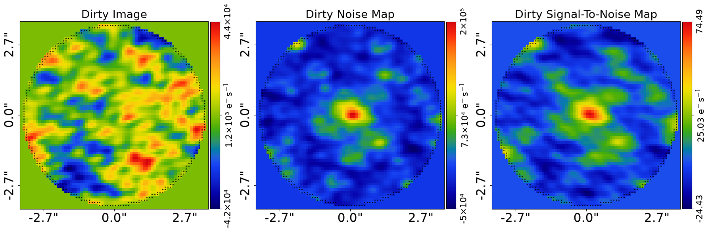
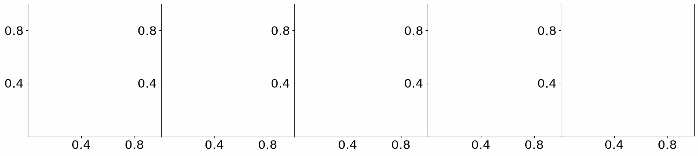
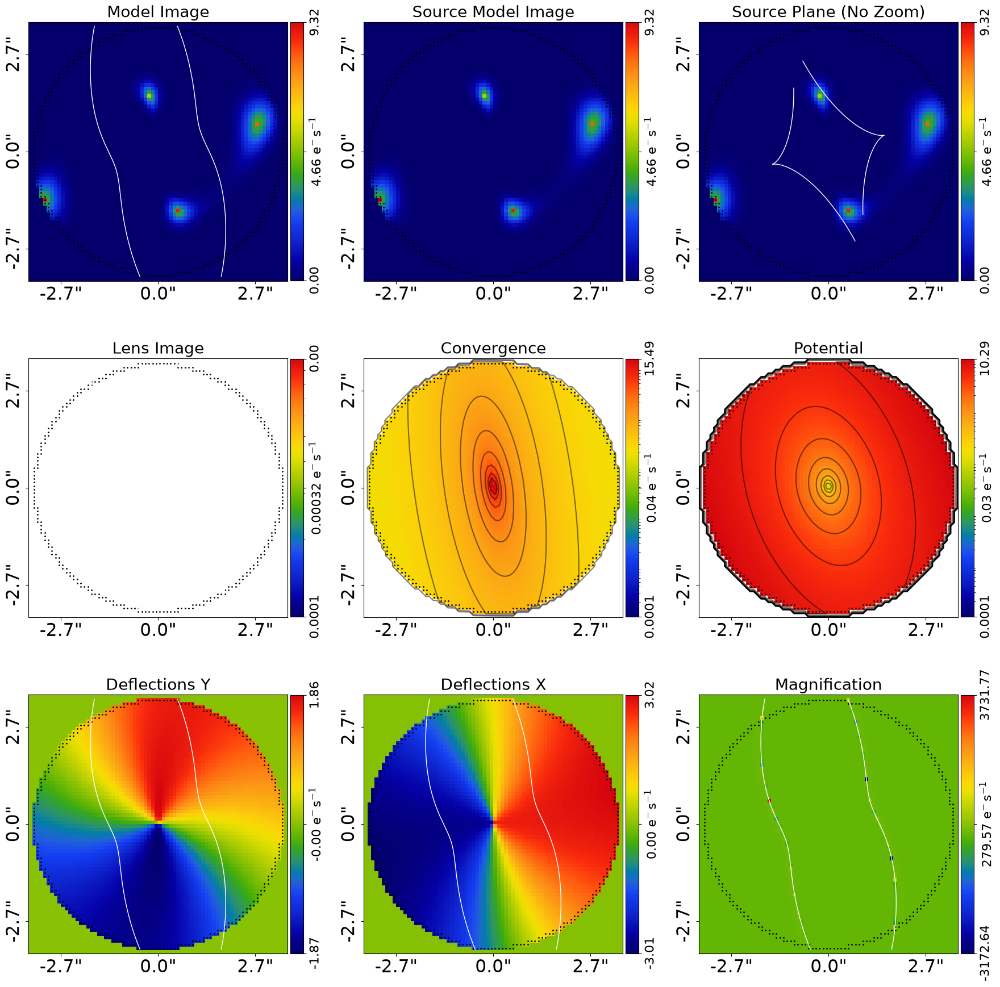
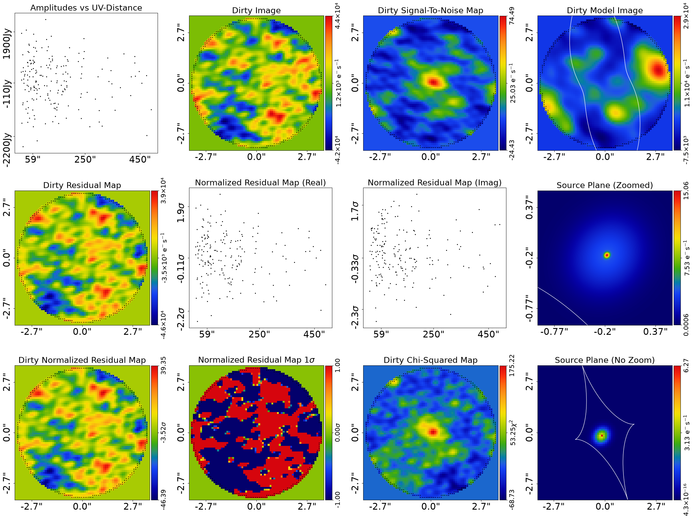
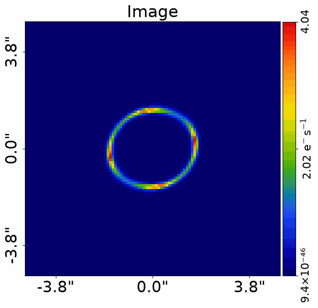
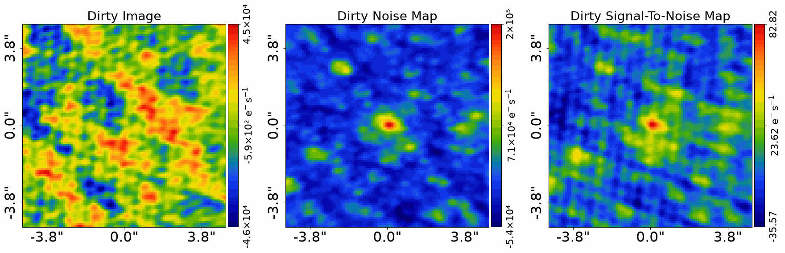

> ✏️ **This page is auto-generated from [`scripts/interferometer/start_here.py`](../../scripts/interferometer/start_here.py) — do not edit it directly.**
> It shows the example fully executed, with its real output images.
> Run it yourself via the [Python script](../../scripts/interferometer/start_here.py) or the [Jupyter notebook](../../notebooks/interferometer/start_here.ipynb).

Start Here: Interferometer
==========================

Strong lenses are observed with radio/mm interferometers (e.g. ALMA), which measure
complex visibilities in the uv-plane instead of CCD images.

This script shows you how to model such a lens system using **PyAutoLens** with as little setup
as possible. In about 15 minutes you’ll be able to point the code at your own FITS files and
fit your first lens.

We focus on a *galaxy-scale* lens (a single lens galaxy). If you have multiple lens galaxies,
see the `start_here_group.ipynb` and `start_here_cluster.ipynb` examples.

__Contents__

- **JAX:** JAX acceleration for fast GPU/CPU model-fitting.
- **NUFFT (nufftax):** A JAX-native Non-Uniform FFT, used for the image to uv-plane transform of light profiles.
- **Number of Visibilities:** This example fits a low-resolution interferometric dataset, but the same workflow scales to millions of visibilities.
- **Google Colab Setup:** The introduction `start_here` examples are available on Google Colab, which allows you to run them.
- **Imports:** Import the required Python libraries.
- **Dataset:** Load and plot the strong lens dataset.
- **Model:** Compose the lens model fitted to the data.
- **Model Fit:** Perform the model-fit using the search and analysis.
- **Live Visual Update:** Push the quick-update image to a live display surface.
- **Result:** Overview of the results of the model-fit.
- **Model Your Own Lens:** Adapting this script to fit your own interferometer dataset.
- **Simulator:** Let’s now switch gears and simulate our own strong lens interferometer.
- **Sample:** Often we want to simulate *many* strong lenses — for example, to train a neural network or to.
- **Wrap Up:** Summary of the script and next steps.

__JAX__

PyAutoLens runs interferometer model-fits on JAX by default. If you
installed `autolens[jax]`, `al.AnalysisInterferometer(dataset=dataset)`
below auto-enables `use_jax=True`. Use `TransformerDFT` (the default in
this script) under JAX — `TransformerNUFFT` (pynufft) is faster on large
UV sets but is not JAX-traceable; the `nufftax` replacement (see the
`__NUFFT (nufftax)__` section below) is a research path tracking that.

For the broader JAX principles (when you write `@jax.jit` yourself, the
return-type contract), see the top-level `autolens_workspace/start_here.py`
`__JAX__` section. For a runnable `@jax.jit + SimulatorInterferometer(use_jax=True)`
example, see the `__JAX Variant__` section at the end of
`scripts/interferometer/simulator.py`.

__NUFFT (nufftax)__

The image-to-visibilities Fourier transform is performed by a Non-Uniform Fast Fourier Transform (NUFFT),
exposed in **PyAutoLens** as `TransformerNUFFT`. The default backend is `nufftax`, a pure-JAX NUFFT
that jit-compiles and vmap-batches like the rest of the library:

  https://github.com/GragasLab/nufftax

Because `nufftax` is JAX-native, light-profile interferometer modeling now runs at full GPU speed for
datasets with **arbitrarily many visibilities** — including high-resolution ALMA observations with tens of
millions to hundreds of millions of visibilities. Previously this was only practical for small datasets,
or required switching to a pixelized source reconstruction. Pixelized sources are still recommended for
complex, irregular source morphologies (see `features/pixelization`), but they are no longer a
performance requirement for large datasets.

If `nufftax` is not installed, install it via `pip install nufftax`. A legacy pynufft-backed
transformer (`TransformerNUFFTPyNUFFT`) is also available as a non-JAX fallback.

__Number of Visibilities__

This example fits a **low-resolution interferometric dataset** with a small number of visibilities (273). The
dataset is intentionally minimal so that the example runs quickly and allows you to become familiar with the API
and modeling workflow.

The same modeling workflow — light profiles + `TransformerNUFFT` (nufftax) — scales to high-resolution
datasets with **millions to hundreds of millions of visibilities** (e.g. ALMA), with no special handling
beyond switching the transformer choice. Both computational time and VRAM use stay manageable on a GPU
because `nufftax` runs the NUFFT inside the JAX jit/vmap pipeline.

Pixelized source reconstructions (see `features/pixelization`) remain the right tool when the source has
complex, irregular morphology that simple light profiles cannot capture. They are no longer required
purely because the dataset is large.

__Google Colab Setup__

The introduction `start_here` examples are available on Google Colab, which allows you to run them in a web browser
without manual local PyAutoLens installation.

The code below sets up your environment if you are using Google Colab, including installing autolens and downloading
files required to run the notebook. If you are running this script not in Colab (e.g. locally on your own computer),
running the code will still check correctly that your environment is set up and ready to go.


```python

import subprocess
import sys

try:
    import google.colab

    subprocess.check_call(
        [sys.executable, "-m", "pip", "install", "autonerves", "--no-deps"]
    )
except ImportError:
    pass

from autonerves import setup_colab

setup_colab.for_autolens(
    raise_error_if_not_gpu=False  # Switch to False for CPU Google Colab
)
```

    
                You are not running in a Google Colab environment so cannot use the setup_colab() function.
    
                You should therefore have PyAutoLens installed locally in your environment already (e.g. via pip or
                conda) and can run the rest of your script normally.
    
                You may now continue running your script or Notebook.
                


__Imports__

Lets first import autolens, its plotting module and the other libraries we'll need.

You'll see these imports in the majority of workspace examples.


```python
from autolens import jax_wrapper  # Sets JAX environment before other imports

from autolens import setup_notebook; setup_notebook()

from pathlib import Path
import numpy as np

import autofit as af
import autolens as al
import autolens.plot as aplt
```

    Working Directory has been set to `autolens_workspace`


__Mask (Real Space)__

Interferometer modeling evaluates the lens image on a *real-space grid* and Fourier transforms
to the uv-plane to compare with visibilities. 

We therefore define a circular real-space mask, which sets the pixel grid size and pixel-to-arcsecond 
pixel scale in real space.


```python
mask_radius = 3.5

real_space_mask = al.Mask2D.circular(
    shape_native=(256, 256),
    pixel_scales=0.1,
    radius=mask_radius,
)
```

__Dataset__

We begin by loading an `Interferometer` dataset from FITS, three ingredients are needed for lens modeling:

- `data.fits`: complex visibilities (shape: n_vis)
- `noise_map.fits`: per-visibility complex RMS
- `uv_wavelengths.fits`: (u, v) sampling of the interferometer in wavelengths

We must also choose a transformer for mapping the real-space image to visibilities:

- `TransformerNUFFT`: JAX-native Non-Uniform FFT (default, backed by `nufftax`). Recommended for any
  dataset size — runs at full GPU speed for millions of visibilities.
- `TransformerDFT`: exact Discrete FT. Slower than the NUFFT for large `n_vis`, but useful as a reference
  for verification and for the pixelized source reconstruction's sparse-operator workflow (see
  `features/pixelization`).

We load a low resolution Square Mile Array (SMA) dataset for this example, which has just 273 visibilities.
We use `TransformerNUFFT` so that this example reflects the recommended workflow at any visibility count;
for 273 visibilities `TransformerDFT` would also work and produce a near-identical result.


```python
dataset_name = "simple"
dataset_path = Path("dataset") / "interferometer" / dataset_name
```

__Dataset Auto-Simulation__

If the dataset does not already exist on your system, it will be created by running the corresponding
simulator script. This ensures that all example scripts can be run without manually simulating data first.


```python
if not dataset_path.exists():
    import subprocess
    import sys

    subprocess.run(
        [sys.executable, "scripts/interferometer/simulator.py"],
        check=True,
    )

dataset = al.Interferometer.from_fits(
    data_path=dataset_path / "data.fits",
    noise_map_path=dataset_path / "noise_map.fits",
    uv_wavelengths_path=dataset_path / "uv_wavelengths.fits",
    real_space_mask=real_space_mask,
    transformer_class=al.TransformerNUFFT,
)

aplt.subplot_interferometer_dirty_images(dataset=dataset)
```


    

    


__Model__

To perform lens modeling we must define a lens model, describing the light profiles of 
the source galaxy, and the mass profile of the lens galaxy.

A brilliant lens model to start with is one which uses a Multi Gaussian Expansion (MGE) 
to model the lens and source light, and a Singular Isothermal Ellipsoid (SIE) plus 
shear to model the lens mass. 

Full details of why this models is so good are provided in the main workspace docs, 
but in a nutshell it  provides an excellent balance of being fast to fit, flexible 
enough to capture complex galaxy morphologies and providing accurate fits to the vast 
majority of strong lenses.

The MGE model composition API is quite long and technical, so we simply load the MGE 
models for the source below via a utility function `mge_model_from` which 
hides the API to make the code in this introduction example ready to read. We then 
use the PyAutoLens Model API to compose the over lens model.


```python
# Lens galaxy

mass = af.Model(al.mp.Isothermal)
shear = af.Model(al.mp.ExternalShear)
lens = af.Model(al.Galaxy, redshift=0.5, mass=mass, shear=shear)

# Source galaxy
source_bulge = al.model_util.mge_model_from(
    mask_radius=mask_radius, total_gaussians=5, centre_prior_is_uniform=False
)
source = af.Model(al.Galaxy, redshift=1.0, bulge=source_bulge)

# Compose model
model = af.Collection(galaxies=af.Collection(lens=lens, source=source))
```

We can print the model to show the parameters that the model is composed of, which shows many of the MGE's fixed
parameter values the API above hided the composition of.


```python
print(model.info)
```

    Total Free Parameters = 11
    
    model                                                                           Collection (N=11)
        galaxies                                                                    Collection (N=11)
            lens                                                                    Galaxy (N=7)
                mass                                                                Isothermal (N=5)
                shear                                                               ExternalShear (N=2)
            source                                                                  Galaxy (N=4)
                bulge                                                               Basis (N=4)
                    profile_list                                                    Collection (N=4)
    ... [18 lines of output truncated] ...
            bulge
                profile_list
                    0 - 4
                        centre
                            centre_0                                                GaussianPrior [7], mean = 0.0, sigma = 0.3
                            centre_1                                                GaussianPrior [8], mean = 0.0, sigma = 0.3
                        ell_comps
                            ell_comps_0                                             TruncatedGaussianPrior [9], mean = 0.0, sigma = 0.3, lower_limit = -1.0, upper_limit = 1.0
                            ell_comps_1                                             TruncatedGaussianPrior [10], mean = 0.0, sigma = 0.3, lower_limit = -1.0, upper_limit = 1.0
                    0
                        sigma                                                       0.0001
                    1
                        sigma                                                       0.0013677823998673804
                    2
                        sigma                                                       0.01870828693386971
                    3
                        sigma                                                       0.2558886559981587
                    4
                        sigma                                                       3.5000000000000004


__Model Fit__

We now fit the data with the lens model using the non-linear fitting method and nested sampling algorithm Nautilus.

We fit the visibilities with `AnalysisInterferometer`, which defines the `log_likelihood_function` used by 
Nautilus to fit the model to the interferometer data.

__JAX__

`AnalysisInterferometer` defaults to `use_jax=True` when JAX is installed.
The search driver wraps the likelihood in `jax.vmap(jax.jit(...))` —
batches of parameter vectors evaluate in parallel. Force NumPy with
`use_jax=False` (or `PYAUTO_DISABLE_JAX=1`) when debugging.

**Run Time Error:** On certain operating systems (e.g. Windows, Linux) and Python versions, the code below may produce
an error. If this occurs, see the `autolens_workspace/guides/modeling/bug_fix` example for a fix.

__Live Visual Update__

By default the quick-update image is only written to disk. Set `live_visual_update=True` to also push it to a
live display surface:

- **Python script** — a matplotlib window opens automatically and refreshes with each quick update, so you can
  watch the fit converge without leaving your terminal.
- **Jupyter / Colab notebook** — the cell that ran `search.fit(...)` shows a single self-updating image that
  refreshes in place every `iterations_per_quick_update`.

The disk write (`fit.png`) always happens regardless of this flag. Set it to `False` (the default) if you just
want the on-disk output, or if you are running in a headless environment (e.g. an HPC cluster).


```python
search = af.Nautilus(
    path_prefix=Path("interferometer"),  # The path where results and output are stored.
    name="start_here",  # The name of the fit and folder results are output to.
    unique_tag=dataset_name,  # A unique tag which also defines the folder.
    n_live=75,  # The number of Nautilus "live" points, increase for more complex models.
    n_batch=50,  # GPU lens model fits are batched and run simultaneously, see modeling examples for details.
    iterations_per_quick_update=10000,  # Every N iterations the max likelihood model is visualized in the Jupter Notebook and output to hard-disk.
    live_visual_update=False,  # Set True to open a live matplotlib window (script) or refresh a Jupyter cell (notebook).
)

analysis = al.AnalysisInterferometer(
    dataset=dataset,
    use_jax=True,  # JAX will use GPUs for acceleration if available, else JAX will use multithreaded CPUs.
)
```

The code below begins the model-fit. This will take around 10 minutes with a GPU, or 20-30 minutes with a CPU.

**Run Time Error:** On certain operating systems (e.g. Windows, Linux) and Python versions, the code below may produce 
an error. If this occurs, see the `autolens_workspace/guides/modeling/bug_fix` example for a fix.


```python
print(
    """
    The non-linear search has begun running.

    This Jupyter notebook cell with progress once the search has completed - this could take a few minutes!

    On-the-fly updates every iterations_per_quick_update are printed to the notebook.
    """
)

result = search.fit(model=model, analysis=analysis)

print("The search has finished run - you may now continue the notebook.")
```

    
        The non-linear search has begun running.
    
        This Jupyter notebook cell with progress once the search has completed - this could take a few minutes!
    
        On-the-fly updates every iterations_per_quick_update are printed to the notebook.
        
    2026-07-10 19:16:36,937 - autofit.non_linear.search.abstract_search - INFO - Starting non-linear search with JAX (CPU: cpu).


    2026-07-10 19:16:38,379 - start_here - INFO - The output path of this fit is autolens_workspace/output/interferometer/simple/start_here/207f825cf6bd24deca2de5e0ec8a4822


    2026-07-10 19:16:38,387 - start_here - INFO - Outputting pre-fit files (e.g. model.info, visualization).


    2026-07-10 19:16:40,385 - start_here - INFO - Starting new Nautilus non-linear search (no previous samples found).


    2026-07-10 19:16:40,389 - autofit.non_linear.fitness - INFO - JAX: Applying vmap and jit to likelihood function -- may take a few seconds.


    2026-07-10 19:16:40,392 - autofit.non_linear.fitness - INFO - JAX: vmap and jit applied in 0.002760648727416992 seconds.


    2026-07-10 19:16:40,395 - autofit.non_linear.fitness - INFO - Warming up visualization (one-time JAX compilation)...


    2026-07-10 19:17:04,372 - autofit.non_linear.fitness - INFO - Visualization warm-up complete.


    2026-07-10 19:17:04,376 - start_here - INFO - Running search with JAX vectorization (parallelization handled by JAX).


    Starting the nautilus sampler...
    Please report issues at github.com/johannesulf/nautilus.
    Status    | Bounds | Ellipses | Networks | Calls    | f_live | N_eff | log Z    


    

    

    

    

    

    

    

    

    

    

    

    

    

    

    

    

    

    

    

    

    

    

    

    

    

    

    

    

    

    

    

    

    

    

    

    

    

    

    

    

    

    

    

    

    

    

    

    

    

    

    

    

    

    

    

    

    

    

    Finished  | 7      | 1        | 4        | 2650     | N/A    | 543   | -3142.41 
    2026-07-10 19:21:11,151 - start_here - INFO - Fit Running: Updating results (see output folder).


    2026-07-10 19:22:22,645 - autofit.non_linear.plot.plot_util - INFO - Unable to produce corner_anesthetic visual: posterior estimate not yet sufficient. Should succeed in a later update.


    Starting the nautilus sampler...
    Please report issues at github.com/johannesulf/nautilus.
    Status    | Bounds | Ellipses | Networks | Calls    | f_live | N_eff | log Z    
    Finished  | 7      | 1        | 4        | 2650     | N/A    | 543   | -3142.41 
    2026-07-10 19:22:28,446 - start_here - INFO - Fit Running: Updating results (see output folder).


    2026-07-10 19:22:29,307 - autofit.non_linear.samples.samples - INFO - Samples with weight less than 1e-10 removed from samples.csv.


    2026-07-10 19:22:29,605 - autofit.non_linear.search.updater - INFO - Creating latent samples by drawing 100 from the PDF.


    2026-07-10 19:23:43,625 - autofit.non_linear.plot.plot_util - INFO - Unable to produce corner_anesthetic visual: posterior estimate not yet sufficient. Should succeed in a later update.


    2026-07-10 19:23:49,717 - start_here - INFO - Removing search internal folder.


    2026-07-10 19:23:49,727 - start_here - INFO - Removing all files except for .zip file


    2026-07-10 19:23:52,965 - start_here - INFO - Search complete, returning result


    The search has finished run - you may now continue the notebook.


    

    


    

    


__Result__

Now this is running you should checkout the `autolens_workspace/output` folder, where many results of the fit
are written in a human readable format (e.g. .json files) and .fits and .png images of the fit are stored.

When the fit is complex, we can print the results by printing `result.info`.


```python
print(result.info)
```

    Bayesian Evidence                                                               -3142.41489594
    Maximum Log Likelihood                                                          -3137.13309794
    
    model                                                                           Collection (N=11)
        galaxies                                                                    Collection (N=11)
            lens                                                                    Galaxy (N=7)
                mass                                                                Isothermal (N=5)
                shear                                                               ExternalShear (N=2)
            source                                                                  Galaxy (N=4)
                bulge                                                               Basis (N=4)
    ... [83 lines of output truncated] ...
    instances
    
    galaxies
        lens
            redshift                                                                0.5
        source
            redshift                                                                1.0
            bulge
                profile_list
                    0
                        sigma                                                       0.0001
                    1
                        sigma                                                       0.0013677823998673804
                    2
                        sigma                                                       0.01870828693386971
                    3
                        sigma                                                       0.2558886559981587
                    4
                        sigma                                                       3.5000000000000004


The result also contains the maximum likelihood lens model which can be used to plot the best-fit lensing information
and fit to the data.


```python
aplt.subplot_tracer(tracer=result.max_log_likelihood_tracer, grid=result.grids.lp)

aplt.subplot_fit_interferometer(fit=result.max_log_likelihood_fit)
```


    

    


    

    


The result object contains pretty much everything you need to do science with your own strong lens, but details
of all the information it contains are beyond the scope of this introductory script. The `guides` and `result` 
packages of the workspace contains all the information you need to analyze your results yourself.

__Model Your Own Lens__

If you have your own strong lens interferometer data — at any visibility count, from a handful up to the
hundreds of millions typical of ALMA — you are ready to model it yourself by adapting the code above and
inputting the path to your own .fits files into the `Interferometer.from_fits()` function.

A few things to note, with full details on data preparation provided in the main workspace documentation:

- Supply your own visibilities, noise-map and uv-wavelengths .fits files.
- Ensure the lens galaxy is roughly centered in the image.
- Double-check `pixel_scales` for the real space mask of your interferometer.
- Adjust the mask radius to include all relevant light.
- Start with the default model — it works very well for pretty much all galaxy scale lenses!

__Simulator__

Let’s now switch gears and simulate our own strong lens interferometer. This is a great way to:

- Practice lens modeling before using real data.
- Build large training sets (e.g. for machine learning).
- Test lensing theory in a controlled environment.

To do this we need to define a 2D grid of (y,x) coordinates in the image-plane. This grid is
where we’ll evaluate the light from the lens and source galaxies.


```python
grid = al.Grid2D.uniform(
    shape_native=(100, 100),
    pixel_scales=0.1,
)
```

We now define a `Tracer` — this is the key object that combines all galaxies in the system
and computes how light rays are deflected.

- The lens galaxy has mass (an isothermal profile + shear).
- The source galaxy has its own light (a SersicCore profile).

Together they define a strong lens system. The tracer will “ray-trace” our grid through
this mass distribution and generate a lensed image.


```python
lens_galaxy = al.Galaxy(
    redshift=0.5,
    mass=al.mp.Isothermal(
        centre=(0.0, 0.0),
        einstein_radius=1.6,
        ell_comps=al.convert.ell_comps_from(axis_ratio=0.9, angle=45.0),
    ),
    shear=al.mp.ExternalShear(gamma_1=0.05, gamma_2=0.05),
)

source_galaxy = al.Galaxy(
    redshift=1.0,
    bulge=al.lp.SersicCore(
        centre=(0.0, 0.0),
        ell_comps=al.convert.ell_comps_from(axis_ratio=0.8, angle=60.0),
        intensity=4.0,
        effective_radius=0.1,
        sersic_index=1.0,
    ),
)

tracer = al.Tracer(galaxies=[lens_galaxy, source_galaxy])
```

Plotting the tracer’s image gives us a “perfect” view of the strong lens system, before
adding telescope effects.


```python
aplt.plot_array(array=tracer.image_2d_from(grid=grid), title="Image")
```


    

    


The image can be saved to .fits for later use.


```python
image = tracer.image_2d_from(grid=grid)

al.output_to_fits(
    values=image.native,
    file_path=Path("image.fits"),
    overwrite=True,
)
```

__Simulator__

The images above do not represent real interferometer data, as they do not include the transform of the data 
to visibilities or any noise. 

The `SimulatorInterferometer` class simulates these two key properties of real interferometer data, which we use below to 
create realistic interferometer data of the strong lens system.

The units of the image are arbitrary, with the workspace providing guides on how to convert to physical units for lens
simulations.

The code below performs the simulation, plots the simulated interferometer data and outputs it to .fits files with .png
files included for easy visualization.


```python
# You could put your own uv_wavelengths.fits file here to simulate your own interferometer.
uv_wavelengths = dataset.uv_wavelengths

simulator = al.SimulatorInterferometer(
    uv_wavelengths=uv_wavelengths,
    exposure_time=300.0,  # Length of observation in seconds, higher time = higher S/N
    noise_sigma=1000.0,  # RMS of the complex Gaussian noise added to the visibilities
    transformer_class=al.TransformerNUFFT,  # JAX-native NUFFT (nufftax) — scales to many visibilities
)

dataset = simulator.via_tracer_from(tracer=tracer, grid=grid)

aplt.subplot_interferometer_dirty_images(dataset=dataset)

# Save simulated visibilities/uv-wavelengths/noise to FITS (same format as real)

dataset_path = Path("dataset") / "interferometer" / "simulated_lens"

aplt.fits_interferometer(
    dataset=dataset,
    data_path=dataset_path / "data.fits",
    noise_map_path=dataset_path / "noise_map.fits",
    uv_wavelengths_path=dataset_path / "uv_wavelengths.fits",
    overwrite=True,
)
```


    

    


__Sample__

Often we want to simulate *many* strong lenses — for example, to train a neural network
or to explore population-level statistics.

This uses the model composition API to define the distribution of the light and mass profiles
of the lens and source galaxies we draw from. The model composition is a little too complex for
the first example, thus we use a helper function to create a simple lens and source model.

We then generate 3 lenses for speed, and plot their images so you can see the variety of lenses
we create.

Each lens is simulated as if it were observed with an interferometer, therefore with a PSF and noise-map.


```python
print(al.model_util.SIMULATOR_RANDOM_LENS_SUMMARY)
```

    Each simulated strong lens draws fresh truths from: lens bulge SNR in [20, 60] (when included), lens mass einstein_radius in [0.2, 1.8] with normal-clipped ellipticity, external shear ~ Normal(0, 0.05), source bulge SNR in [10, 30] / point-source flux in [0.0, 2.0] (mode dependent).


We now simulate a sample of strong lenses, we just do 3 for efficiency here but you can increase this to any number.


```python
total_datasets = 3

for sample_index in range(total_datasets):

    lens_galaxy, source_galaxy = al.model_util.random_galaxies_for_simulation_from(
        include_lens_light=False
    )

    tracer = al.Tracer(galaxies=[lens_galaxy, source_galaxy])

    dataset = simulator.via_tracer_from(tracer=tracer, grid=grid)

```

__Wrap Up__

This script has shown how to model interferometer data of strong lenses, and simulate your own strong lens datasets.

Details of the **PyAutoLens** API and how lens modeling and simulations actually work were omitted for simplicity,
but everything you need to know is described throughout the main workspace documentation. You should check it out,
but maybe you want to try and model your own lens first!

The following locations of the workspace are good places to checkout next:

- `autolens_workspace/*/interferometer/modeling`: A full description of the lens modeling API and how to customize your model-fits.
- `autolens_workspace/*/interferometer/simulators`: A full description of the lens simulation API and how to customize your simulations.
- `autolens_workspace/*/interferometer/data_preparation`: How to load and prepare your own interferometer data for lens modeling.
- `autolens_workspace/*/interferometer/source_science`: Performing source science calculations like computing the unlensed source's total flux and magnification.
- `autolens_workspace/guides/results`: How to load and analyze the results of your lens model fits, including tools for large samples.
- `autolens_workspace/guides`: A complete description of the API and information on lensing calculations and units.
- `autolens_workspace/interferometer/features`: A description of advanced features for lens modeling, for example pixelized source reconstructions, read this once you're confident with the basics!


```python

```
