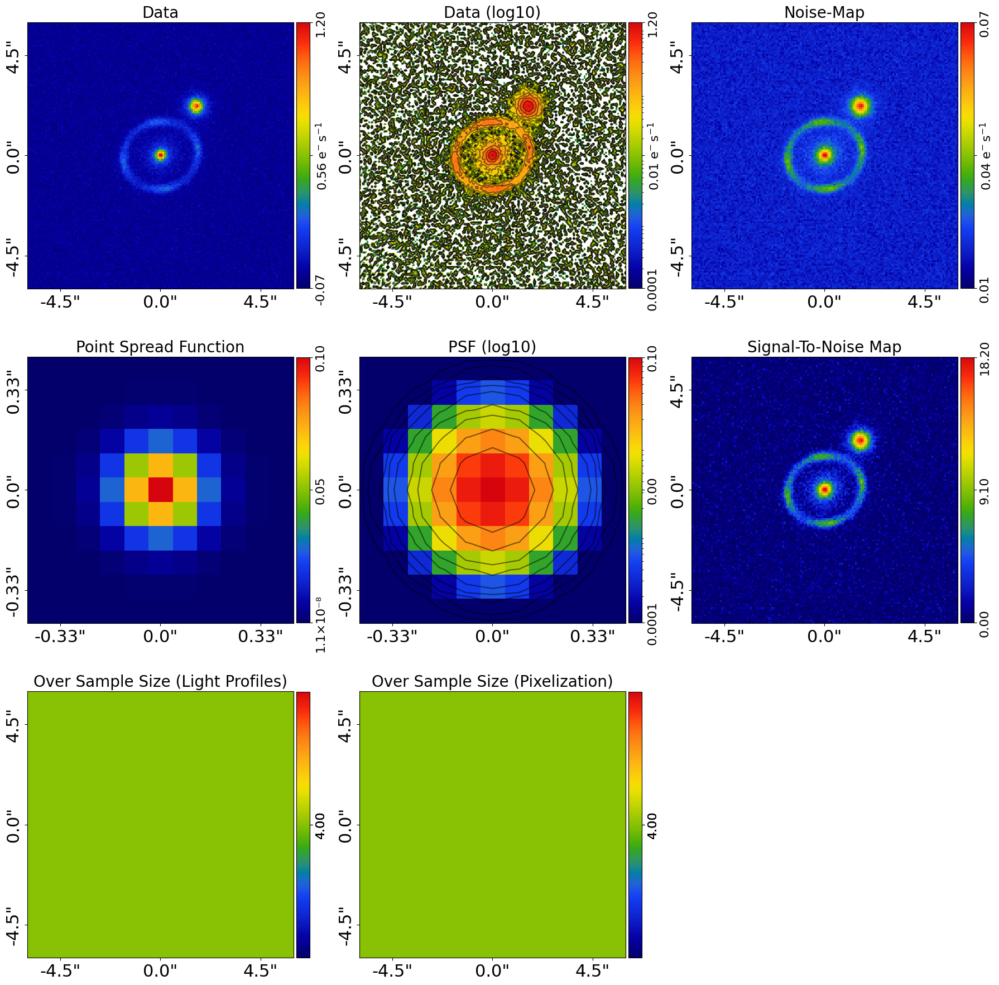
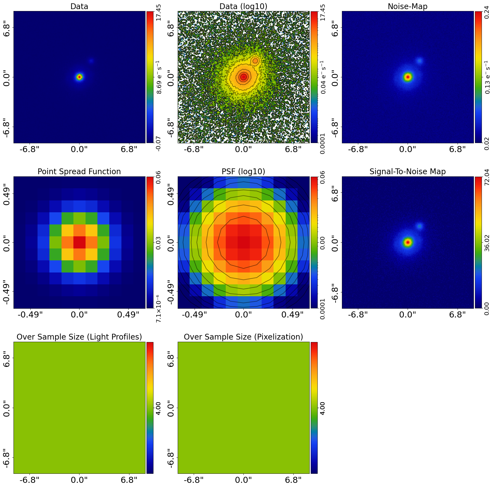
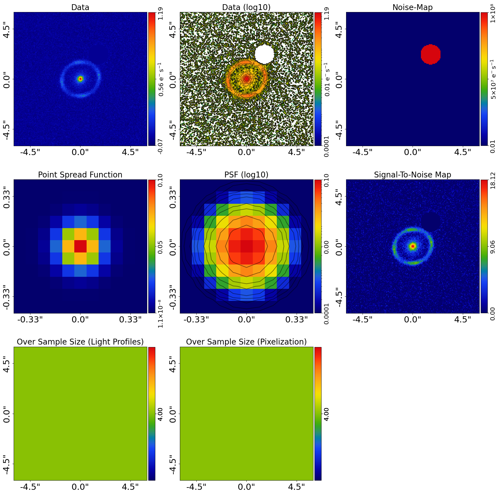
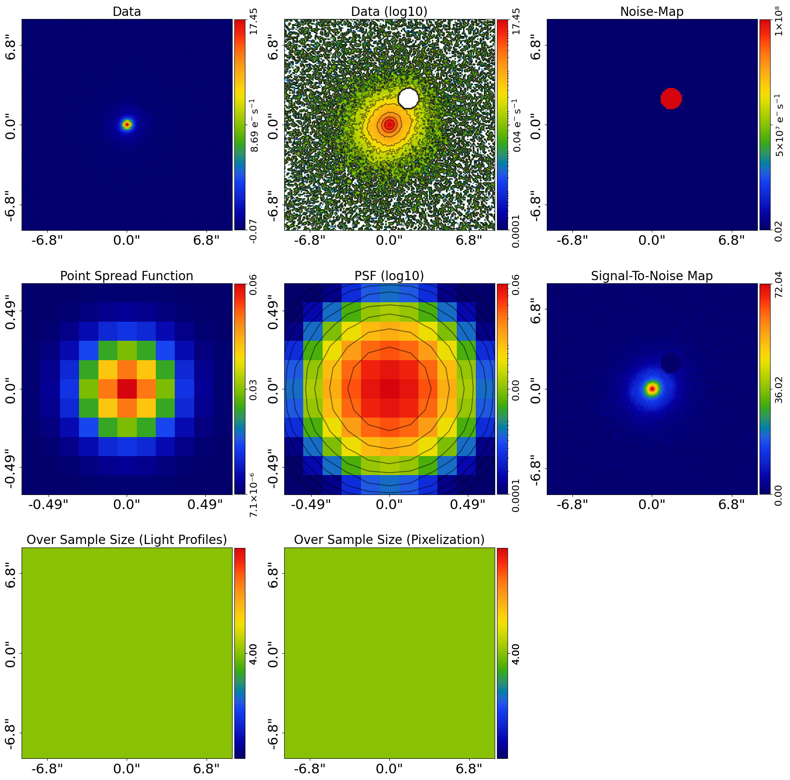
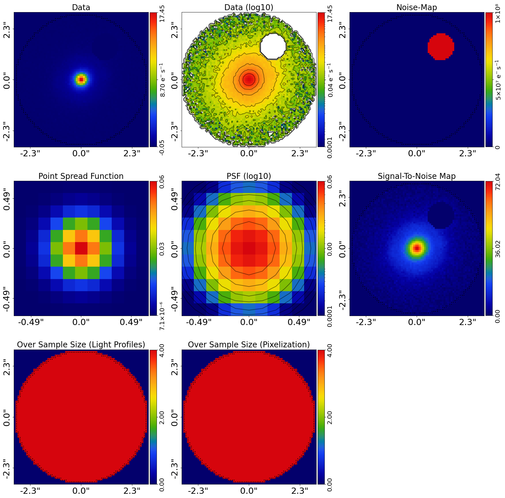
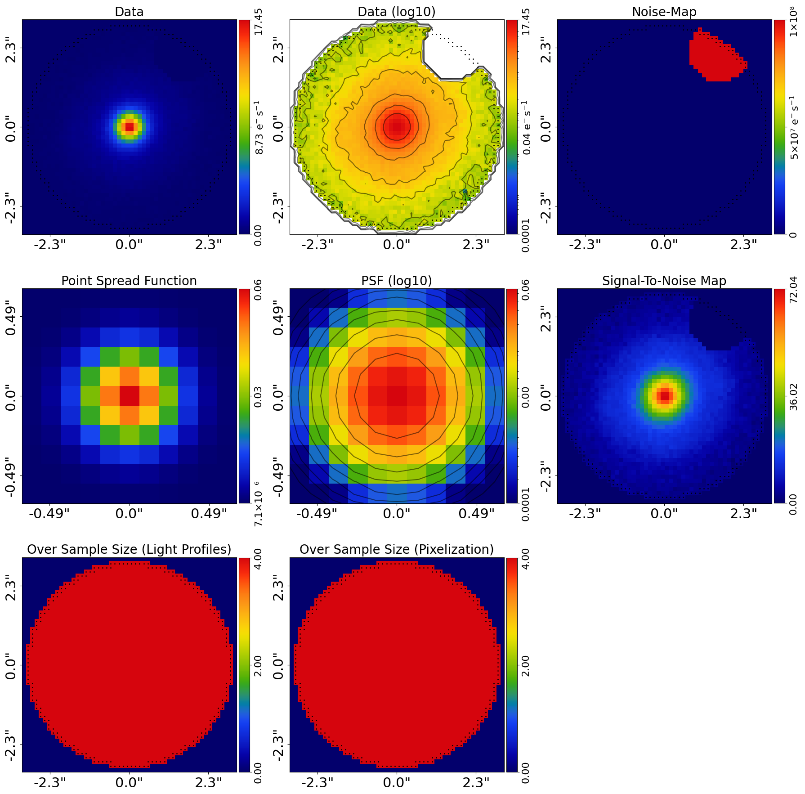
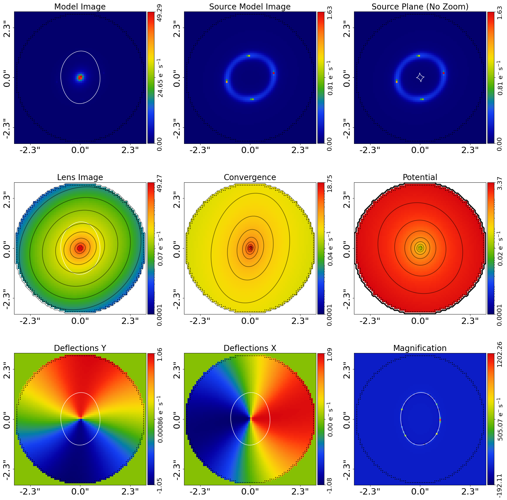
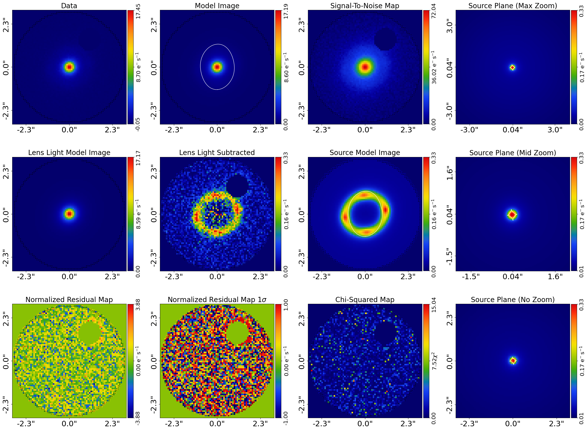
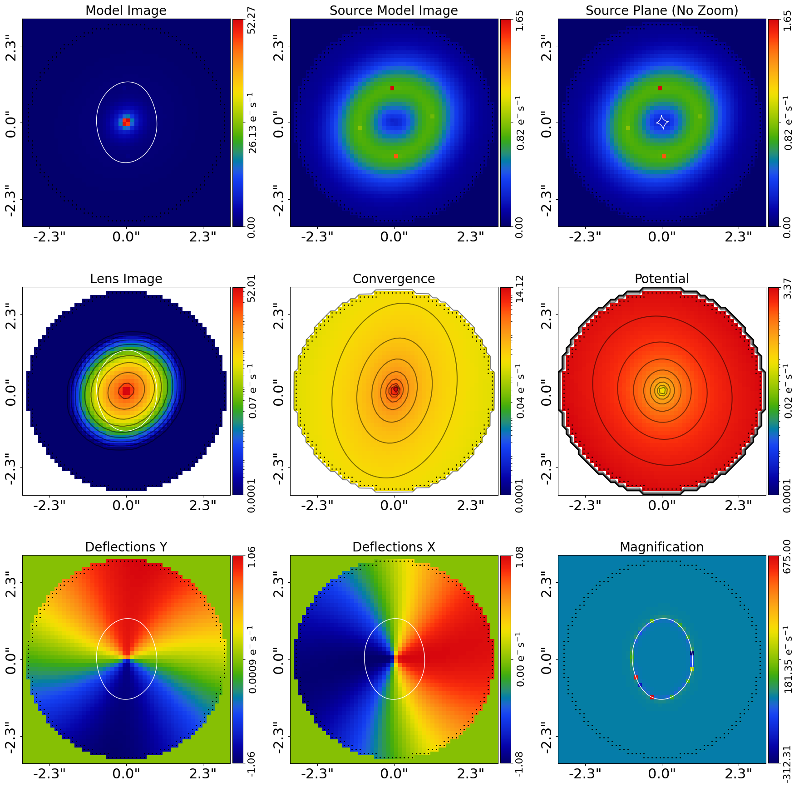
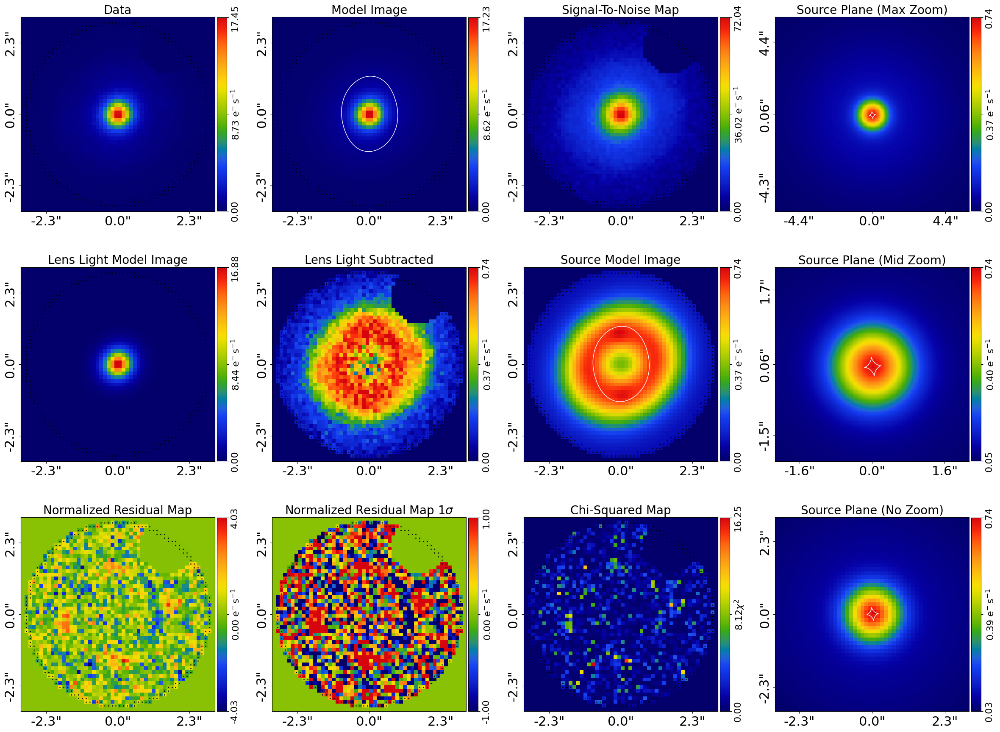

> ✏️ **This page is auto-generated from [`scripts/multi/modeling.py`](../../scripts/multi/modeling.py) — do not edit it directly.**
> It shows the example fully executed, with its real output images.
> Run it yourself via the [Python script](../../scripts/multi/modeling.py) or the [Jupyter notebook](../../notebooks/multi/modeling.ipynb).

Modeling: Multi Modeling
========================

This script fits a multi-wavelength `Imaging` dataset of a 'galaxy-scale' strong lens with a model where:

 - The lens galaxy's light is a MGE bulge where the `ell_comps` varies across wavelength.
 - The lens galaxy's total mass distribution is an `Isothermal` and `ExternalShear`.
 - The source galaxy's light is a an MGE where the `ell_comps` varies across wavelength.

Two images are fitted, corresponding to a greener ('g' band) redder image (`r` band).

This is an advanced script and assumes previous knowledge of the core **PyAutoLens** API for lens modeling. Thus,
certain parts of code are not documented to ensure the script is concise.

__Contents__

- **Colors:** The colors of the multi-wavelength image, which in this case are green (g-band) and red (r-band).
- **Pixel Scales:** Every multi-wavelength dataset can have its own unique pixel-scale.
- **Dataset & Mask:** Standard set up of the dataset and mask that is fitted.
- **Model:** Compose the lens model fitted to the data.
- **Model Extension:** Galaxies change appearance across wavelength, for example their ellipticities.
- **Linear Light Profiles:** As an advanced user you should be familiar wiht linear light profiles, see elsewhere in the.
- **Analysis List:** Set up two instances of the `Analysis` class object, one for each dataset.
- **JAX:** JAX acceleration for fast GPU/CPU model-fitting.
- **Analysis Factor:** Each analysis object is wrapped in an `AnalysisFactor`, which pairs it with the model and prepares.
- **Factor Graph:** All `AnalysisFactor` objects are combined into a `FactorGraphModel`, which represents a global.
- **Search:** Configure the non-linear search used to fit the model.
- **Live Visual Update:** Push the quick-update image to a live display surface.
- **VRAM Use:** The `modeling` examples of individual dataset types explain how VRAM is used during GPU-based.
- **Result:** Overview of the results of the model-fit.
- **Wrap Up:** Summary of the script and next steps.


```python

from autolens import jax_wrapper  # Sets JAX environment before other imports

from autolens import setup_notebook; setup_notebook()

from pathlib import Path
import autofit as af
import autolens as al
import autolens.plot as aplt
```

    Working Directory has been set to `autolens_workspace`


__Colors__

The colors of the multi-wavelength image, which in this case are green (g-band) and red (r-band).

The strings are used for load each dataset.


```python
waveband_list = ["g", "r"]
```

__Pixel Scales__

Every multi-wavelength dataset can have its own unique pixel-scale.


```python
pixel_scales_list = [0.08, 0.12]
```

__Dataset__

Load and plot each multi-wavelength strong lens dataset, using a list of their waveband colors.

Note how the lens and source appear different brightnesses in each wavelength. Multi-wavelength image can therefore 
better separate the lens and source galaxies.


```python
dataset_type = "multi"
dataset_label = "imaging"
dataset_name = "lens_sersic"

dataset_path = Path("dataset") / dataset_type / dataset_label / dataset_name
```

__Dataset Auto-Simulation__

If the dataset does not already exist on your system, it will be created by running the corresponding
simulator script. This ensures that all example scripts can be run without manually simulating data first.


```python
if al.util.dataset.should_simulate(str(dataset_path)):
    import subprocess
    import sys

    subprocess.run(
        [sys.executable, "scripts/multi/simulator.py"],
        check=True,
    )

dataset_list = [
    al.Imaging.from_fits(
        data_path=Path(dataset_path) / f"{waveband}_data.fits",
        psf_path=Path(dataset_path) / f"{waveband}_psf.fits",
        noise_map_path=Path(dataset_path) / f"{waveband}_noise_map.fits",
        pixel_scales=pixel_scales,
    )
    for waveband, pixel_scales in zip(waveband_list, pixel_scales_list)
]

for dataset in dataset_list:
    aplt.subplot_imaging_dataset(dataset=dataset)
```


    

    


    

    


__Extra Galaxies Noise Scaling__

Before masking, we must deal with any extra galaxies in the data: nearby galaxies (or foreground stars, or
data-reduction artefacts) whose emission is not associated with the strong lens but blends into the field. If
their light is left in the data it will contaminate the model-fit and bias the inferred lens model. It is too
easy to skip straight to modeling without checking for these, so we make this step an explicit part of the
workflow.

To prevent extra galaxies from impacting the fit, we do not mask them entirely from the fit. Instead, the pixels
are kept in the fit but their data values are scaled to zero and their noise-map values increased to very large
values, so they contribute negligibly to the likelihood. This is preferable to removing the pixels entirely
(e.g. for a pixelized source reconstruction, removing pixels can produce discontinuities in the pixelization).

The `lens_sersic` dataset includes a faint extra galaxy, and a per-waveband `{waveband}_mask_extra_galaxies.fits`
covering it is shipped with the dataset (created by the simulator). If you are modeling your own data with an
extra galaxy, you must either create such a mask using the data-preparation tools, or shrink the circular mask
below so the extra galaxy lies outside it and is removed from the fit entirely.

**Multi-wavelength Specific:** the noise scaling is applied to every waveband one-by-one, loading the mask whose
pixel scale and shape match that waveband's dataset.


```python
dataset_scaled_list = []

for dataset, waveband in zip(dataset_list, waveband_list):

    mask_extra_galaxies = al.Mask2D.from_fits(
        file_path=Path(dataset_path) / f"{waveband}_mask_extra_galaxies.fits",
        pixel_scales=dataset.pixel_scales,
        invert=True,  # `True` means a pixel is scaled.
    )

    dataset = dataset.apply_noise_scaling(mask=mask_extra_galaxies)

    aplt.subplot_imaging_dataset(dataset=dataset)

    dataset_scaled_list.append(dataset)

dataset_list = dataset_scaled_list
```

    2026-07-11 13:13:41,466 - autoarray.dataset.imaging.dataset - INFO - IMAGING - Data noise scaling applied, a total of 402 pixels were scaled to large noise values.


    

    


    2026-07-11 13:13:42,619 - autoarray.dataset.imaging.dataset - INFO - IMAGING - Data noise scaling applied, a total of 179 pixels were scaled to large noise values.


    

    


__Mask__

Define a 3.0" circular mask, which includes the emission of the lens and source galaxies.

For multi-wavelength lens modeling, we use the same mask for every dataset whenever possible. This is not
absolutely necessary, but provides a more reliable analysis.


```python
mask_radius = 3.0

mask_list = [
    al.Mask2D.circular(
        shape_native=dataset.shape_native,
        pixel_scales=dataset.pixel_scales,
        radius=mask_radius,
    )
    for dataset in dataset_list
]


dataset_list = [
    dataset.apply_mask(mask=mask) for imaging, mask in zip(dataset_list, mask_list)
]

for dataset in dataset_list:
    aplt.subplot_imaging_dataset(dataset=dataset)
```

    2026-07-11 13:13:43,863 - autoarray.dataset.imaging.dataset - INFO - IMAGING - Data masked, contains a total of 4404 image-pixels


    2026-07-11 13:13:43,868 - autoarray.dataset.imaging.dataset - INFO - IMAGING - Data masked, contains a total of 1976 image-pixels


    

    


    

    


__Model__

We compose a lens model where:

 - The lens galaxy's light is an MGE with 2 x 30 Gaussians, where the `intensity` parameter of the lens galaxy
 for each individual waveband of imaging is a different free parameter [6 parameters].

 - The lens galaxy's total mass distribution is an `Isothermal` and `ExternalShear` [7 parameters].

 - The source galaxy's light is a an MGE, where the `intensity` parameter of the source galaxy
 for each individual waveband of imaging is a different free parameter [8 parameters].

The number of free parameters and therefore the dimensionality of non-linear parameter space is N=23.

__Model Extension__

Galaxies change appearance across wavelength, for example their ellipticities.

Models applied to combined analyses can be extended to include free parameters specific to each dataset. In this example,
we will make the galaxy's ellipticity vary across the g and r-band datasets, which will be illustrated below.

__Linear Light Profiles__

As an advanced user you should be familiar wiht linear light profiles, see elsewhere in the workspace for informaiton
if not.

For multi wavelength dataset modeling, the `lp_linear` API is extremely powerful as the `ell_comps` varies across
the datasets, meaning that making it linear reduces the dimensionality of parameter space significantly.


```python
total_gaussians = 20

bulge = al.model_util.mge_model_from(
    mask_radius=mask_radius,
    total_gaussians=total_gaussians,
    gaussian_per_basis=1,
    centre_prior_is_uniform=True,
)

lens = af.Model(
    al.Galaxy,
    redshift=0.5,
    bulge=bulge,
    mass=al.mp.Isothermal,
    shear=al.mp.ExternalShear,
)

bulge = al.model_util.mge_model_from(
    mask_radius=mask_radius,
    total_gaussians=20,
    gaussian_per_basis=1,
    centre_prior_is_uniform=False,
)

source = af.Model(al.Galaxy, redshift=1.0, bulge=bulge)

model = af.Collection(galaxies=af.Collection(lens=lens, source=source))

```

__Analysis List__

Set up two instances of the `Analysis` class object, one for each dataset.

__JAX__

PyAutoLens uses JAX under the hood for fast GPU/CPU acceleration. If JAX is installed with GPU
support, your fits will run much faster (around 10 minutes instead of an hour). If only a CPU is available,
JAX will still provide a speed up via multithreading, with fits taking around 20-30 minutes.

If you don’t have a GPU locally, consider Google Colab which provides free GPUs, so your modeling runs are much faster.


```python
analysis_list = [
    al.AnalysisImaging(
        dataset=dataset,
        use_jax=True,  # JAX will use GPUs for acceleration if available, else JAX will use multithreaded CPUs.
    )
    for dataset in dataset_list
]
```

__Analysis Factor__

Each analysis object is wrapped in an `AnalysisFactor`, which pairs it with the model and prepares it for use in a 
factor graph. This step allows us to flexibly define how each dataset relates to the model.

The term "Factor" comes from factor graphs, a type of probabilistic graphical model. In this context, each factor 
represents the connection between one dataset and the shared model.

The API for extending the model across datasets is shown below, by overwriting the `ell_comps`
variables of the model passed to each `AnalysisFactor` object with new priors, making each dataset have its own
`ell_comps` free parameter.

NOTE: Other aspects of galaxies may vary across wavelength, none of which are included in this example. The API below 
can easily be extended to include these additional parameters, and the `features` package explains other tools for 
extending the model across datasets.


```python
analysis_factor_list = []

for analysis in analysis_list:

    model_analysis = model.copy()

    ell_comps_0_prior = af.GaussianPrior(mean=0.0, sigma=0.3)
    ell_comps_1_prior = af.GaussianPrior(mean=0.0, sigma=0.3)

    for i in range(len(model_analysis.galaxies.lens.bulge.profile_list)):

        model_analysis.galaxies.lens.bulge.profile_list[i].ell_comps.ell_comps_0 = (
            ell_comps_0_prior
        )
        model_analysis.galaxies.lens.bulge.profile_list[i].ell_comps.ell_comps_1 = (
            ell_comps_1_prior
        )

    analysis_factor = af.AnalysisFactor(prior_model=model_analysis, analysis=analysis)

    analysis_factor_list.append(analysis_factor)
```

__Factor Graph__

All `AnalysisFactor` objects are combined into a `FactorGraphModel`, which represents a global model fit to 
multiple datasets using a graphical model structure.

The key outcomes of this setup are:

 - The individual log likelihoods from each `Analysis` object are summed to form the total log likelihood 
   evaluated during the model-fitting process.

 - Results from all datasets are output to a unified directory, with subdirectories for visualizations 
   from each analysis object, as defined by their `visualize` methods.

This is a basic use of **PyAutoFit**'s graphical modeling capabilities, which support advanced hierarchical 
and probabilistic modeling for large, multi-dataset analyses.


```python
factor_graph = af.FactorGraphModel(*analysis_factor_list, use_jax=True)
```

To inspect this new model, with extra parameters for each dataset created, we 
print `factor_graph.global_prior_model.info`.


```python
print(factor_graph.global_prior_model.info)
```

    Total Free Parameters = 17
    
    model                                                                           GlobalPriorModel (N=17)
        0 - 1                                                                       Collection (N=15)
            galaxies                                                                Collection (N=15)
                lens                                                                Galaxy (N=11)
                    mass                                                            Isothermal (N=5)
                    shear                                                           ExternalShear (N=2)
                source                                                              Galaxy (N=4)
                lens - source
    ... [115 lines of output truncated] ...
                            sigma                                                   3.0
    0
        galaxies
            lens
                bulge
                    profile_list
                        0 - 19
                            ell_comps
                                ell_comps_0                                         GaussianPrior [215], mean = 0.0, sigma = 0.3
                                ell_comps_1                                         GaussianPrior [216], mean = 0.0, sigma = 0.3
    1
        galaxies
            lens
                bulge
                    profile_list
                        0 - 19
                            ell_comps
                                ell_comps_0                                         GaussianPrior [217], mean = 0.0, sigma = 0.3
                                ell_comps_1                                         GaussianPrior [218], mean = 0.0, sigma = 0.3


__Search__

__Live Visual Update__

By default the quick-update image is only written to disk. Set `live_visual_update=True` to also push it to a
live display surface:

- **Python script** — a matplotlib window opens automatically and refreshes with each quick update, so you can
  watch the fit converge without leaving your terminal.
- **Jupyter / Colab notebook** — the cell that ran `search.fit(...)` shows a single self-updating image that
  refreshes in place every `iterations_per_quick_update`.

The disk write (`fit.png`) always happens regardless of this flag. Set it to `False` (the default) if you just
want the on-disk output, or if you are running in a headless environment (e.g. an HPC cluster).


```python
search = af.Nautilus(
    path_prefix=Path(
        "multi_wavelength"
    ),  # The path where results and output are stored.
    name="modeling",  # The name of the fit and folder results are output to.
    unique_tag=dataset_name,  # A unique tag which also defines the folder.
    n_live=150,  # The number of Nautilus "live" points, increase for more complex models.
    n_batch=50,  # GPU lens model fits are batched and run simultaneously, see VRAM section below.
    iterations_per_quick_update=10000,  # Every N iterations the max likelihood model is visualized in the Jupter Notebook and output to hard-disk.
    live_visual_update=False,  # Set True to open a live matplotlib window (script) or refresh a Jupyter cell (notebook).
)
```

__VRAM Use__

The `modeling` examples of individual dataset types explain how VRAM is used during GPU-based fitting and how to 
print the estimated VRAM required by a model.

When multiple datasets are fitted simultaneously, as in this example, VRAM usage increases with each
dataset, as their data structures must all be stored in VRAM.

Given VRAM use is an important consideration, we print out the estimated VRAM required for this
model-fit and advise you do this for your own pixelization model-fits.

The method below prints the VRAM usage estimate for the analysis and model with the specified batch size,
it takes about 20-30 seconds to run so you may want to comment it out once you are familiar with your GPU's VRAM limits.


```python
factor_graph.print_vram_use(
    model=factor_graph.global_prior_model, batch_size=search.batch_size
)
```

    2026-07-11 13:13:53,150 - autofit.non_linear.fitness - INFO - JAX: Applying vmap and jit to likelihood function -- may take a few seconds.


    2026-07-11 13:13:53,151 - autofit.non_linear.fitness - INFO - JAX: vmap and jit applied in 0.0007517337799072266 seconds.


    VRAM USE = 1.042 GB


__Model-Fit__

To fit multiple datasets, we pass the `FactorGraphModel` to a non-linear search.

Unlike single-dataset fitting, we now pass the `factor_graph.global_prior_model` as the model and 
the `factor_graph` itself as the analysis object.

This structure enables simultaneous fitting of multiple datasets in a consistent and scalable way.

**Run Time Error:** On certain operating systems (e.g. Windows, Linux) and Python versions, the code below may produce 
an error. If this occurs, see the `autolens_workspace/guides/modeling/bug_fix` example for a fix.


```python
print(
    """
    The non-linear search has begun running.

    This Jupyter notebook cell with progress once the search has completed - this could take a few minutes!

    On-the-fly updates every iterations_per_quick_update are printed to the notebook.
    """
)

result_list = search.fit(model=factor_graph.global_prior_model, analysis=factor_graph)

print("The search has finished run - you may now continue the notebook.")

```

    2026-07-11 14:15:40,001 - autofit.non_linear.fitness - INFO - Performing quick update of maximum log likelihood fit image and model.results


    2026-07-11 14:15:52,796 - autofit.non_linear.fitness - INFO - Maximum Log Likelihood                                                          5929.29327180
    
    
    
    model                                                                           GlobalPriorModel (N=17)
        0 - 1                                                                       Collection (N=15)
            galaxies                                                                Collection (N=15)
                lens                                                                Galaxy (N=11)
                    mass                                                            Isothermal (N=5)
                    shear                                                           ExternalShear (N=2)
    ... [40 lines of output truncated] ...
    0
        galaxies
            lens
                bulge
                    profile_list
                        0 - 19
                            ell_comps
                                ell_comps_0                                         0.059
                                ell_comps_1                                         -0.002
    1
        galaxies
            lens
                bulge
                    profile_list
                        0 - 19
                            ell_comps
                                ell_comps_0                                         0.054
                                ell_comps_1                                         0.000
    


    2026-07-11 14:15:52,797 - autofit.non_linear.fitness - INFO - Quick update complete in 12.796274423599243 seconds.


    

    

    

    

    

    

    

    

    

    

    

    

    

    

    

    

    

    

    

    

    

    

    

    

    

    

    

    

    

    

    

    

    

    

    

    

    

    

    

    

    

    

    

    

    

    

    

    

    

    

    

    

    

    

    

    

    Finished  | 89     | 1        | 4        | 51350    | N/A    | 3056  | +5851.81 
    2026-07-11 14:19:46,225 - modeling - INFO - Fit Running: Updating results (see output folder).


    2026-07-11 14:21:11,668 - autofit.non_linear.plot.plot_util - INFO - Unable to produce corner_anesthetic visual: posterior estimate not yet sufficient. Should succeed in a later update.


    Starting the nautilus sampler...
    Please report issues at github.com/johannesulf/nautilus.
    Status    | Bounds | Ellipses | Networks | Calls    | f_live | N_eff | log Z    
    Finished  | 89     | 1        | 4        | 51350    | N/A    | 3056  | +5851.81 
    2026-07-11 14:21:29,635 - modeling - INFO - Fit Running: Updating results (see output folder).


    2026-07-11 14:21:50,595 - autofit.non_linear.samples.samples - INFO - Samples with weight less than 1e-10 removed from samples.csv.


    2026-07-11 14:21:52,220 - autofit.non_linear.search.updater - INFO - Creating latent samples by drawing 100 from the PDF.


    2026-07-11 14:22:54,383 - autofit.non_linear.plot.plot_util - INFO - Unable to produce corner_anesthetic visual: posterior estimate not yet sufficient. Should succeed in a later update.


    2026-07-11 14:23:22,873 - modeling - INFO - Removing search internal folder.


    2026-07-11 14:23:22,880 - modeling - INFO - Removing all files except for .zip file


    2026-07-11 14:23:24,395 - modeling - INFO - Search complete, returning result


    The search has finished run - you may now continue the notebook.


    <Figure size 6800x6800 with 0 Axes>


    <Figure size 6800x6800 with 0 Axes>


__Result__

The result object returned by this model-fit is a list of `Result` objects, because we used a factor graph.
Each result corresponds to each analysis, and therefore corresponds to the model-fit at that wavelength.

For example, close inspection of the `max_log_likelihood_instance` of the two results shows that all parameters,
except the `effective_radius` of the source galaxy's `bulge`, are identical.


```python
print(result_list[0].max_log_likelihood_instance)
print(result_list[1].max_log_likelihood_instance)
```

    <autofit.mapper.model.ModelInstance object at 0x7fed872d3170>
    <autofit.mapper.model.ModelInstance object at 0x7fed81930c80>


Plotting each result's tracer shows that the source appears different, owning to its different intensities.


```python
for result in result_list:
    aplt.subplot_tracer(tracer=result.max_log_likelihood_tracer, grid=result.grids.lp)

    aplt.subplot_fit_imaging(fit=result.max_log_likelihood_fit)
```


    

    


    

    


    

    


    

    


The `Samples` object still has the dimensions of the overall non-linear search (in this case N=15). 

Therefore, the samples is identical in every result object.


```python
for result in result_list:
    aplt.corner_anesthetic(samples=result.samples)
```

    2026-07-11 14:23:55,221 - autofit.non_linear.plot.plot_util - INFO - Unable to produce corner_anesthetic visual: posterior estimate not yet sufficient. Should succeed in a later update.


    2026-07-11 14:23:55,981 - autofit.non_linear.plot.plot_util - INFO - Unable to produce corner_anesthetic visual: posterior estimate not yet sufficient. Should succeed in a later update.


    <Figure size 6000x6000 with 0 Axes>


    <Figure size 6000x6000 with 0 Axes>


__Wrap Up__

This simple example introduces the API for fitting multiple datasets with a shared model.

It should already be quite intuitive how this API can be adapted to fit more complex models, or fit different
datasets with different models. For example, an `AnalysisImaging` and `AnalysisInterferometer` can be combined, into
a single factor graph model, to simultaneously fit a imaging and interferometric data.

The `advanced/multi/modeling` package has more examples of how to fit multiple datasets with different models,
including relational models that vary parameters across datasets as a function of wavelength.


```python

```
