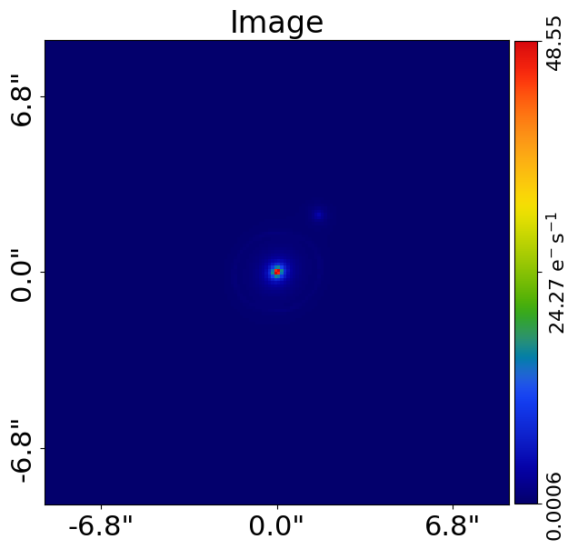
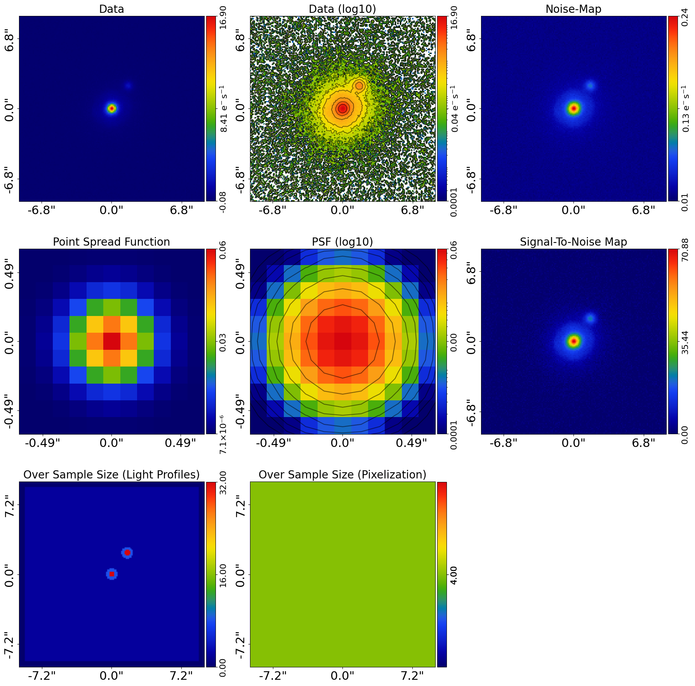
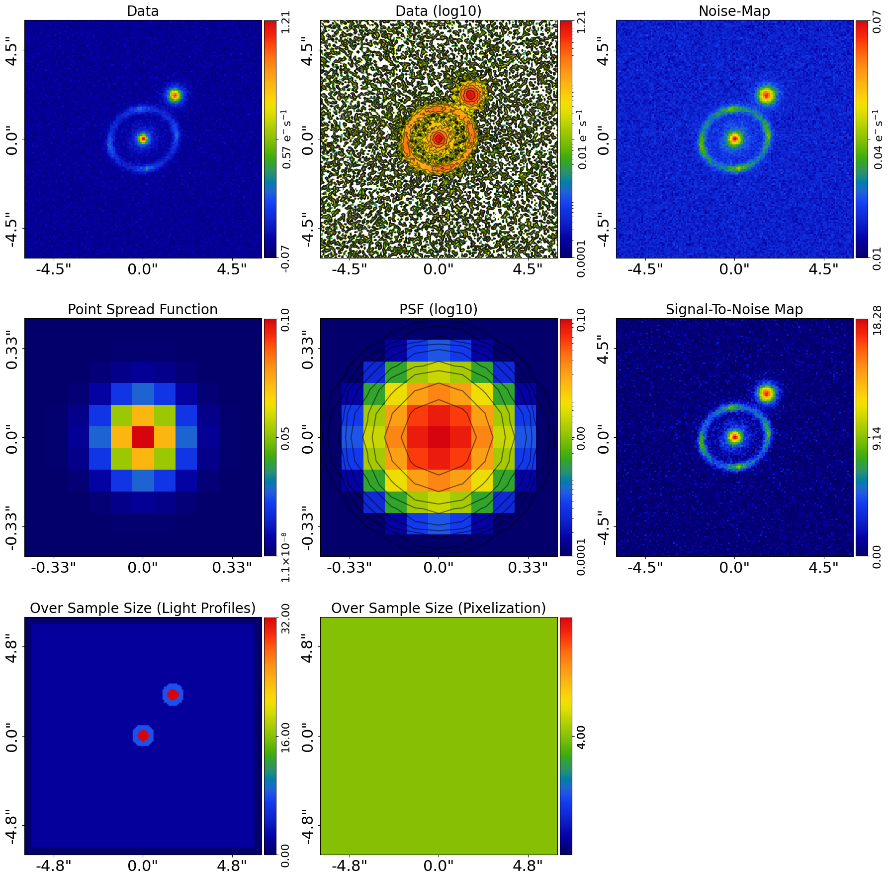
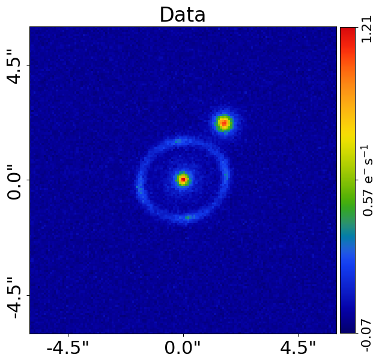
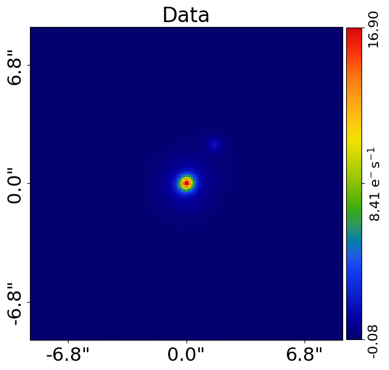
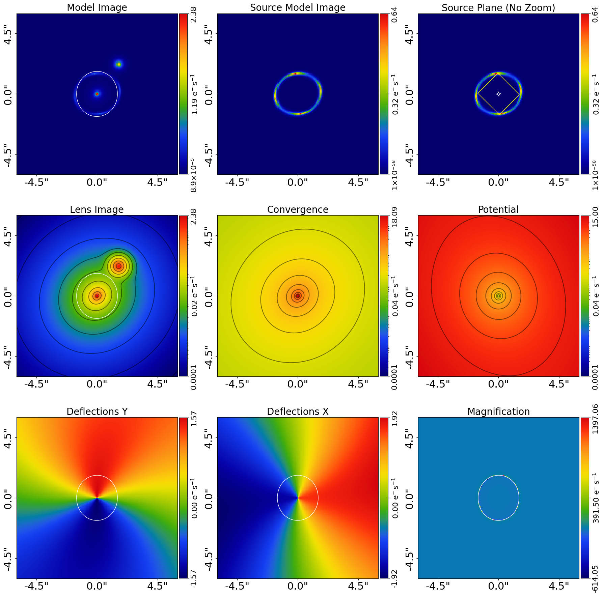
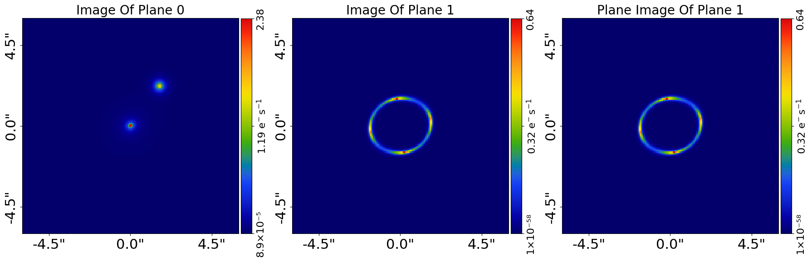
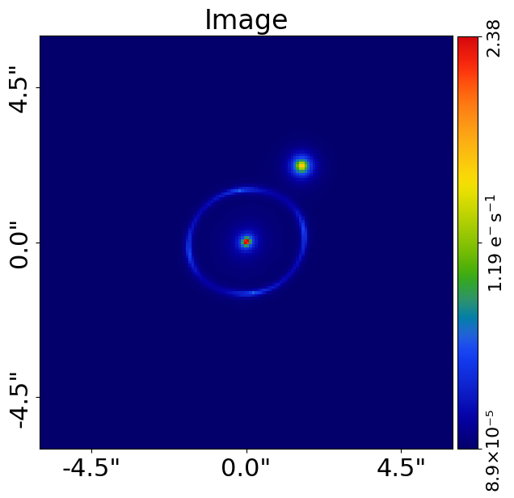
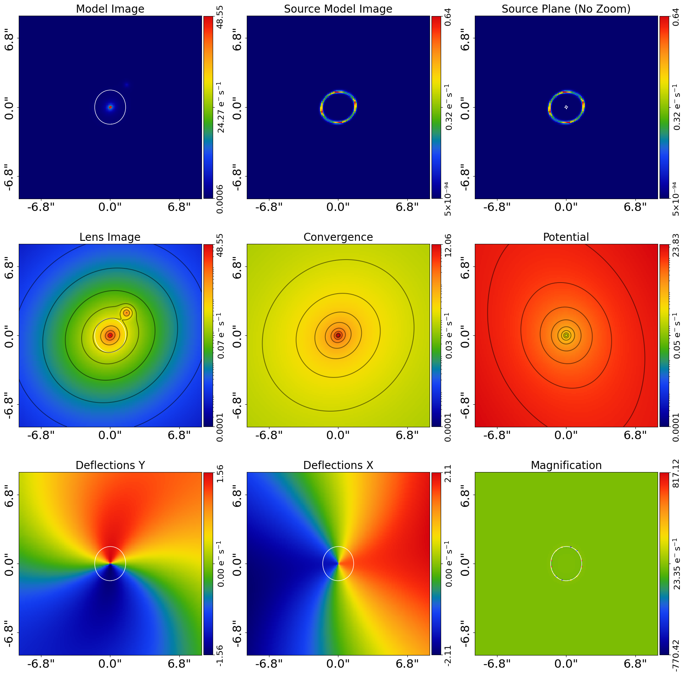
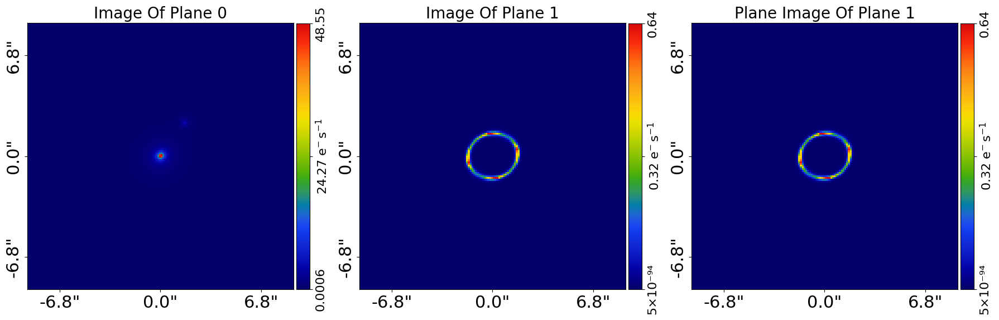

> ✏️ **This page is auto-generated from [`scripts/multi/simulator.py`](../../scripts/multi/simulator.py) — do not edit it directly.**
> It shows the example fully executed, with its real output images.
> Run it yourself via the [Python script](../../scripts/multi/simulator.py) or the [Jupyter notebook](../../notebooks/multi/simulator.ipynb).

Simulator: SIE
==============

This script simulates multi-wavelength `Imaging` of a 'galaxy-scale' strong lens where:

 - The lens galaxy's light profile is an `Sersic`, which has a different `intensity` at each wavelength.
 - The lens galaxy's total mass distribution is an `Isothermal` and `ExternalShear`.
 - The source galaxy's light is an `Sersic`, which has a different `intensity` at each wavelength.
 - A faint extra galaxy is included offset from the lens, whose emission must be removed via noise scaling
   (a per-waveband `{waveband}_mask_extra_galaxies.fits` covering it is written below).

Two images are simulated, corresponding to a greener ('g' band) redder image (`r` band).

This is an advanced script and assumes previous knowledge of the core **PyAutoLens** API for simulating images. Thus,
certain parts of code are not documented to ensure the script is concise.

__Contents__

- **Colors:** The colors of the multi-wavelength image, which in this case are green (g-band) and red (r-band).
- **Dataset Paths:** Overview of dataset paths for this example.
- **Simulate:** The pixel-scale of each color image is different meaning we make a list of grids for the simulation.
- **Ray Tracing:** The lens galaxy light at each wavelength has a different intensity, thus we create two lens.
- **Output:** Output each simulated dataset to the dataset path as .fits files, with a tag describing its color.
- **Visualize:** Output a subplot of the simulated dataset, the image and the tracer's quantities to the dataset.
- **Tracer json:** Save the `Tracer` in the dataset folder as a .json file, ensuring the true light profiles, mass.


```python

from autoconf import jax_wrapper  # Sets JAX environment before other imports

from autoconf import setup_notebook; setup_notebook()

from pathlib import Path
import autolens as al
import autolens.plot as aplt
```

    Working Directory has been set to `autolens_workspace`


__Colors__

The colors of the multi-wavelength image, which in this case are green (g-band) and red (r-band).

The strings are used for naming the datasets on output.


```python
waveband_list = ["g", "r"]
```

__Dataset Paths__


```python
dataset_type = "multi"
dataset_label = "imaging"
dataset_name = "lens_sersic"

dataset_path = Path("dataset") / dataset_type / dataset_label / dataset_name
```

__Simulate__

The pixel-scale of each color image is different meaning we make a list of grids for the simulation.


```python
pixel_scales_list = [0.08, 0.12]
```

The centre of a faint extra galaxy, placed inside the 3.0" modeling mask but clear of the lensed source arcs
(Einstein radius ~1.6"). It is reused for over-sampling, the galaxy itself and the per-waveband
`mask_extra_galaxies.fits` written further down.


```python
extra_galaxy_centre = (2.2, 1.6)

grid_list = []

for pixel_scales in pixel_scales_list:
    grid = al.Grid2D.uniform(
        shape_native=(150, 150),
        pixel_scales=pixel_scales,
    )

    over_sample_size = al.util.over_sample.over_sample_size_via_radial_bins_from(
        grid=grid,
        sub_size_list=[32, 8, 2],
        radial_list=[0.3, 0.6],
        centre_list=[(0.0, 0.0), extra_galaxy_centre],
    )

    grid = grid.apply_over_sampling(over_sample_size=over_sample_size)

    grid_list.append(grid)
```

Simulate simple Gaussian PSFs for the images in the r and g bands.


```python
sigma_list = [0.1, 0.2]

psf_list = [
    al.Convolver.from_gaussian(
        convolve_over_sample_size=1,
        shape_native=(11, 11), sigma=sigma, pixel_scales=grid.pixel_scales
    )
    for grid, sigma in zip(grid_list, sigma_list)
]
```

Create separate simulators for the g and r bands.


```python
background_sky_level_list = [0.1, 0.15]

simulator_list = [
    al.SimulatorImaging(
        exposure_time=300.0,
        psf=psf,
        background_sky_level=background_sky_level,
        add_poisson_noise_to_data=True,
    )
    for psf, background_sky_level in zip(psf_list, background_sky_level_list)
]
```

__Ray Tracing__

The lens galaxy light at each wavelength has a different intensity, thus we create two lens galaxies for each waveband. 

The lens galaxy's mass (SIE+Shear) is identical for each waveband and included in both lens galaxies in the list..


```python
intensity_list = [0.05, 1.5]

bulge_list = [
    al.lp.Sersic(
        centre=(0.0, 0.0),
        ell_comps=al.convert.ell_comps_from(axis_ratio=0.9, angle=45.0),
        intensity=intensity,
        effective_radius=0.8,
        sersic_index=4.0,
    )
    for intensity in intensity_list
]

mass = al.mp.Isothermal(
    centre=(0.0, 0.0),
    einstein_radius=1.6,
    ell_comps=al.convert.ell_comps_from(axis_ratio=0.9, angle=45.0),
)

lens_galaxy_list = [
    al.Galaxy(
        redshift=0.5,
        bulge=bulge,
        mass=mass,
        shear=al.mp.ExternalShear(gamma_1=0.05, gamma_2=0.05),
    )
    for bulge in bulge_list
]
```

__Ray Tracing__

The source galaxy at each wavelength has a different intensity, thus we create two source galaxies for each waveband.


```python
intensity_list = [0.5, 0.7]

source_galaxy_list = [
    al.Galaxy(
        redshift=1.0,
        bulge=al.lp.SersicCore(
            centre=(0.0, 0.0),
            ell_comps=al.convert.ell_comps_from(axis_ratio=0.8, angle=60.0),
            intensity=intensity,
            effective_radius=0.1,
            sersic_index=1.0,
        ),
    )
    for intensity in intensity_list
]
```

__Extra Galaxy__

A single faint extra galaxy offset from the lens, representing a nearby contaminating object whose emission is
removed in the modeling example via the `__Extra Galaxies Noise Scaling__` step. Its intensity differs per
waveband (like the lens and source) and it has a light profile only (no mass), so the lensed source arcs are
unchanged.


```python
extra_intensity_list = [0.4, 1.0]

extra_galaxy_list = [
    al.Galaxy(
        redshift=0.5,
        light=al.lp.ExponentialSph(
            centre=extra_galaxy_centre, intensity=intensity, effective_radius=0.3
        ),
    )
    for intensity in extra_intensity_list
]
```

Use these galaxies to setup tracers at each waveband, which will generate each image for the simulated `Imaging`
dataset.


```python
tracer_list = [
    al.Tracer(galaxies=[lens_galaxy, extra_galaxy, source_galaxy])
    for lens_galaxy, extra_galaxy, source_galaxy in zip(
        lens_galaxy_list, extra_galaxy_list, source_galaxy_list
    )
]
```

Lets look at the tracer`s image, this is the image we'll be simulating.


```python
for tracer, grid in zip(tracer_list, grid_list):
    aplt.plot_array(array=tracer.image_2d_from(grid=grid), title="Image")
```


    

    


    

    


Pass the simulator a tracer, which creates the image which is simulated as an imaging dataset.


```python
dataset_list = [
    simulator.via_tracer_from(tracer=tracer, grid=grid)
    for grid, simulator, tracer in zip(grid_list, simulator_list, tracer_list)
]
```

    .../PyAutoArray/autoarray/operators/convolver.py:1415: UserWarning: No blurring_image provided. Only the direct image will be convolved. This may change the correctness of the PSF convolution.
      warnings.warn(


Plot the simulated `Imaging` dataset before outputting it to fits.


```python
for dataset in dataset_list:
    aplt.subplot_imaging_dataset(dataset=dataset)
```


    

    


    

    


__Output__

Output each simulated dataset to the dataset path as .fits files, with a tag describing its color.


```python
for waveband, dataset in zip(waveband_list, dataset_list):
    aplt.fits_imaging(
        dataset=dataset,
        data_path=Path(dataset_path) / f"{waveband}_data.fits",
        psf_path=Path(dataset_path) / f"{waveband}_psf.fits",
        noise_map_path=Path(dataset_path) / f"{waveband}_noise_map.fits",
        overwrite=True,
    )
```

__Mask Extra Galaxies__

Build and output a per-waveband `{waveband}_mask_extra_galaxies.fits` covering the extra galaxy, so the modeling
example (`multi/modeling.py`) can load each one and apply noise scaling. The mask is built per dataset because the
wavebands have different pixel scales and therefore different `shape_native`. The circle is sized to ~3x the
galaxy's `effective_radius`, derived from the same `extra_galaxy_centre` defined above.


```python
for waveband, dataset in zip(waveband_list, dataset_list):
    mask_extra_galaxies = al.Mask2D.circular(
        shape_native=dataset.shape_native,
        pixel_scales=dataset.pixel_scales,
        centre=extra_galaxy_centre,
        radius=3.0 * 0.3,
        invert=True,  # `True` inside the circle, i.e. the region whose noise is scaled.
    )

    aplt.fits_array(
        array=mask_extra_galaxies,
        file_path=Path(dataset_path) / f"{waveband}_mask_extra_galaxies.fits",
        overwrite=True,
    )
```

__Visualize__

Output a subplot of the simulated dataset, the image and the tracer's quantities to the dataset path as .png files.


```python
for waveband, dataset in zip(waveband_list, dataset_list):
    aplt.subplot_imaging_dataset(dataset=dataset)
    aplt.plot_array(array=dataset.data, title="Data")


for waveband, grid, tracer in zip(waveband_list, grid_list, tracer_list):
    aplt.subplot_tracer(tracer=tracer, grid=grid)
    aplt.subplot_galaxies_images(tracer=tracer, grid=grid)

    aplt.plot_array(array=tracer.image_2d_from(grid=grid), title="Image")
```


    

    


    

    


    

    


    

    


    

    


    

    


    

    


    

    


    

    


    

    


__Tracer json__

Save the `Tracer` in the dataset folder as a .json file, ensuring the true light profiles, mass profiles and galaxies
are safely stored and available to check how the dataset was simulated in the future. 

This can be loaded via the method `tracer = al.from_json()`.


```python
[
    al.output_to_json(
        obj=tracer, file_path=Path(dataset_path, f"{waveband}_tracer.json")
    )
    for color, tracer in zip(waveband_list, tracer_list)
]
```


    [None, None]


The dataset can be viewed in the folder `autolens_workspace/imaging/multi/lens_sersic`.


```python

```
