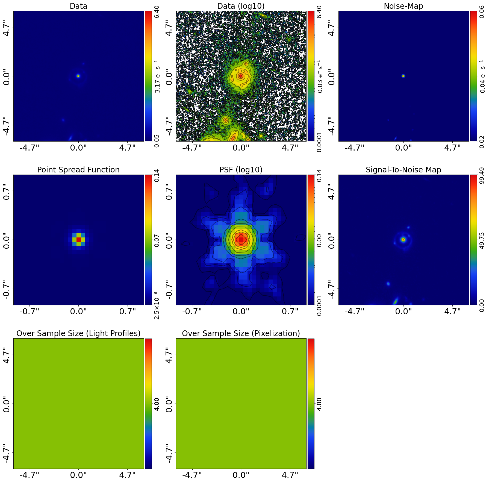
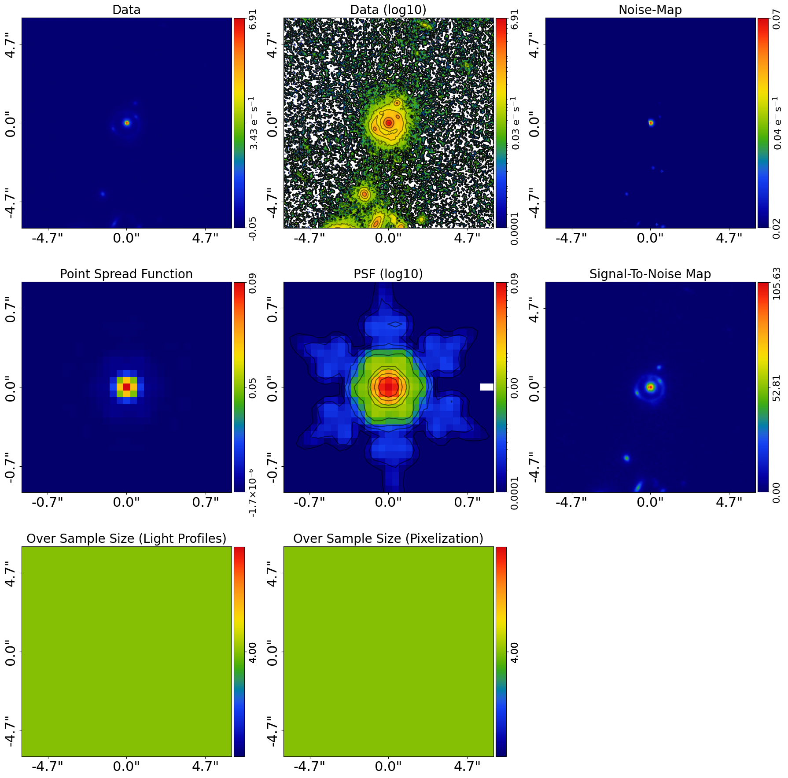
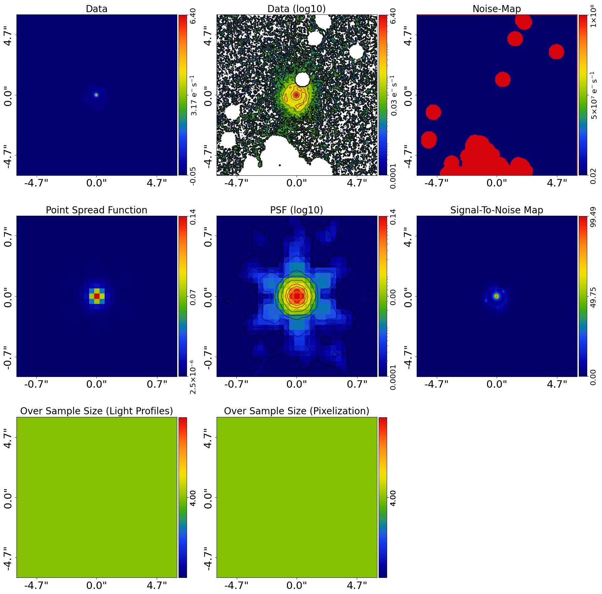
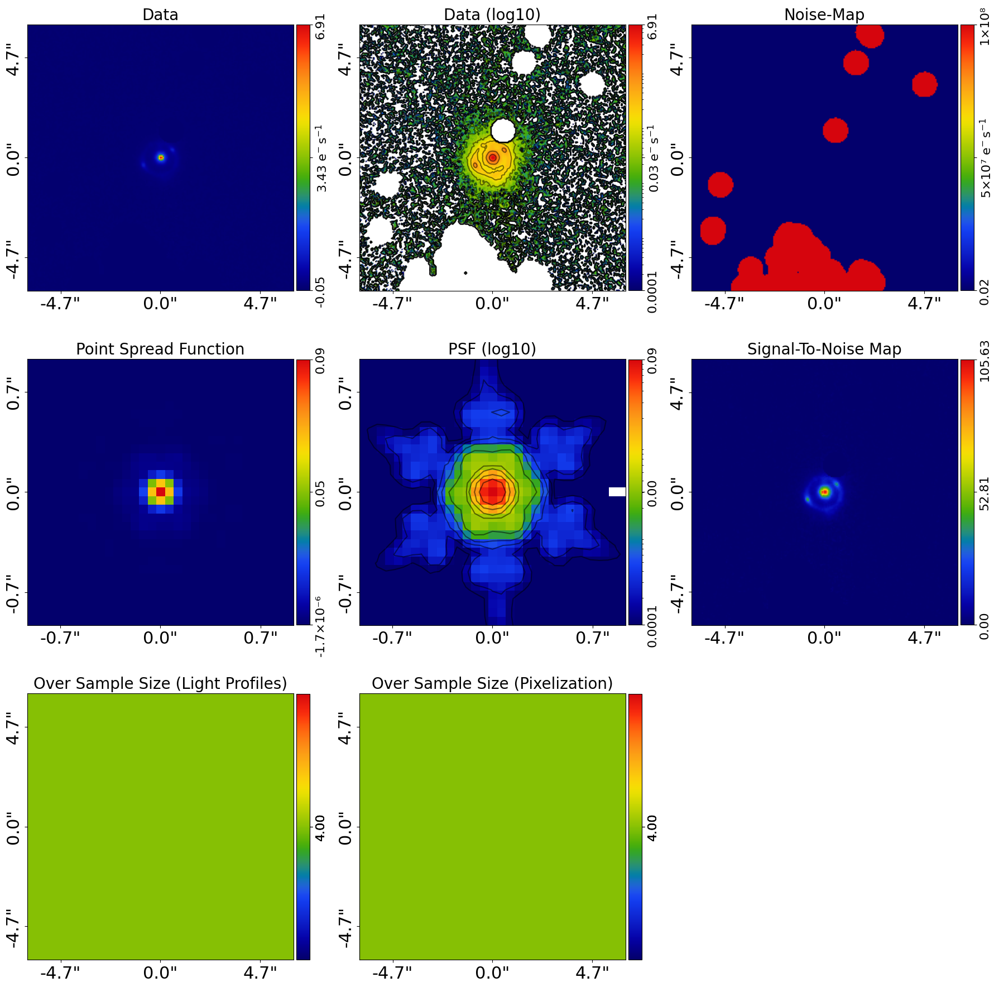
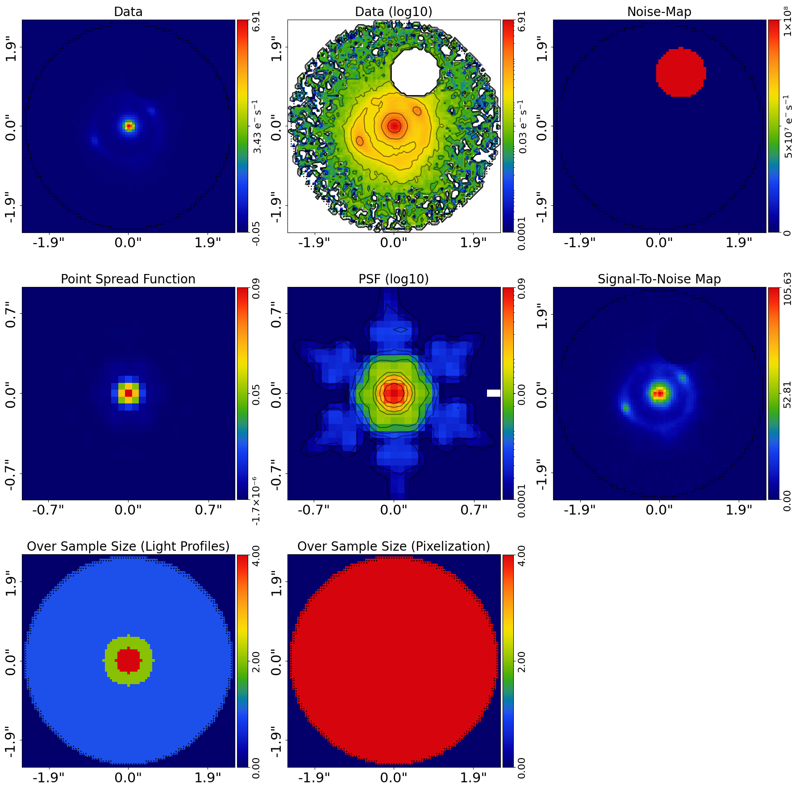
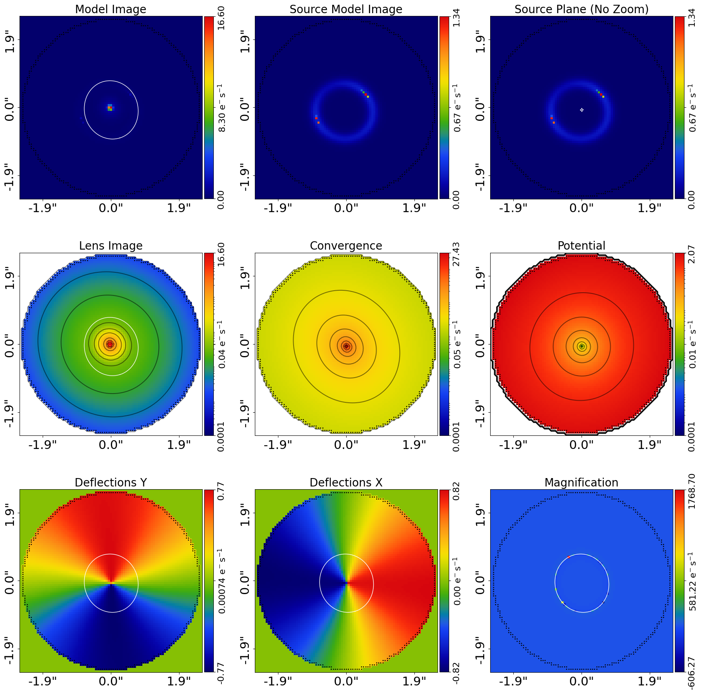
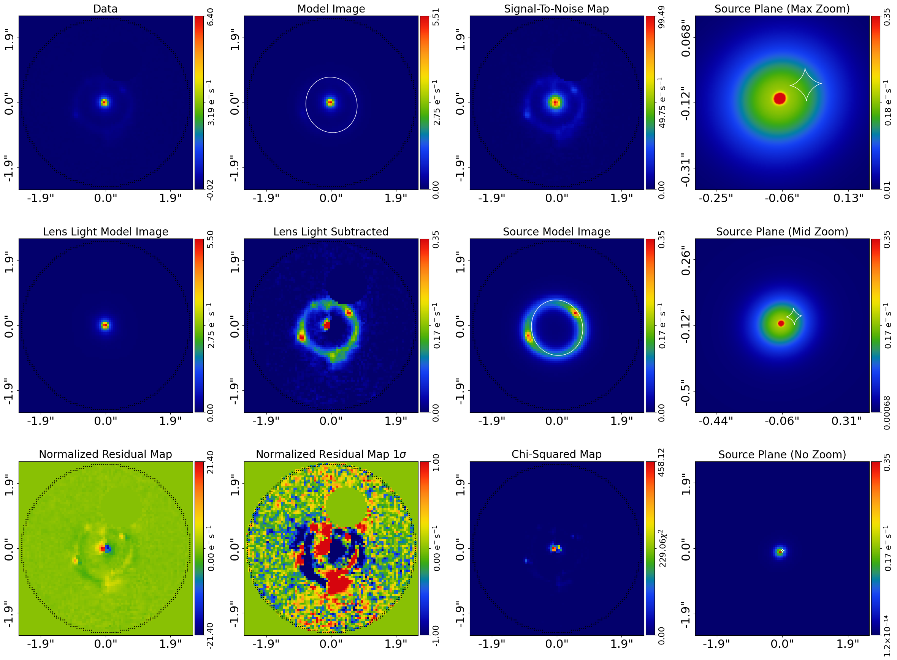
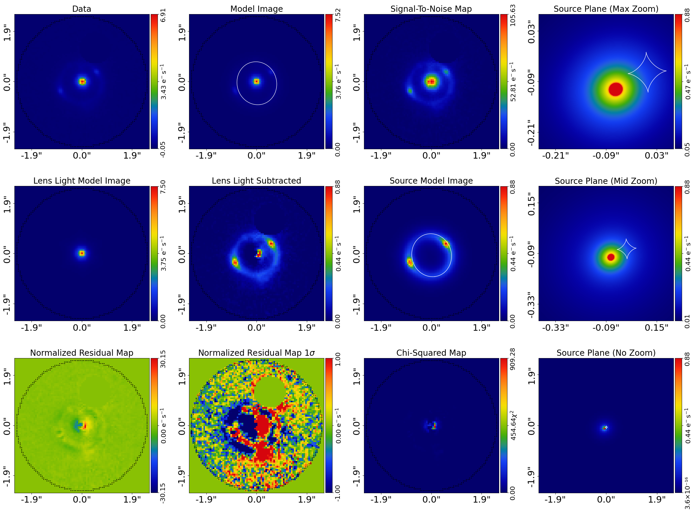

> ✏️ **This page is auto-generated from [`scripts/multi/start_here.py`](../../scripts/multi/start_here.py) — do not edit it directly.**
> It shows the example fully executed, with its real output images.
> Run it yourself via the [Python script](../../scripts/multi/start_here.py) or the [Jupyter notebook](../../notebooks/multi/start_here.ipynb).

Start Here: Multi Wavelength
============================

Strong gravitational lenses are often observed with CCD imaging, for example using HST, JWST,
or ground-based telescopes.

The examples `start_here_imaging.ipynb` illustrates how to perform lens modeling of CCD imaging
of single lenses, it is recommend you read that example before reading this one.

This script shows you how to model multiple images of a strong lens, taken at different wavelengths,
with as little setup as possible. In about 15 minutes you’ll be able to point the code at your own
FITS files and fit your first lens.

Multi-wavelength lens modeling is an advanced feature and it is recommend you become more familiar with
**PyAutoLens** and lens modeling before using it for your own science. Nevertheless, this script
should make it quick and easy to at least have a go doing multi-wavelength modeling of your own data.

We focus on a *galaxy-scale* lens (a single lens galaxy). If you have multiple lens galaxies,
see the `start_here_group.ipynb` and `start_here_cluster.ipynb` examples.

__Contents__

- **JAX:** JAX acceleration for fast GPU/CPU model-fitting.
- **Google Colab Setup:** The introduction `start_here` examples are available on Google Colab, which allows you to run them.
- **Imports:** Import the required Python libraries.
- **Dataset:** Load and plot the strong lens dataset.
- **Extra Galaxy Removal:** There may be regions of an image that have signal near the lens and source that is from other.
- **Masking:** Lens modeling does not need to fit the entire image, only the region containing lens and source.
- **Model:** Compose the lens model fitted to the data.
- **Analysis:** Create the Analysis object that defines how the model is fitted to the data.
- **Model Fit:** Perform the model-fit using the search and analysis.
- **Live Visual Update:** Push the quick-update image to a live display surface.
- **Result:** Overview of the results of the model-fit.
- **Model Your Own Lens:** If you have your own strong lens imaging data, you are now ready to model it yourself by adapting.
- **Simulator:** In the example `start_here_imaging.ipynb`, we showed how to simulate CCD imaging of a strong lens.
- **Wrap Up:** Summary of the script and next steps.

__JAX__

PyAutoLens runs multi-wavelength model-fits on JAX by default. The
per-band `al.AnalysisImaging(dataset=dataset, use_jax=True)` instances
below auto-enable JAX, and the `af.FactorGraphModel(*analysis_factor_list,
use_jax=True)` further down stitches them together with JAX-aware
broadcasting. If you installed `autolens[jax]`, expect 1-10 minutes per
band on GPU vs hours on pure NumPy.

For the broader JAX principles, see the top-level
`autolens_workspace/start_here.py` `__JAX__` section. Per-band
`SimulatorImaging(use_jax=True)` usage is shown in
`scripts/imaging/simulator.py` `__JAX Variant__`.

__Google Colab Setup__

The introduction `start_here` examples are available on Google Colab, which allows you to run them in a web browser
without manual local PyAutoLens installation.

The code below sets up your environment if you are using Google Colab, including installing autolens and downloading
files required to run the notebook. If you are running this script not in Colab (e.g. locally on your own computer),
running the code will still check correctly that your environment is set up and ready to go.


```python

import subprocess
import sys

try:
    import google.colab

    subprocess.check_call(
        [sys.executable, "-m", "pip", "install", "autoconf", "--no-deps"]
    )
except ImportError:
    pass

from autoconf import setup_colab

setup_colab.for_autolens(
    raise_error_if_not_gpu=False  # Switch to False for CPU Google Colab
)

```

    
                You are not running in a Google Colab environment so cannot use the setup_colab() function.
    
                You should therefore have PyAutoLens installed locally in your environment already (e.g. via pip or
                conda) and can run the rest of your script normally.
    
                You may now continue running your script or Notebook.
                


__Imports__

Lets first import autolens, its plotting module and the other libraries we'll need.

You'll see these imports in the majority of workspace examples.


```python
from autolens import jax_wrapper  # Sets JAX environment before other imports

from autolens import setup_notebook; setup_notebook()

import numpy as np
from pathlib import Path

import autofit as af
import autolens as al
import autolens.plot as aplt
```

    Working Directory has been set to `autolens_workspace`


__Dataset__

We begin by loading the dataset. Three ingredients are needed for lens modeling:

1. The image itself (CCD counts).
2. A noise-map (per-pixel RMS noise).
3. The PSF (Point Spread Function).

Here we use multi-wavelength James Webb Space Telescope imaging of a strong lens called the COSMOS-Web ring. Replace 
these FITS paths with your own to immediately try modeling your data.

The `pixel_scales` value converts pixel units into arcseconds. It is critical you set this
correctly for your data.

**Multi-wavelength Specific**: Note how each waveband and its corresponding pixel scale are put into a list and dictionary, 
which we use to load all 4 wavelength images in a list of imaging datasets.


```python
waveband_list = [
    #    "F115W",  # Commented out to make code run fast, but can be included to show 4 wavebad modeling.
    #    "F150W",
    "F277W",
    "F444W",
]
pixel_scale_dict = {
    "F115W": 0.03,
    "F150W": 0.03,
    "F277W": 0.06,
    "F444W": 0.06,
}

dataset_name = "cosmos_web_ring"
dataset_path = Path("dataset") / "imaging" / dataset_name / "wavebands"

dataset_list = []

for dataset_waveband in waveband_list:

    dataset_waveband_path = dataset_path / dataset_waveband

    pixel_scale = pixel_scale_dict[dataset_waveband]

    dataset = al.Imaging.from_fits(
        data_path=dataset_waveband_path / "data.fits",
        psf_path=dataset_waveband_path / "psf.fits",
        noise_map_path=dataset_waveband_path / "noise_map.fits",
        pixel_scales=pixel_scale,
    )

    aplt.subplot_imaging_dataset(dataset=dataset)

    dataset_list.append(dataset)
```


    

    


    

    


__Extra Galaxy Removal__

There may be regions of an image that have signal near the lens and source that is from other galaxies not associated
with the strong lens we are studying. The emission from these images will impact our model fitting and needs to be
removed from the analysis.

This `mask_extra_galaxies` is used to prevent them from impacting a fit by scaling the RMS noise map values to
large values. This mask may also include emission from objects which are not technically galaxies,
but blend with the galaxy we are studying in a similar way. Common examples of such objects are foreground stars
or emission due to the data reduction process.

In this example, the noise is scaled over all regions of the image, even those quite far away from the strong lens
in the centre. We are next going to apply a 2.5" circular mask which means we only analyse the central region of
the image. It only in these central regions where for the actual lens analysis it matters that we scaled the noise.

After performing lens modeling to this strong lens, the script further down provides a GUI to create such a mask
for your own data, if necessary.

**Multi-wavelength Specific**: The RMS noise map scaling is applied to all datasets one-by-one.


```python
dataset_scaled_list = []

for dataset, dataset_waveband in zip(dataset_list, waveband_list):

    dataset_waveband_path = dataset_path / dataset_waveband

    mask_extra_galaxies = al.Mask2D.from_fits(
        file_path=dataset_waveband_path / "mask_extra_galaxies.fits",
        pixel_scales=dataset.pixel_scales,
        invert=True,
    )

    dataset = dataset.apply_noise_scaling(mask=mask_extra_galaxies)

    aplt.subplot_imaging_dataset(dataset=dataset)

    dataset_scaled_list.append(dataset)
```

    2026-07-11 12:41:48,162 - autoarray.dataset.imaging.dataset - INFO - IMAGING - Data noise scaling applied, a total of 6023 pixels were scaled to large noise values.


    

    


    2026-07-11 12:41:49,335 - autoarray.dataset.imaging.dataset - INFO - IMAGING - Data noise scaling applied, a total of 5725 pixels were scaled to large noise values.


    

    


__Masking__

Lens modeling does not need to fit the entire image, only the region containing lens and
source light. We therefore define a circular mask around the lens.

- Make sure the mask fully encloses the lensed arcs and the lens galaxy.
- Avoid masking too much empty sky, as this slows fitting without adding information.

We’ll also oversample the central pixels, which improves modeling accuracy without adding
unnecessary cost far from the lens.

**Multi-wavelength Specific**: The mask is applied to each wavelength of data.


```python
mask_radius = 2.5

dataset_masked_list = []

for dataset in dataset_scaled_list:

    mask = al.Mask2D.circular(
        shape_native=dataset.shape_native,
        pixel_scales=dataset.pixel_scales,
        radius=mask_radius,
    )

    dataset = dataset.apply_mask(mask=mask)

    # Over sampling is important for accurate lens modeling, but details are omitted
    # for simplicity here, so don't worry about what this code is doing yet!

    over_sample_size = al.util.over_sample.over_sample_size_via_radial_bins_from(
        grid=dataset.grid,
        sub_size_list=[4, 2, 1],
        radial_list=[0.3, 0.6],
        centre_list=[(0.0, 0.0)],
    )

    dataset = dataset.apply_over_sampling(over_sample_size_lp=over_sample_size)

    aplt.subplot_imaging_dataset(dataset=dataset)

    dataset_masked_list.append(dataset)
```

    2026-07-11 12:41:50,736 - autoarray.dataset.imaging.dataset - INFO - IMAGING - Data masked, contains a total of 5449 image-pixels


    

    


    2026-07-11 12:41:51,746 - autoarray.dataset.imaging.dataset - INFO - IMAGING - Data masked, contains a total of 5449 image-pixels


    

    


__Model__

To perform lens modeling we must define a lens model, describing the light profiles of 
the lens and source galaxies, and the mass profile of the lens galaxy.

A brilliant lens model to start with is one which uses a Multi Gaussian Expansion (MGE) 
to model the lens and source light, and a Singular Isothermal Ellipsoid (SIE) plus 
shear to model the lens mass. 

Full details of why this models is so good are provided in the main workspace docs, 
but in a nutshell it  provides an excellent balance of being fast to fit, flexible 
enough to capture complex galaxy morphologies and providing accurate fits to the vast 
majority of strong lenses.

The MGE model composition API is quite long and technical, so we simply load the MGE 
models for the lens and source below via a utility function `mge_model_from` which 
hides the API to make the code in this introduction example ready to read. We then 
use the PyAutoLens Model API to compose the over lens model.

**Multi-wavelength Specific**: The main lens model composition does not change for 
multi wavelength, however it is worth emphaising that the MGE will infer a unique
lens and source solution for each wavelength whereby the Gaussians have different
intensities, meaning that effects like colour gradients will be captured accurately.

Multi wavelength data may also have small offsets between each band, often smaller
than a pixel and thus below standard astrometric precision. We therefore include
a `dataset_model` composition which models these offsets as free parameters during
the lens modeling. Slightly further down in the script we will tell autolens
to make a different between each dataset.


```python
# Lens:

bulge = al.model_util.mge_model_from(
    mask_radius=mask_radius, total_gaussians=20, centre_prior_is_uniform=True
)

mass = af.Model(al.mp.Isothermal)

shear = af.Model(al.mp.ExternalShear)

lens = af.Model(al.Galaxy, redshift=0.5, bulge=bulge, mass=mass, shear=shear)

# Source:

bulge = al.model_util.mge_model_from(
    mask_radius=mask_radius, total_gaussians=20, centre_prior_is_uniform=False
)

source = af.Model(al.Galaxy, redshift=1.0, bulge=bulge)

# Dataset Model

dataset_model = af.Model(al.DatasetModel)

# Overall Lens Model:

model = af.Collection(
    dataset_model=dataset_model, galaxies=af.Collection(lens=lens, source=source)
)
```

We can print the model to show the parameters that the model is composed of, which shows many of the MGE's fixed
parameter values the API above hided the composition of.


```python
print(model.info)
```

    Total Free Parameters = 15
    
    model                                                                           Collection (N=15)
        dataset_model                                                               DatasetModel (N=0)
        galaxies                                                                    Collection (N=15)
            lens                                                                    Galaxy (N=11)
                mass                                                                Isothermal (N=5)
                shear                                                               ExternalShear (N=2)
            source                                                                  Galaxy (N=4)
            lens - source
    ... [105 lines of output truncated] ...
                        sigma                                                       0.020639789690294032
                    11
                        sigma                                                       0.03517027745951032
                    12
                        sigma                                                       0.05993028200091701
                    13
                        sigma                                                       0.10212142070372625
                    14
                        sigma                                                       0.17401527605673328
                    15
                        sigma                                                       0.2965226697046549
                    16
                        sigma                                                       0.5052757185530644
                    17
                        sigma                                                       0.8609916807156944
                    18
                        sigma                                                       1.4671329870837333
                    19
                        sigma                                                       2.5


__Analysis__

In other examples, a single `Analysis` object is passed the dataset and used to perform lens modeling.

When there are multiple datasets, a list of analysis objects is created, once for each dataset.

__JAX__

`AnalysisImaging(use_jax=True)` runs per-band; `FactorGraphModel(use_jax=True)`
below stitches them into the joint multi-band likelihood. The non-linear
search driver wraps the joint likelihood in `jax.vmap(jax.jit(...))` —
batches of parameter vectors evaluate in parallel across all bands on a
single GPU call. Force NumPy with `use_jax=False` (or `PYAUTO_DISABLE_JAX=1`)
on either constructor when debugging.


```python
analysis_list = [
    al.AnalysisImaging(
        dataset=dataset,
        use_jax=True,  # JAX will use GPUs for acceleration if available, else JAX will use multithreaded CPUs.
    )
    for dataset in dataset_masked_list
]
```

Each analysis object is wrapped in an `AnalysisFactor`, which pairs it with the model and prepares it for use in a 
factor graph. This step allows us to flexibly define how each dataset relates to the model.

Whilst not illustrates here, note that the API below is extremely customizeable and allows us to
make the model vary on a per dataset basis. We use this below to make it so the dataset offset of the second,
third and fourth datasets are included.


```python
analysis_factor_list = []

for i, analysis in enumerate(analysis_list):
    model_analysis = model.copy()

    if i > 0:
        model_analysis.dataset_model.grid_offset.grid_offset_0 = af.UniformPrior(
            lower_limit=-1.0, upper_limit=1.0
        )
        model_analysis.dataset_model.grid_offset.grid_offset_1 = af.UniformPrior(
            lower_limit=-1.0, upper_limit=1.0
        )

    analysis_factor = af.AnalysisFactor(prior_model=model, analysis=analysis)

    analysis_factor_list.append(analysis_factor)

# Required to set up a fit with mutliple datasets.
factor_graph = af.FactorGraphModel(*analysis_factor_list, use_jax=True)
```

__Model Fit__

We now fit the data with the lens model using the non-linear fitting method and nested sampling algorithm Nautilus.

This requires an `AnalysisImaging` object, which defines the `log_likelihood_function` used by Nautilus to fit
the model to the imaging data.

**Run Time Error:** On certain operating systems (e.g. Windows, Linux) and Python versions, the code below may produce
an error. If this occurs, see the `autolens_workspace/guides/modeling/bug_fix` example for a fix.

__Live Visual Update__

By default the quick-update image is only written to disk. Set `live_visual_update=True` to also push it to a
live display surface:

- **Python script** — a matplotlib window opens automatically and refreshes with each quick update, so you can
  watch the fit converge without leaving your terminal.
- **Jupyter / Colab notebook** — the cell that ran `search.fit(...)` shows a single self-updating image that
  refreshes in place every `iterations_per_quick_update`.

The disk write (`fit.png`) always happens regardless of this flag. Set it to `False` (the default) if you just
want the on-disk output, or if you are running in a headless environment (e.g. an HPC cluster).


```python
search = af.Nautilus(
    path_prefix=Path(
        "multi_wavelength"
    ),  # The path where results and output are stored.
    name="start_here",  # The name of the fit and folder results are output to.
    unique_tag=dataset_name,  # A unique tag which also defines the folder.
    n_live=150,  # The number of Nautilus "live" points, increase for more complex models.
    n_batch=50,  # GPU lens model fits are batched and run simultaneously, see VRAM section below.
    iterations_per_quick_update=10000,  # Every N iterations the max likelihood model is visualized in the Jupter Notebook and output to hard-disk.
    live_visual_update=False,  # Set True to open a live matplotlib window (script) or refresh a Jupyter cell (notebook).
)
```

The code below begins the model-fit. This will take around 10 minutes with a GPU, or 20-30 minutes with a CPU.

**Run Time Error:** On certain operating systems (e.g. Windows, Linux) and Python versions, the code below may produce 
an error. If this occurs, see the `autolens_workspace/guides/modeling/bug_fix` example for a fix.


```python
print(
    """
    The non-linear search has begun running.

    This Jupyter notebook cell with progress once the search has completed - this could take a few minutes!

    On-the-fly updates every iterations_per_quick_update are printed to the notebook.
    """
)

result_list = search.fit(model=factor_graph.global_prior_model, analysis=factor_graph)

print("The search has finished run - you may now continue the notebook.")
```

    2026-07-11 12:55:56,222 - autofit.non_linear.fitness - INFO - Performing quick update of maximum log likelihood fit image and model.results


    2026-07-11 12:56:27,469 - autofit.non_linear.fitness - INFO - Maximum Log Likelihood                                                          9854.77491550
    
    
    
    model                                                                           GlobalPriorModel (N=15)
        0 - 1                                                                       Collection (N=15)
            dataset_model                                                           DatasetModel (N=0)
            galaxies                                                                Collection (N=15)
                lens                                                                Galaxy (N=11)
                    mass                                                            Isothermal (N=5)
    ... [26 lines of output truncated] ...
                    profile_list
                        0 - 19
                            centre
                                centre_0                                            -0.006
                                centre_1                                            -0.025
                            ell_comps
                                ell_comps_0                                         -0.025
                                ell_comps_1                                         -0.006
            source
                bulge
                    profile_list
                        0 - 19
                            centre
                                centre_0                                            -0.110
                                centre_1                                            -0.066
                            ell_comps
                                ell_comps_0                                         0.026
                                ell_comps_1                                         0.022
    


    2026-07-11 12:56:27,471 - autofit.non_linear.fitness - INFO - Quick update complete in 31.24862003326416 seconds.


    

    

    

    

    

    

    

    

    

    

    

    

    

    

    

    

    

    

    

    

    

    

    

    

    

    

    

    

    

    

    

    

    

    

    

    

    

    

    

    

    

    

    

    

    

    

    

    

    

    

    

    

    

    

    

    

    

    

    

    

    

    

    

    

    

    

    

    

    

    

    

    

    

    

    

    

    

    

    

    

    

    

    

    

    

    

    

    

    

    

    

    

    

    

    

    

    

    

    

    

    

    

    

    

    

    

    

    

    

    

    

    

    

    

    

    

    

    

    

    

    

    

    

    

    

    

    

    

    

    

    

    

    

    

    

    

    

    

    

    

    

    

    

    

    

    

    

    

    

    

    

    

    

    

    

    

    

    

    

    

    

    

    

    

    

    

    Finished  | 98     | 1        | 4        | 66250    | N/A    | 3056  | +9771.14 
    2026-07-11 13:06:41,128 - start_here - INFO - Fit Running: Updating results (see output folder).


    2026-07-11 13:08:58,365 - autofit.non_linear.plot.plot_util - INFO - Unable to produce corner_anesthetic visual: posterior estimate not yet sufficient. Should succeed in a later update.


    Starting the nautilus sampler...
    Please report issues at github.com/johannesulf/nautilus.
    Status    | Bounds | Ellipses | Networks | Calls    | f_live | N_eff | log Z    
    Finished  | 98     | 1        | 4        | 66250    | N/A    | 3056  | +9771.14 
    2026-07-11 13:09:18,484 - start_here - INFO - Fit Running: Updating results (see output folder).


    2026-07-11 13:09:44,013 - autofit.non_linear.samples.samples - INFO - Samples with weight less than 1e-10 removed from samples.csv.


    2026-07-11 13:09:44,983 - autofit.non_linear.search.updater - INFO - Creating latent samples by drawing 100 from the PDF.


    2026-07-11 13:11:37,350 - autofit.non_linear.plot.plot_util - INFO - Unable to produce corner_anesthetic visual: posterior estimate not yet sufficient. Should succeed in a later update.


    2026-07-11 13:12:13,186 - start_here - INFO - Removing search internal folder.


    2026-07-11 13:12:13,193 - start_here - INFO - Removing all files except for .zip file


    2026-07-11 13:12:14,739 - start_here - INFO - Search complete, returning result


    The search has finished run - you may now continue the notebook.


    <Figure size 6000x6000 with 0 Axes>


    <Figure size 6000x6000 with 0 Axes>


__Result__

The result object returned by this model-fit is a list of `Result` objects, because we used a factor graph.
Each result corresponds to each analysis, and therefore corresponds to the model-fit at that wavelength.

For example, close inspection of the `max_log_likelihood_instance` of the two results shows that all parameters,
except the `effective_radius` of the source galaxy's `bulge`, are identical.


```python
print(result_list[0].max_log_likelihood_instance)
print(result_list[1].max_log_likelihood_instance)
```

    <autofit.mapper.model.ModelInstance object at 0x7f96994f1880>
    <autofit.mapper.model.ModelInstance object at 0x7f9697e71b80>


The result also contains the maximum likelihood lens model which can be used to plot the best-fit lensing information
and fit to the data.


```python
for result in result_list:
    aplt.subplot_tracer(tracer=result.max_log_likelihood_tracer, grid=result.grids.lp)

    aplt.subplot_fit_imaging(fit=result.max_log_likelihood_fit)
```


    

    


    

    


    

    


    

    


__Model Your Own Lens__

If you have your own strong lens imaging data, you are now ready to model it yourself by adapting the code above
and simply inputting the path to your own .fits files into the `Imaging.from_fits()` function.

A few things to note, with full details on data preparation provided in the main workspace documentation:

- Supply your own CCD image, PSF, and RMS noise-map.
- Ensure the lens galaxy is roughly centered in the image.
- Double-check `pixel_scales` for your telescope/detector.
- Adjust the mask radius to include all relevant light.
- Remove extra light from galaxies and other objects using the extra galaxies mask GUI above.
- Start with the default model — it works very well for pretty much all galaxy scale lenses!

__Simulator__

In the example `start_here_imaging.ipynb`, we showed how to simulate CCD imaging of a strong lens.

We do not give a full description of the simulation API for multi wavelength lens imaging here,
but it is fully described in the main workspace documentation.

__Wrap Up__

This script has shown how to model CCD imaging data of strong lenses, and simulate your own strong lens images.

Details of the **PyAutoLens** API and how lens modeling and simulations actually work were omitted for simplicity,
but everything you need to know is described throughout the main workspace documentation. You should check it out,
but maybe you want to try and model your own lens first!

The following locations of the workspace are good places to checkout next:

- `autolens_workspace/*/multi/features`: A full description of the multi wavelength and multi image fitting.


```python

```
