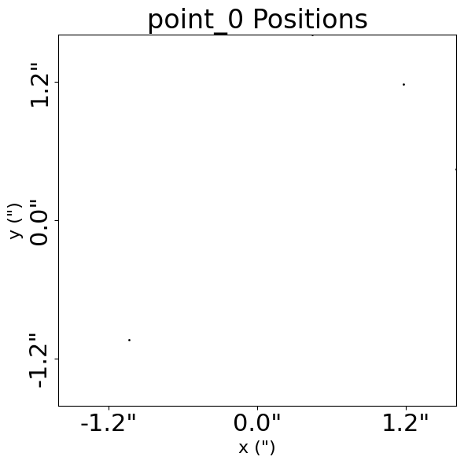
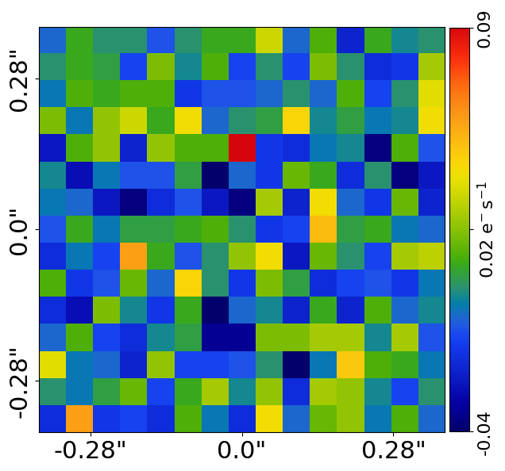
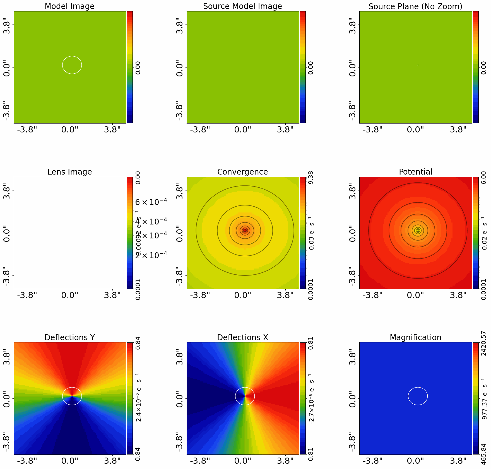
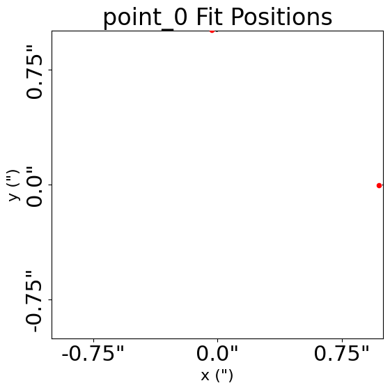
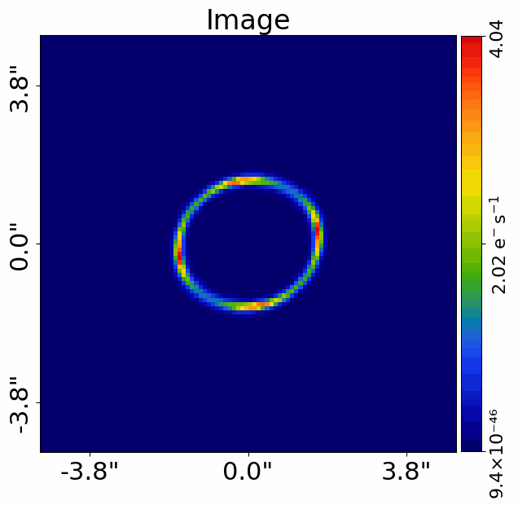
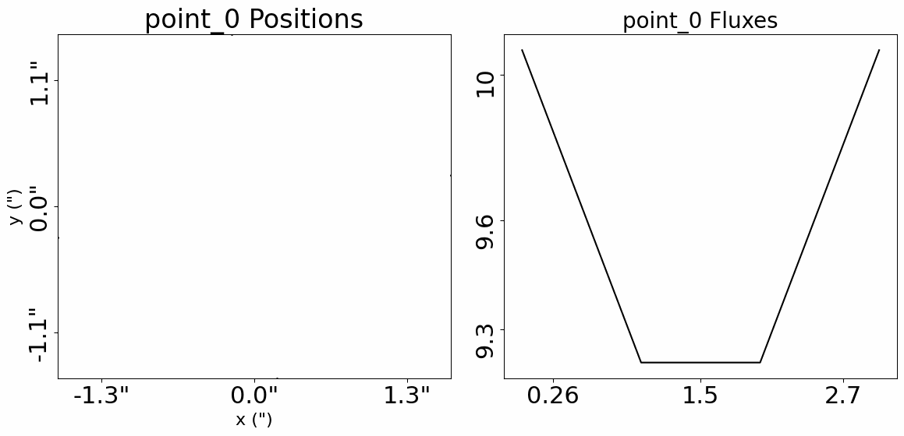

> ✏️ **This page is auto-generated from [`scripts/point_source/start_here.py`](../../scripts/point_source/start_here.py) — do not edit it directly.**
> It shows the example fully executed, with its real output images.
> Run it yourself via the [Python script](../../scripts/point_source/start_here.py) or the [Jupyter notebook](../../notebooks/point_source/start_here.ipynb).

Start Here: Imaging
===================

Strong gravitational lenses often have point sources (e.g. quasars) that are being lensed, appearing as two or
four distinct point-like images. These lenses are particularly useful for measuring cosmological parameters
like the Hubble constant, and for studying the small-scale properties of dark matter.

This script shows you how to model such a lens system using **PyAutoLens** with as little setup
as possible. In about 15 minutes you’ll be able to point the code at your own data and
fit your first lens.

We focus on a *galaxy-scale* lens (a single lens galaxy). If you have multiple lens galaxies,
see the `start_here_group.ipynb` and `start_here_cluster.ipynb` examples.

Point source modeling uses the positions of the lensed source in the image-plane, and optionally may also
use their fluxes and time delays. However, it is common for lensed quasar overall to be observed by CCD
imaging data, which is used to measure the positions of the point sources precisions and produes visuals
of the strong lens which aid its interpretation.

This script therefore also shows how to plot the CCD imaging of a point source lens, but does not use the
imaging data to constrain the lens model itself.

__Contents__

- **JAX:** JAX acceleration for fast GPU/CPU model-fitting.
- **Google Colab Setup:** The introduction `start_here` examples are available on Google Colab, which allows you to run them.
- **Imports:** Import the required Python libraries.
- **Dataset:** Load and plot the strong lens dataset.
- **Point Solver:** For point-source modeling we require a `PointSolver`, which determines the multiple-images of the.
- **Model:** Compose the lens model fitted to the data.
- **Name Pairing:** The `PointDataset` above had a name, `point_0`.
- **Model Fit:** Perform the model-fit using the search and analysis.
- **Live Visual Update:** Push the quick-update image to a live display surface.
- **Result:** Overview of the results of the model-fit.
- **Model Your Own Lens:** If you have your own strong lens point source data, you are now ready to model it yourself by.
- **Fluxes and Time Delays:** If you have measured the fluxes and/or time delays of the lensed point sources, these can also be.
- **Simulator:** Let’s now switch gears and simulate our own strong lens point sources.
- **Sample:** Often we want to simulate *many* strong lenses — for example, to train a neural network or to.
- **Wrap Up:** Summary of the script and next steps.

__JAX__

PyAutoLens runs point-source model-fits on JAX by default (JAX installs
with `autolens` itself). `AnalysisPoint` auto-enables `use_jax=True`; the
search driver wraps the likelihood in `jax.vmap(jax.jit(...))`.

For the broader JAX principles see `autolens_workspace/start_here.py`
`__JAX__`. For the most user-impactful piece — the `PointSolver(use_jax=True)`
+ `@jax.jit` pattern for fast forward solving — see the `__JAX Variant__`
at the end of `scripts/point_source/simulator.py`. Point-source solving
is the rare case where the `@jax.jit` wrap really pays off (the
triangle-refinement loop dominates simulation runtime); the variant
script shows how to do it cleanly.

__Google Colab Setup__

The introduction `start_here` examples are available on Google Colab, which allows you to run them in a web browser
without manual local PyAutoLens installation.

The code below sets up your environment if you are using Google Colab, including installing autolens and downloading
files required to run the notebook. If you are running this script not in Colab (e.g. locally on your own computer),
running the code will still check correctly that your environment is set up and ready to go.


```python

import subprocess
import sys

try:
    import google.colab

    subprocess.check_call(
        [sys.executable, "-m", "pip", "install", "autonerves", "--no-deps"]
    )
except ImportError:
    pass

from autonerves import setup_colab

setup_colab.for_autolens(
    raise_error_if_not_gpu=False  # Switch to False for CPU Google Colab
)
```

    
                You are not running in a Google Colab environment so cannot use the setup_colab() function.
    
                You should therefore have PyAutoLens installed locally in your environment already (e.g. via pip or
                conda) and can run the rest of your script normally.
    
                You may now continue running your script or Notebook.
                


__Imports__

Lets first import autolens, its plotting module and the other libraries we'll need.

You'll see these imports in the majority of workspace examples.


```python
from autolens import jax_wrapper  # Sets JAX environment before other imports

from autolens import setup_notebook; setup_notebook()

import numpy as np
from pathlib import Path

import autofit as af
import autolens as al
import autolens.plot as aplt
```

    Working Directory has been set to `autolens_workspace`


__Dataset__

We begin by Creating the point source dataset, which for now contains only: 

1. The positions of the lensed images in the image-plane.
2. Their RMS noise-map values, corresponding to the uncertainty on their position measurements.
3. The PSF (Point Spread Function).

We print and plot the dataset to show these properties but also see that the dataset has a name,
this will be import later when we perform lens modeling.


```python
positions = al.Grid2DIrregular(
    [(-1.039, -1.038), (0.442, 1.608), (1.609, 0.442), (1.179, 1.179)]
)
noise_map = al.ArrayIrregular([0.005, 0.005, 0.005, 0.005])

dataset = al.PointDataset(
    name="point_0", positions=positions, positions_noise_map=noise_map
)

print("Point Dataset Info:")
print(dataset.info)

aplt.subplot_point_dataset(dataset=dataset)
```

    Point Dataset Info:
    name : point_0
    positions : Grid2DIrregular([[-1.039, -1.038],
           [ 0.442,  1.608],
           [ 1.609,  0.442],
           [ 1.179,  1.179]])
    positions_noise_map : ArrayIrregular([0.005, 0.005, 0.005, 0.005])
    fluxes : None
    fluxes_noise_map : None
    time_delays : None
    time_delays_noise_map : None
    redshift : None
    


    

    


We can also load the dataset from the workspace `datasset` folder, which means the image we
load below is also available.


```python
dataset_name = "simple"
dataset_path = Path("dataset") / "point_source" / dataset_name
```

__Dataset Auto-Simulation__

If the dataset does not already exist on your system, it will be created by running the corresponding
simulator script. This ensures that all example scripts can be run without manually simulating data first.


```python
if not dataset_path.exists():
    import subprocess
    import sys

    subprocess.run(
        [sys.executable, "scripts/point_source/simulator.py"],
        check=True,
    )

dataset = al.from_json(
    file_path=dataset_path / "point_dataset_positions_only.json",
)
```

We next load an image of the dataset. 

Although we are performing point-source modeling and do not use this data in the actual modeling, it is useful to 
load it for visualization, for example to see where the multiple images of the point source are located relative to the 
lens galaxy.

The image will also be passed to the analysis further down, meaning that visualization of the point-source model
overlaid over the image will be output making interpretation of the results straight forward.

Loading and inputting the image of the dataset in this way is entirely optional, and if you are only interested in
performing point-source modeling you do not need to do this.

We also plot the dataset's multiple image positions over the observed image, to ensure they overlap the
lensed source's multiple images.


```python
data = al.Array2D.from_fits(file_path=dataset_path / "data.fits", pixel_scales=0.05)

aplt.plot_array(array=data, title="")
```


    

    


__Point Solver__

For point-source modeling we require a `PointSolver`, which determines the multiple-images of the mass model for a 
point source at location (y,x) in the source plane. 

It does this by ray tracing triangles from the image-plane to the source-plane and calculating if the 
source-plane (y,x) centre is inside the triangle. The method gradually ray-traces smaller and smaller triangles so 
that the multiple images can be determine with sub-pixel precision.

The solver has various settings which are set below to ensure for lens modeling the multiple images are computed
accurately, precisely and efficiently. These are described elsewhere in the workspace documentation.

The triangle ray-tracing method is fully compatible wit JAX and is significantly accelerated on the GPU.


```python
grid = al.Grid2D.uniform(
    shape_native=(100, 100),
    pixel_scales=0.2,  # <- The pixel-scale describes the conversion from pixel units to arc-seconds.
)

solver = al.PointSolver.for_grid(
    grid=grid, pixel_scale_precision=0.001, magnification_threshold=0.1
)
```

__Model__

To perform lens modeling we must define a lens model, describing the mass profile of the lens 
galaxy and point source model of the source galaxy.

A brilliant lens model to start with is one which uses aSingular Isothermal 
Ellipsoid (SIE) plus shear to model the lens mass and simply assumes the source is
a point source, with a `centre` (y,x) position that is a free parameter of the model.

__Name Pairing__

The `PointDataset` above had a name, `point_0`. This `name` pairs  the dataset to the `Point` in 
the model below, which is called `point_0`. 

If there is no point-source in the model that has the same name as a `PointDataset`, that data 
is not used in the model-fit. 

For galaxy scale lenses, where there is just one source galaxy, name pairing is unnecessary. 
However, cluster-scale strong lenses use the point source modeling API. These systems can have
over 100 source galaxies, and name pairing is necessary to ensure every point source in 
the lens model is fitted to its particular lensed images in the `PointDataset`.


```python
# Lens:

mass = af.Model(al.mp.Isothermal)

lens = af.Model(al.Galaxy, redshift=0.5, mass=al.mp.Isothermal)

# Source:

point_0 = af.Model(al.ps.Point)

source = af.Model(al.Galaxy, redshift=1.0, point_0=point_0)

# Overall Lens Model:

model = af.Collection(galaxies=af.Collection(lens=lens, source=source))
```

We can print the model to show the parameters that the model is composed of.


```python
print(model.info)
```

    Total Free Parameters = 7
    
    model                                                                           Collection (N=7)
        galaxies                                                                    Collection (N=7)
            lens                                                                    Galaxy (N=5)
                mass                                                                Isothermal (N=5)
            source                                                                  Galaxy (N=2)
                point_0                                                             Point (N=2)
    
    galaxies
        lens
            redshift                                                                0.5
            mass
                centre
                    centre_0                                                        GaussianPrior [5], mean = 0.0, sigma = 0.1
                    centre_1                                                        GaussianPrior [6], mean = 0.0, sigma = 0.1
                ell_comps
                    ell_comps_0                                                     TruncatedGaussianPrior [7], mean = 0.0, sigma = 0.3, lower_limit = -1.0, upper_limit = 1.0
                    ell_comps_1                                                     TruncatedGaussianPrior [8], mean = 0.0, sigma = 0.3, lower_limit = -1.0, upper_limit = 1.0
                einstein_radius                                                     UniformPrior [9], lower_limit = 0.0, upper_limit = 8.0
        source
            redshift                                                                1.0
            point_0
                centre
                    centre_0                                                        GaussianPrior [10], mean = 0.0, sigma = 0.3
                    centre_1                                                        GaussianPrior [11], mean = 0.0, sigma = 0.3


__Model Fit__

We now fit the data with the lens model using the non-linear fitting method and nested sampling algorithm Nautilus.

This requires an `AnalysisPoint` object, which defines the `log_likelihood_function` used by Nautilus to fit
the model to the point source data.

__JAX__

`AnalysisPoint` defaults to `use_jax=True` when JAX is installed.
`AnalysisPoint._register_fit_point_pytrees()` runs on first `fit_from`
to register `FitPositionsSource`, `FitPositionsImagePair`, and `Tracer`
as JAX pytrees — you don't need to call `register_tracer_classes`
yourself for the modeling path (that's only required for the explicit
JIT-it-yourself pattern in `simulator.py`'s `__JAX Variant__`).

**Run Time Error:** On certain operating systems (e.g. Windows, Linux) and Python versions, the code below may produce
an error. If this occurs, see the `autolens_workspace/guides/modeling/bug_fix` example for a fix.

__Live Visual Update__

By default the quick-update image is only written to disk. Set `live_visual_update=True` to also push it to a
live display surface:

- **Python script** — a matplotlib window opens automatically and refreshes with each quick update, so you can
  watch the fit converge without leaving your terminal.
- **Jupyter / Colab notebook** — the cell that ran `search.fit(...)` shows a single self-updating image that
  refreshes in place every `iterations_per_quick_update`.

The disk write (`fit.png`) always happens regardless of this flag. Set it to `False` (the default) if you just
want the on-disk output, or if you are running in a headless environment (e.g. an HPC cluster).


```python
search = af.Nautilus(
    path_prefix=Path("point_source"),  # The path where results and output are stored.
    name="start_here",  # The name of the fit and folder results are output to.
    unique_tag=dataset_name,  # A unique tag which also defines the folder.
    n_live=75,  # The number of Nautilus "live" points, increase for more complex models.
    n_batch=50,  # GPU lens model fits are batched and run simultaneously, see modeling examples for details.
    iterations_per_quick_update=250000,  # Every N iterations the max likelihood model is visualized and written to output folder.
    live_visual_update=False,  # Set True to open a live matplotlib window (script) or refresh a Jupyter cell (notebook).
)

analysis = al.AnalysisPoint(
    dataset=dataset,
    solver=solver,
    use_jax=True,  # JAX will use GPUs for acceleration if available, else JAX will use multithreaded CPUs.
)
```

The code below begins the model-fit. This will take around 10 minutes with a GPU, or 20-30 minutes with a CPU.

**Run Time Error:** On certain operating systems (e.g. Windows, Linux) and Python versions, the code below may produce 
an error. If this occurs, see the `autolens_workspace/guides/modeling/bug_fix` example for a fix.


```python
print(
    """
    The non-linear search has begun running.

    This Jupyter notebook cell with progress once the search has completed - this could take a few minutes!

    On-the-fly updates every iterations_per_quick_update are printed to the notebook.
    """
)

result = search.fit(model=model, analysis=analysis)

print("The search has finished run - you may now continue the notebook.")
```

    
        The non-linear search has begun running.
    
        This Jupyter notebook cell with progress once the search has completed - this could take a few minutes!
    
        On-the-fly updates every iterations_per_quick_update are printed to the notebook.
        
    2026-07-10 19:56:40,643 - autofit.non_linear.search.abstract_search - INFO - Starting non-linear search with JAX (CPU: cpu).


    2026-07-10 19:56:40,672 - start_here - INFO - The output path of this fit is autolens_workspace/output/point_source/simple/start_here/a3ee7a7700fde2c85e563a3bfdae45a4


    2026-07-10 19:56:40,674 - start_here - INFO - Outputting pre-fit files (e.g. model.info, visualization).


    2026-07-10 19:56:40,858 - start_here - INFO - Starting new Nautilus non-linear search (no previous samples found).


    2026-07-10 19:56:40,862 - autofit.non_linear.fitness - INFO - JAX: Applying vmap and jit to likelihood function -- may take a few seconds.


    2026-07-10 19:56:40,863 - autofit.non_linear.fitness - INFO - JAX: vmap and jit applied in 0.0013637542724609375 seconds.


    2026-07-10 19:56:40,864 - autofit.non_linear.fitness - INFO - Warming up visualization (one-time JAX compilation)...


    2026-07-10 19:56:40,869 - autofit.non_linear.fitness - WARNING - Visualization warm-up failed (non-fatal); first quick update may be slow.


    2026-07-10 19:56:40,870 - start_here - INFO - Running search with JAX vectorization (parallelization handled by JAX).


    Starting the nautilus sampler...
    Please report issues at github.com/johannesulf/nautilus.
    Status    | Bounds | Ellipses | Networks | Calls    | f_live | N_eff | log Z    


    

    

    

    

    

    

    

    

    

    

    

    

    

    

    

    

    

    

    

    

    

    

    

    

    

    

    

    

    

    

    

    

    

    

    

    

    

    

    

    

    

    

    

    

    

    

    

    

    

    

    

    

    

    

    

    

    

    

    

    

    

    

    

    

    

    

    

    

    

    

    

    

    

    

    

    

    

    

    

    

    

    

    

    

    

    

    

    

    

    

    

    

    

    

    

    

    

    

    

    

    

    

    

    

    

    

    

    

    

    

    

    

    

    

    

    

    

    

    

    

    

    

    

    

    

    

    

    

    

    

    

    

    

    

    

    

    

    

    

    

    

    

    

    

    

    

    

    

    

    

    

    

    

    

    

    

    

    

    

    

    

    

    

    

    

    

    

    

    

    

    

    

    

    

    

    

    

    

    

    

    

    

    

    

    

    

    

    

    

    

    

    

    

    

    

    

    

    

    

    

    

    

    

    

    

    

    

    

    

    

    

    

    

    

    

    

    

    

    

    

    

    

    

    

    

    

    

    

    

    

    

    

    

    

    

    

    

    

    

    

    

    

    

    

    

    

    

    

    

    

    

    

    

    

    

    

    

    

    

    

    

    

    

    

    

    

    

    

    

    

    

    

    

    

    

    

    

    

    

    

    

    

    

    

    

    

    

    

    

    

    

    

    

    Finished  | 58     | 1        | 4        | 11250    | N/A    | 1322  | -70.13   
    2026-07-10 20:09:59,866 - start_here - INFO - Fit Running: Updating results (see output folder).


    Starting the nautilus sampler...
    Please report issues at github.com/johannesulf/nautilus.
    Status    | Bounds | Ellipses | Networks | Calls    | f_live | N_eff | log Z    
    Finished  | 58     | 1        | 4        | 11250    | N/A    | 1322  | -70.13   
    2026-07-10 20:13:37,015 - start_here - INFO - Fit Running: Updating results (see output folder).


    2026-07-10 20:13:42,045 - autofit.non_linear.samples.samples - INFO - Samples with weight less than 1e-10 removed from samples.csv.


    2026-07-10 20:13:42,351 - autofit.non_linear.search.updater - INFO - Creating latent samples by drawing 100 from the PDF.


    2026-07-10 20:14:44,661 - start_here - INFO - Removing search internal folder.


    2026-07-10 20:14:44,685 - start_here - INFO - Removing all files except for .zip file


    2026-07-10 20:14:47,499 - start_here - INFO - Search complete, returning result


    The search has finished run - you may now continue the notebook.


__Result__

Now this is running you should checkout the `autolens_workspace/output` folder, where many results of the fit
are written in a human readable format (e.g. .json files) and .fits and .png images of the fit are stored.

When the fit is complex, we can print the results by printing `result.info`.


```python
print(result.info)
```

    Bayesian Evidence                                                               -70.12846881
    Maximum Log Likelihood                                                          -24.16216808
    
    model                                                                           Collection (N=7)
        galaxies                                                                    Collection (N=7)
            lens                                                                    Galaxy (N=5)
                mass                                                                Isothermal (N=5)
            source                                                                  Galaxy (N=2)
                point_0                                                             Point (N=2)
    
    ... [44 lines of output truncated] ...
                    centre_0                                                        0.1849 (0.1786, 0.1900)
                    centre_1                                                        0.2070 (0.2055, 0.2086)
                ell_comps
                    ell_comps_0                                                     0.0024 (-0.0010, 0.0058)
                    ell_comps_1                                                     0.0495 (0.0453, 0.0547)
                einstein_radius                                                     0.8262 (0.8227, 0.8301)
        source
            point_0
                centre
                    centre_0                                                        0.2050 (0.2002, 0.2084)
                    centre_1                                                        0.1871 (0.1854, 0.1891)
    
    instances
    
    galaxies
        lens
            redshift                                                                0.5
        source
            redshift                                                                1.0


The result also contains the maximum likelihood lens model which can be used to plot the best-fit lensing information
and fit to the data.


```python
aplt.subplot_tracer(tracer=result.max_log_likelihood_tracer, grid=result.grid)
aplt.subplot_fit_point(fit=result.max_log_likelihood_fit)
```


    

    


    

    


The result object contains pretty much everything you need to do science with your own strong lens, but details
of all the information it contains are beyond the scope of this introductory script. The `guides` and `result` 
packages of the workspace contains all the information you need to analyze your results yourself.

__Model Your Own Lens__

If you have your own strong lens point source data, you are now ready to model it yourself by adapting the code above
and simply writing your own `PointSourceDataset`, or loading one from .json if you have already created it.

A few things to note, with full details on data preparation provided in the main workspace documentation:

- PyAutoLens uses (y,x) conventions, so the positions below are y = 1.0", y = 2.0", x = 0.0" and x = 0.0".
- Supply your own CCD image for the lensed quasar for visualization.
- Ensure the lens galaxy is roughly centered in the image.
- Double-check `pixel_scales` for your telescope/detector.
- Start with the default model — it works very well for pretty much all galaxy scale lenses!


```python
positions = al.Grid2DIrregular(
    [(-1.039, -1.038), (0.442, 1.608), (1.609, 0.442), (1.179, 1.179)]
)
noise_map = al.ArrayIrregular([0.005, 0.005, 0.005, 0.005])

dataset = al.PointDataset(
    name="point_0", positions=positions, positions_noise_map=noise_map
)
```

__Fluxes and Time Delays__

If you have measured the fluxes and/or time delays of the lensed point sources, these can also be included in
the `PointDataset` above and fitted by the lens model.

We first add fluxes, time delays and their RMS noise-map values to the dataset. Note that ordering is used across
quantities, so the first flux and time delay corresponds to the first position (1.0, 0.0) and so on.


```python
positions = al.Grid2DIrregular(
    [(-1.039, -1.038), (0.442, 1.608), (1.609, 0.442), (1.179, 1.179)]
)
fluxes = al.ArrayIrregular(values=[6.82, 55.16, 53.63, 100.62])
time_delays = al.ArrayIrregular(values=[-136.99, -176.85, -177.02, -176.74])

# Position noise = 5 mas (PSF-centroiding precision on HST imaging).
# Flux noise = 5% relative (microlensing-dominated regime).
# Time delay noise = 5% relative magnitude (COSMOGRAIL/TDCOSMO regime).
# See `simulator.py` for a full discussion of these values.
positions_noise_map = al.ArrayIrregular([0.005, 0.005, 0.005, 0.005])
fluxes_noise_map = al.ArrayIrregular(values=[0.34, 2.76, 2.68, 5.03])
time_delays_noise_map = al.ArrayIrregular(values=[6.85, 8.84, 8.85, 8.84])

dataset = al.PointDataset(
    name="point_0",
    positions=positions,
    positions_noise_map=positions_noise_map,
    fluxes=fluxes,
    fluxes_noise_map=fluxes_noise_map,
    time_delays=time_delays,
    time_delays_noise_map=time_delays_noise_map,
)
```

__Model__

When we add fluxes to the point dataset, we also need to updatre our model such that our point source
objects have their `flux` as a free parameter we fit for. The model API below does this, using the `PointFlux` 
component instead of the `Point` component. 

Time delays do not need the model to be updated, as they are computed from the mass model and the 
point source (y,x) position.

You should think very carefully if including fluxes in your modeling is a sensible idea, even if you have
the data available. For real lenses, they are often affected by microlensing, dust extinction, and
intrinsic variability of the source, all of which are difficult to model. 


```python
# Lens:

mass = af.Model(al.mp.Isothermal)

lens = af.Model(al.Galaxy, redshift=0.5, mass=al.mp.Isothermal)

# Source:

point_0 = af.Model(al.ps.PointFlux)

source = af.Model(al.Galaxy, redshift=1.0, point_0=point_0)

# Overall Lens Model:

model = af.Collection(galaxies=af.Collection(lens=lens, source=source))
```

__Model Fit__

We now fit the model to the data using Nautilus, as before, but including
the fluxes and time delays in the `AnalysisPoint` object.


```python
search = af.Nautilus(
    path_prefix=Path("point_source"),  # The path where results and output are stored.
    name="start_here_flux_time_delay",  # The name of the fit and folder results are output to.
    unique_tag="example_point",  # A unique tag which also defines the folder.
    n_live=75,  # The number of Nautilus "live" points, increase for more complex models.
    n_batch=50,  # GPU lens model fits are batched and run simultaneously, see VRAM section below.
    iterations_per_full_update=20000,  # Every N iterations the results are written to hard-disk for inspection.
)

analysis = al.AnalysisPoint(
    dataset=dataset,
    solver=solver,
    use_jax=True,  # JAX will use GPUs for acceleration if available, else JAX will use multithreaded CPUs.
)

result = search.fit(model=model, analysis=analysis)
```

    2026-07-10 20:15:05,118 - autofit.non_linear.search.abstract_search - INFO - Starting non-linear search with JAX (CPU: cpu).


    2026-07-10 20:15:05,153 - start_here_flux_time_delay - INFO - The output path of this fit is autolens_workspace/output/point_source/example_point/start_here_flux_time_delay/6f132863bbb378fe0559ddb6d7830ae3


    2026-07-10 20:15:05,156 - start_here_flux_time_delay - INFO - Outputting pre-fit files (e.g. model.info, visualization).


    2026-07-10 20:15:05,710 - start_here_flux_time_delay - INFO - Starting new Nautilus non-linear search (no previous samples found).


    2026-07-10 20:15:05,712 - autofit.non_linear.fitness - INFO - JAX: Applying vmap and jit to likelihood function -- may take a few seconds.


    2026-07-10 20:15:05,715 - autofit.non_linear.fitness - INFO - JAX: vmap and jit applied in 0.002467632293701172 seconds.


    2026-07-10 20:15:05,717 - autofit.non_linear.fitness - INFO - Warming up visualization (one-time JAX compilation)...


    2026-07-10 20:15:05,726 - autofit.non_linear.fitness - WARNING - Visualization warm-up failed (non-fatal); first quick update may be slow.


    2026-07-10 20:15:05,729 - start_here_flux_time_delay - INFO - Running search with JAX vectorization (parallelization handled by JAX).


    Starting the nautilus sampler...
    Please report issues at github.com/johannesulf/nautilus.
    Status    | Bounds | Ellipses | Networks | Calls    | f_live | N_eff | log Z    


    

    

    

    

    

    

    

    

    

    

    

    

    

    

    

    

    

    

    

    

    

    

    

    

    

    

    

    

    

    

    

    

    

    

    

    

    

    

    

    

    

    

    

    

    

    

    

    

    

    

    

    

    

    

    

    

    

    

    

    

    

    

    

    

    

    

    

    

    

    

    

    

    

    

    

    

    

    

    

    

    

    

    

    

    

    

    

    

    

    

    

    

    

    

    

    

    

    

    

    

    

    

    

    

    

    

    

    

    

    

    

    

    

    

    

    

    

    

    

    

    

    

    

    

    

    

    

    

    

    

    

    

    

    

    

    

    

    

    

    

    

    

    

    

    

    

    

    

    

    

    

    

    

    

    

    

    

    

    

    

    

    

    

    

    

    

    

    

    

    

    

    

    

    

    

    

    

    

    

    

    

    

    

    

    

    

    

    

    

    

    

    

    

    

    

    

    

    

    

    

    

    

    

    

    

    

    

    

    

    

    

    

    

    

    

    

    

    

    

    

    

    

    

    

    

    

    

    

    

    

    

    

    

    

    

    

    

    

    

    

    

    

    

    

    

    

    

    

    

    

    

    

    

    

    

    

    

    

    

    

    

    

    

    

    

    

    

    

    

    

    

    

    

    

    

    

    

    

    

    

    

    

    

    

    

    

    

    

    

    

    

    

    

    

    

    

    

    

    

    Finished  | 59     | 1        | 4        | 11800    | N/A    | 887   | -51.53   
    2026-07-10 20:30:02,662 - start_here_flux_time_delay - INFO - Fit Running: Updating results (see output folder).


    Starting the nautilus sampler...
    Please report issues at github.com/johannesulf/nautilus.
    Status    | Bounds | Ellipses | Networks | Calls    | f_live | N_eff | log Z    
    Finished  | 59     | 1        | 4        | 11800    | N/A    | 887   | -51.53   
    2026-07-10 20:31:31,836 - start_here_flux_time_delay - INFO - Fit Running: Updating results (see output folder).


    2026-07-10 20:31:34,089 - autofit.non_linear.samples.samples - INFO - Samples with weight less than 1e-10 removed from samples.csv.


    2026-07-10 20:31:34,217 - autofit.non_linear.search.updater - INFO - Creating latent samples by drawing 100 from the PDF.


    2026-07-10 20:32:23,250 - start_here_flux_time_delay - INFO - Removing search internal folder.


    2026-07-10 20:32:23,254 - start_here_flux_time_delay - INFO - Removing all files except for .zip file


    2026-07-10 20:32:25,187 - start_here_flux_time_delay - INFO - Search complete, returning result


__Simulator__

Let’s now switch gears and simulate our own strong lens point sources. This is a great way to:

- Practice lens modeling before using real data.
- Build large training sets (e.g. for machine learning).
- Test lensing theory in a controlled environment.

With each point source we'll also output CCD imaging of the source which is useful for visually
showing the lensing configuration.

To do this we need to define a 2D grid of (y,x) coordinates in the image-plane. This grid is
where we’ll evaluate the light from the lens and source galaxies.


```python
grid = al.Grid2D.uniform(
    shape_native=(100, 100),
    pixel_scales=0.1,
)
```

We now define a `Tracer` — this is the key object that combines all galaxies in the system
and computes how light rays are deflected.

- The lens galaxy has both light (a Sersic bulge) and mass (an isothermal profile + shear).
- The source galaxy has its own light (a SersicCore profile).

Together they define a strong lens system. The tracer will “ray-trace” our grid through
this mass distribution and generate a lensed image.


```python
source_centre = (0.0, 0.0)

lens_galaxy = al.Galaxy(
    redshift=0.5,
    mass=al.mp.Isothermal(
        centre=(0.0, 0.0),
        einstein_radius=1.6,
        ell_comps=al.convert.ell_comps_from(axis_ratio=0.9, angle=45.0),
    ),
    shear=al.mp.ExternalShear(gamma_1=0.05, gamma_2=0.05),
)

source_galaxy = al.Galaxy(
    redshift=1.0,
    bulge=al.lp.SersicCore(
        centre=source_centre,
        ell_comps=al.convert.ell_comps_from(axis_ratio=0.8, angle=60.0),
        intensity=4.0,
        effective_radius=0.1,
        sersic_index=1.0,
    ),
    point_0=al.ps.PointFlux(centre=source_centre, flux=1.0),
)

tracer = al.Tracer(galaxies=[lens_galaxy, source_galaxy])
```

Plotting the tracer’s image gives us a “perfect” view of the strong lens system, before
adding telescope effects.


```python
aplt.plot_array(array=tracer.image_2d_from(grid=grid), title="Image")
```


    

    


The image can be saved to .fits for later use.


```python
image = tracer.image_2d_from(grid=grid)

dataset_type = "point_source"
dataset_name = "start_here_example"
dataset_path = Path("dataset") / dataset_type / dataset_name

al.output_to_fits(
    values=image.native,
    file_path=dataset_path / "image.fits",
    overwrite=True,
)
```

__Simulator__

We now compute:

 - The point source positions, reusing the `PointSolver` above.
 - The RMS noise map of the positions, set to the centroid precision of PSF fitting on HST imaging
   (~5 mas) — *not* the imaging pixel scale, which is the detector's sampling rather than its
   centroiding precision.
 - The point source fluxes, by computing the magnification from the tracer and applying it to an
   input source flux.
 - The RMS noise map of the fluxes, set to 5% relative — for lensed quasars and supernovae,
   photometric flux uncertainties are dominated by microlensing systematics rather than photon noise.
 - The time delays, which come from the tracer's mass model.
 - The RMS noise of the time delays, set to 5% relative — matching COSMOGRAIL/TDCOSMO precision on
   well-sampled photometric monitoring of multiply-imaged quasars.

See `simulator.py` for a full discussion of these values.


```python
positions = solver.solve(
    tracer=tracer, source_plane_coordinate=source_galaxy.point_0.centre
)

magnifications = al.LensCalc.from_tracer(
    tracer=tracer
).magnification_2d_via_hessian_from(grid=positions)

time_delays = tracer.time_delays_from(grid=positions)

flux = 1.0
fluxes = [flux * np.abs(magnification) for magnification in magnifications]
fluxes = al.ArrayIrregular(values=fluxes)

position_noise = 0.005
flux_rel_noise = 0.05
time_delay_rel_noise = 0.05

positions_noise_map = al.ArrayIrregular([position_noise] * len(positions))

fluxes_noise_map = al.ArrayIrregular(values=flux_rel_noise * np.asarray(fluxes))

time_delays_noise_map = al.ArrayIrregular(
    values=np.abs(time_delays) * time_delay_rel_noise
)
```

We can pass these to a `PointDataset` and output to hard disk as a .json file.


```python
dataset = al.PointDataset(
    name="point_0",
    positions=positions,
    positions_noise_map=positions_noise_map,
    fluxes=fluxes,
    fluxes_noise_map=fluxes_noise_map,
    time_delays=time_delays,
    time_delays_noise_map=time_delays_noise_map,
)

aplt.subplot_point_dataset(dataset=dataset)

dataset_path = Path("dataset") / "point_source" / "simulated_lens"


al.output_to_json(
    obj=dataset,
    file_path=dataset_path / "point_dataset_positions_only.json",
)
```


    

    


__Sample__

Often we want to simulate *many* strong lenses — for example, to train a neural network
or to explore population-level statistics.

This uses the model composition API to define the distribution of the light and mass profiles
of the lens and source galaxies we draw from. The model composition is a little too complex for
the first example, thus we use a helper function to create a simple lens and source model.

We then generate 3 lenses for speed, and plot their images so you can see the variety of lenses
we create.

Each lens is simulated as if it were observed with CD imaging, therefore with a PSF and noise-map.


```python
print(al.model_util.SIMULATOR_RANDOM_LENS_SUMMARY)
```

    Each simulated strong lens draws fresh truths from: lens bulge SNR in [20, 60] (when included), lens mass einstein_radius in [0.2, 1.8] with normal-clipped ellipticity, external shear ~ Normal(0, 0.05), source bulge SNR in [10, 30] / point-source flux in [0.0, 2.0] (mode dependent).


We now simulate a sample of strong lens, we just do 3 for efficiency here but you can increase this to any number.


```python
total_datasets = 3

for sample_index in range(total_datasets):

    lens_galaxy, source_galaxy = al.model_util.random_galaxies_for_simulation_from(
        include_lens_light=False, use_point_source=True
    )

    tracer = al.Tracer(galaxies=[lens_galaxy, source_galaxy])

    positions = solver.solve(
        tracer=tracer, source_plane_coordinate=source_galaxy.point_0.centre
    )
    magnifications = al.LensCalc.from_tracer(
        tracer=tracer
    ).magnification_2d_via_hessian_from(grid=positions)
    time_delays = tracer.time_delays_from(grid=positions)

    flux = 1.0
    fluxes = [flux * np.abs(magnification) for magnification in magnifications]
    fluxes = al.ArrayIrregular(values=fluxes)

    positions_noise_map = al.ArrayIrregular([position_noise] * len(positions))
    fluxes_noise_map = al.ArrayIrregular(values=flux_rel_noise * np.asarray(fluxes))
    time_delays_noise_map = al.ArrayIrregular(
        values=np.abs(time_delays) * time_delay_rel_noise
    )

    dataset = al.PointDataset(
        name=f"point_0",
        positions=positions,
        fluxes=fluxes,
        time_delays=time_delays,
        positions_noise_map=positions_noise_map,
        fluxes_noise_map=fluxes_noise_map,
        time_delays_noise_map=time_delays_noise_map,
    )
```

__Wrap Up__

This script has shown how to model point source data of strong lenses, and simulate your own strong lenses.

Details of the **PyAutoLens** API and how lens modeling and simulations actually work were omitted for simplicity,
but everything you need to know is described throughout the main workspace documentation. You should check it out,
but maybe you want to try and model your own lens first!

The following locations of the workspace are good places to checkout next:

- `autolens_workspace/*/point_source/modeling`: A full description of the lens modeling API and how to customize your model-fits.
- `autolens_workspace/*/point_source/simulator`: A full description of the lens simulation API and how to customize your simulations.
- `autolens_workspace/*/point_source/data_preparation`: How to load and prepare your own imaging data for lens modeling.
- `autolens_workspace/guides/results`: How to load and analyze the results of your lens model fits, including tools for large samples.
- `autolens_workspace/guides`: A complete description of the API and information on lensing calculations and units.
- `autolens_workspace/point_source/feature`: A description of advanced features for lens modeling, for example time delays, read this once you're confident with the basics!


```python

```
